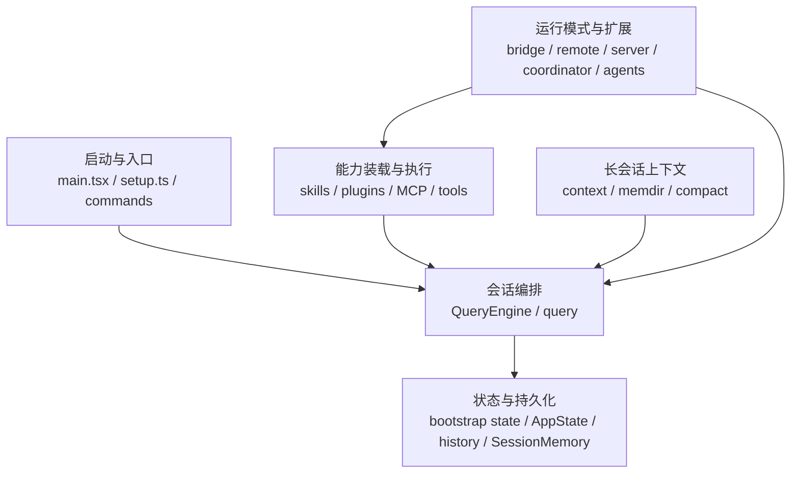
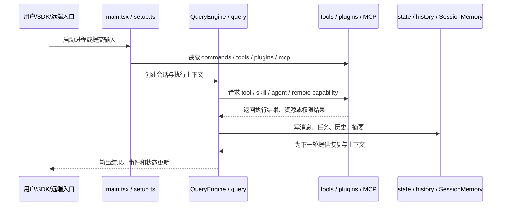

# Claude Code 架构文档索引

## 1. 文档定位

`docs/architecture/README.md` 是索引页，不承担某个重点模块的详细设计。它只做三件事：

- 给出系统级的 overview 视图。
- 给出系统级的数据流视图。
- 说明各专题文档分别解决什么架构问题。

为了让专题文档可持续扩展，当前目录中的重点模块文档统一遵循同一骨架：

- Overview 视图：回答模块如何分层、核心依赖如何指向。
- 数据流视图：回答一次请求、状态变更或事件如何穿过这些模块。
- 责任边界：回答模块拥有什么、不负责什么。
- 共享类比：回答为什么这些层要这样拆，先建立直觉模型。
- 真实场景：回答一条典型链路如何实际流过这些层。
- 源码里的最小例子：用真实文件、函数、类型或状态结构把抽象边界钉回源码。

当前文档集聚焦决定系统骨架的主线，不展开 `buddy/` 这类陪伴式模块、视觉表现层细节和单个命令或工具的实现算法。

除索引页和专题页外，当前目录还包含两类辅助文档：

- 概念文档：固定跨专题复用的术语和概念模型，避免不同专题使用同名不同义的表述。
- 模板文档：为后续新增重点模块专题提供统一骨架，保证 overview 视图、数据流视图和责任边界的写法一致。

换句话说，这套文档不追求“目录说明书”式的铺陈，而追求三件事：

- 先把抽象边界讲清楚。
- 再把一条真实链路讲明白。
- 最后用最小源码例子证明这些判断不是空谈。

## 2. 系统 Overview 视图

这张图只表达主干关系：Claude Code 的中心不是单个 CLI 命令，而是“会话编排内核”及其周围的能力装载、状态保持、长会话控制和运行模式扩展。

## 3. 系统数据流视图

这条数据流强调的是“单轮执行闭环如何被下一轮复用”。因此，状态与上下文模块不是外围附属物，而是会话主线的一部分。

## 4. 文档地图

### 4.1 核心阅读

| 文档 | 聚焦问题 | 在文档集中的作用 |
| --- | --- | --- |
| [concepts-and-terminology.md](./concepts-and-terminology.md) | Command、Skill、Tool、Plugin、MCP 等核心术语是什么意思 | 固定概念模型，避免不同专题的术语漂移。 |
| [startup-and-entry.md](./startup-and-entry.md) | `init`、`main`、`setup`、`commands` 如何完成启动装配与入口分发 | 解释进程初始化、会话环境建立、命令入口汇聚和运行模式分发的边界。 |
| [query-engine-and-query.md](./query-engine-and-query.md) | `QueryEngine` 与 `query` 如何分工 | 解释会话外壳与单轮执行内核的边界。 |
| [tools-permissions-and-execution.md](./tools-permissions-and-execution.md) | tools、permissions、services/tools 如何协作 | 解释工具注册、权限决策和执行编排三层关系。 |
| [capability-loading.md](./capability-loading.md) | skills、plugins、MCP 如何汇聚成统一能力装载面 | 解释能力来源、归一化和运行时汇聚点。 |
| [state-responsibilities.md](./state-responsibilities.md) | bootstrap state、AppState、history、tasks、SessionMemory 如何分工 | 解释系统不是单一 store，而是多层状态面。 |
| [long-session-context.md](./long-session-context.md) | context、memdir、compact 如何控制长会话 | 解释稳定前缀、长期记忆、会话摘要和压缩重建。 |
| [multi-agent-execution.md](./multi-agent-execution.md) | tasks、coordinator、agents 如何形成多代理执行面 | 解释 agent 定义、执行入口、任务投影和主控层。 |
| [runtime-modes.md](./runtime-modes.md) | bridge、remote、server 如何分化运行模式 | 解释本地执行、远端执行和控制面分离的几种路径。 |
| [native-capability-gaps.md](./native-capability-gaps.md) | 相对于原生 Claude Code，这个仓库当前缺了哪些能力 | 区分 removed、stub、simplified 与 feature flag 固定关闭的能力边界。 |
| [built-in-prompts-quick-reference.md](./built-in-prompts-quick-reference.md) | 想先用一页图表理解 prompt 控制面分层、入口和场景 | 作为 prompt 体系的速查入口，帮助快速定位该去看哪条源码链路。 |
| [built-in-prompts.md](./built-in-prompts.md) | `src/` 下真正进入模型的内置 prompt 在哪里、如何分层、分别服务什么场景 | 作为 prompt 控制面的参考清单，聚焦主会话 prompt、工具 prompt、后台 prompt 与内置命令 prompt。 |
| [built-in-prompts-source-trace.md](./built-in-prompts-source-trace.md) | 内置 prompt 如何沿函数调用走到模型请求里 | 作为 prompt 控制面的源码追踪参考，回答定义点、装配点和发送点分别在哪。 |
| [built-in-agents.md](./built-in-agents.md) | 当前仓库有哪些 built-in agents，以及它们的注册条件与 system prompt 原始模板 | 作为内置 agent 能力面的细化文档，单独梳理 agent，而不与 prompt 分层混写。 |
| [built-in-skills.md](./built-in-skills.md) | 当前仓库有哪些 bundled skills，以及它们的 prompt 原文、装配逻辑与附带资源 | 作为内置 skill 能力面的细化文档，单独梳理 skill，而不与 prompt 分层混写。 |
| [built-in-skills-missing-resource/README.md](./built-in-skills-missing-resource/README.md) | `claude-api`、`verify` 这类缺失 markdown 资源如何按原始路径逐文件复原 | 作为 built-in skills 的目录化补充入口，承载逐文件证据、复原内容和不可恢复边界。 |
| [built-in-agents-and-skills.md](./built-in-agents-and-skills.md) | built-in agents、bundled skills 与缺失资源补充页的导航入口 | 给拆分后的 agent / skill 文档和缺失资源补充目录提供统一入口。 |

### 4.2 写作辅助

| 文档 | 解决什么问题 | 在文档集中的作用 |
| --- | --- | --- |
| [module-template.md](./module-template.md) | 新的重点模块专题应该怎么组织 | 给后续架构专题提供统一的章节骨架和写作约束。 |

## 5. 推荐阅读顺序

1. 先读本页，建立系统级分层和高层数据流认识。
2. 再读 [concepts-and-terminology.md](./concepts-and-terminology.md)，统一 Command、Skill、Tool、Plugin、MCP 等核心术语。
3. 接着读 [startup-and-entry.md](./startup-and-entry.md)，建立启动装配、命令入口和运行模式分发的总体认识。
4. 然后读 [query-engine-and-query.md](./query-engine-and-query.md) 与 [tools-permissions-and-execution.md](./tools-permissions-and-execution.md)，建立主执行链路。
5. 再读 [capability-loading.md](./capability-loading.md) 与 [state-responsibilities.md](./state-responsibilities.md)，理解能力装载面和状态拥有者。
6. 然后读 [long-session-context.md](./long-session-context.md) 与 [multi-agent-execution.md](./multi-agent-execution.md)，补齐长会话与多代理两条重点横切主线。
7. 最后读 [runtime-modes.md](./runtime-modes.md)，理解这些核心能力如何投射到 bridge、remote、server 等运行模式中。
8. 如果想确认当前仓库与原生 Claude Code 的能力边界，再读 [native-capability-gaps.md](./native-capability-gaps.md)。
9. 如果要继续补专题，再读 [module-template.md](./module-template.md) 并按模板新建文档。
10. 如果只想先快速定位 prompt 分层、入口和典型场景，先读 [built-in-prompts-quick-reference.md](./built-in-prompts-quick-reference.md)。
11. 如果要盘点哪些字符串真正进入模型，再读 [built-in-prompts.md](./built-in-prompts.md)。
12. 如果要追到函数级调用链，再读 [built-in-prompts-source-trace.md](./built-in-prompts-source-trace.md)。
13. 如果要单独看 built-in agents 的原始细节，再读 [built-in-agents.md](./built-in-agents.md)。
14. 如果要单独看 bundled skills 的原始细节，再读 [built-in-skills.md](./built-in-skills.md)。
15. 如果还要看 `claude-api` / `verify` 这类缺失 markdown 资源的证据、逐文件复原内容和边界，再读 [built-in-skills-missing-resource/README.md](./built-in-skills-missing-resource/README.md)。
16. 如果只想从一个入口跳转到 built-in agents、bundled skills 与缺失资源补充页，读 [built-in-agents-and-skills.md](./built-in-agents-and-skills.md)。

## 6. 非重点范围

当前版本明确不把下面这些内容作为重点模块展开：

- `buddy/` 及其衍生的 companion 表现层能力。
- 纯展示型终端 UI、主题样式和动画细节。
- 单个命令、单个工具、单个技能的算法实现细节；若只想看 prompt 分层、盘点、调用链，见 [built-in-prompts-quick-reference.md](./built-in-prompts-quick-reference.md)、[built-in-prompts.md](./built-in-prompts.md) 与 [built-in-prompts-source-trace.md](./built-in-prompts-source-trace.md)；若只想看内置 agent / skill 文档入口，见 [built-in-agents-and-skills.md](./built-in-agents-and-skills.md)。
- 面向内部实验、演示或特定发布渠道的边缘功能开关。

这些模块并非不重要，而是当前文档优先服务于理解系统骨架与主执行链路。