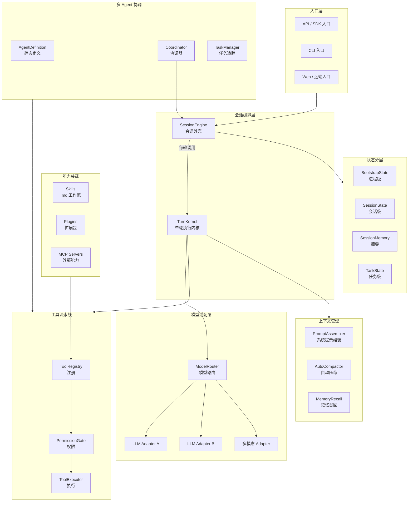
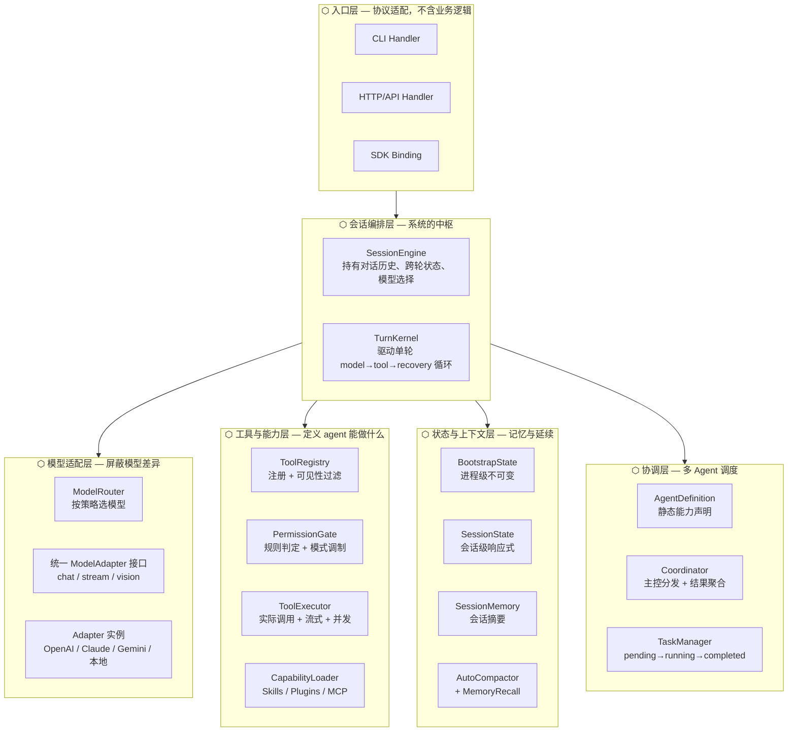
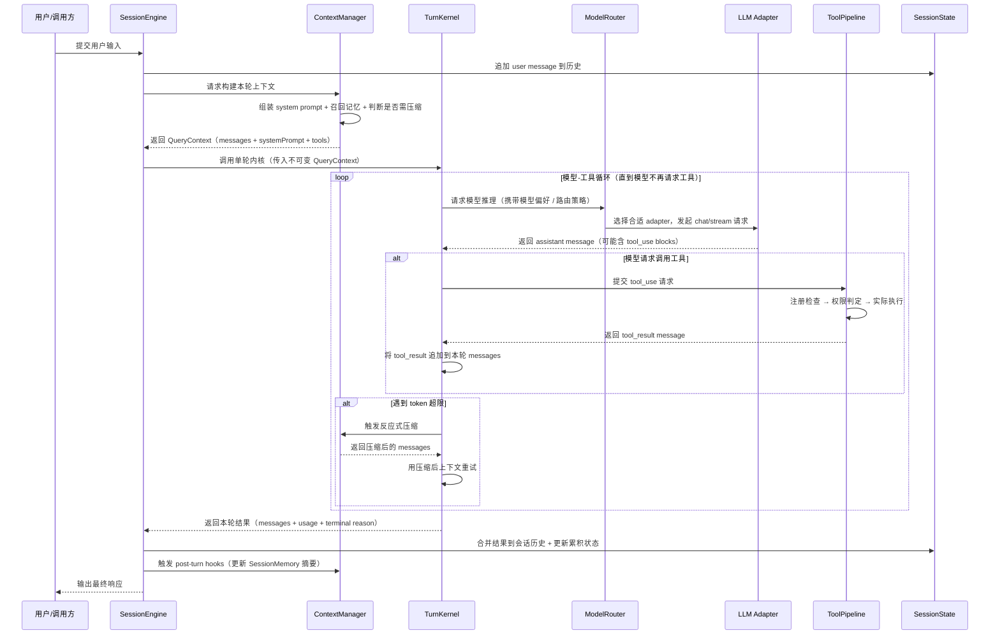
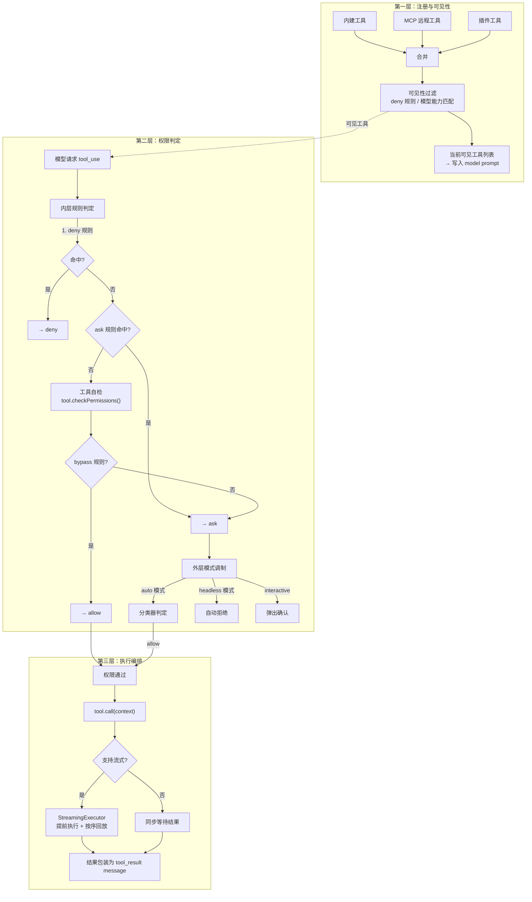
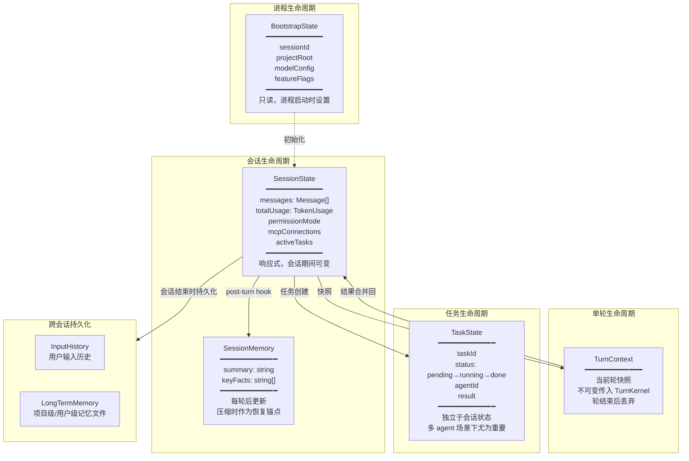
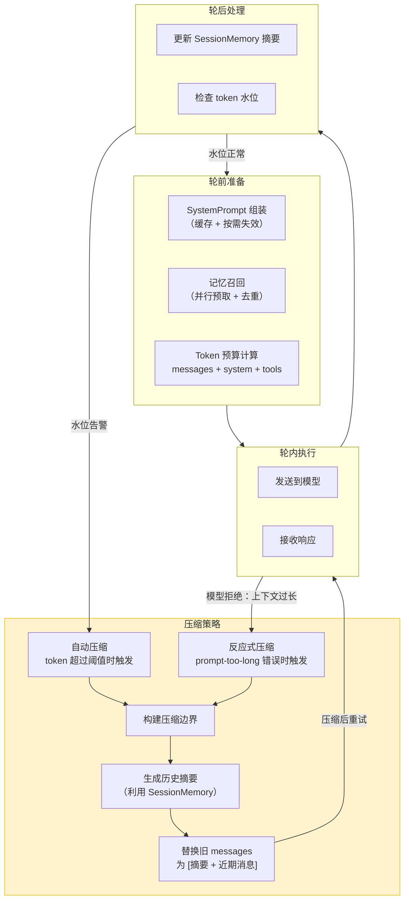
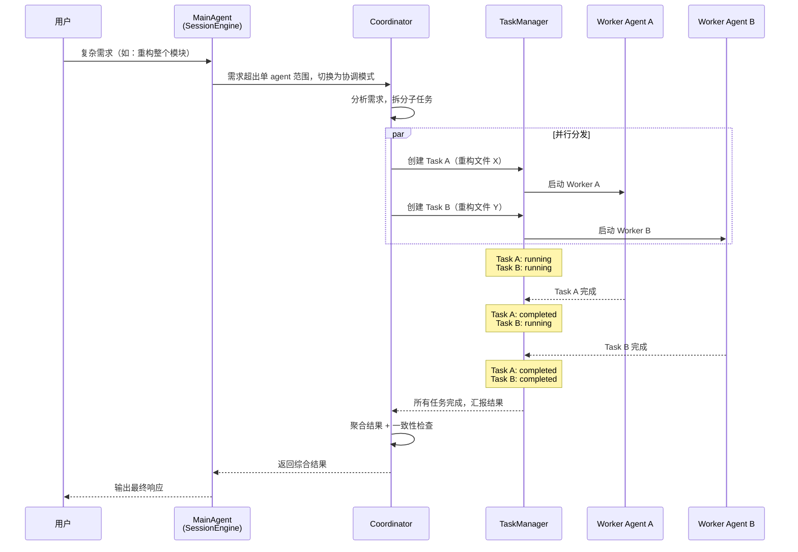
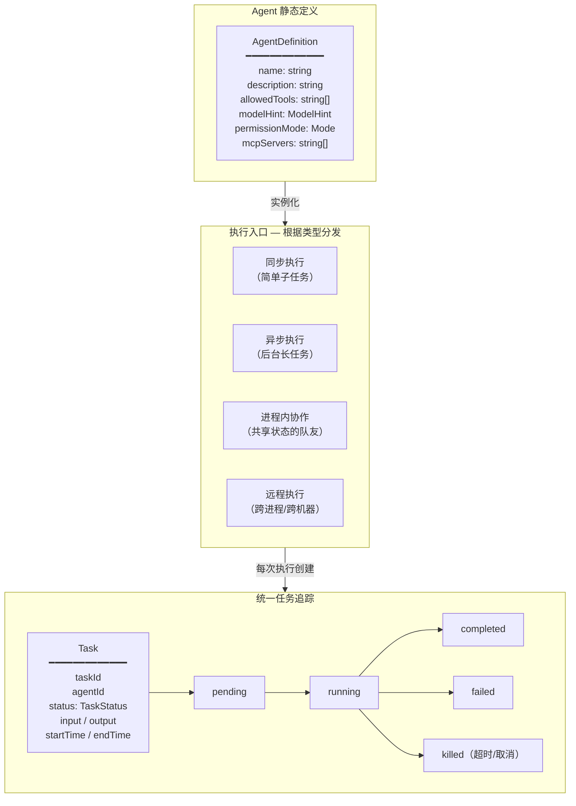
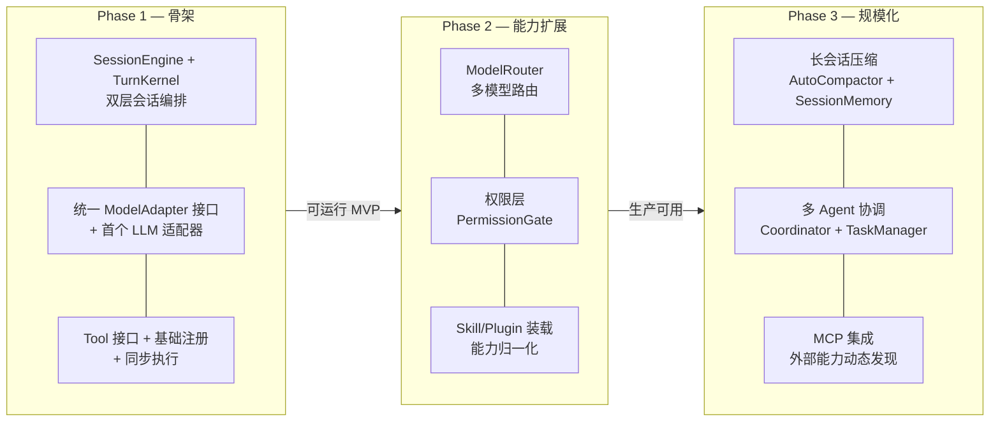

# Agent 系统架构设计参考

> 基于 claude-code 代码库的架构模式分析，为"对接多 LLM/多模态模型、处理文本需求、返回代码/Markdown"的 agent 系统提炼的设计参考。

---

## 1. 系统总体框图



## 2. 分层架构图



## 3. 核心链路：单轮请求处理



## 4. 模型适配层设计

```mermaid
flowchart LR
    subgraph TurnKernel
        REQ["推理请求<br/>{messages, tools, modelHint}"]
    end

    subgraph ModelRouter["ModelRouter — 路由决策"]
        Strategy["路由策略"]
        Strategy -->|"按任务类型"| TaskRoute["代码生成 → 强模型<br/>简单问答 → 轻模型<br/>图片理解 → 多模态模型"]
        Strategy -->|"按成本/延迟"| CostRoute["fast/balanced/quality"]
        Strategy -->|"按可用性"| Fallback["主模型不可用 → fallback"]
    end

    subgraph Adapters["统一 ModelAdapter 接口"]
        direction TB
        IF["interface ModelAdapter"]
        IF --- M1["chat(params): Message"]
        IF --- M2["stream(params): AsyncIterator"]
        IF --- M3["countTokens(messages): number"]
        IF --- M4["supportsTool(): boolean"]
        IF --- M5["supportsVision(): boolean"]
    end

    subgraph Implementations["适配器实现"]
        I1["ClaudeAdapter"]
        I2["OpenAIAdapter"]
        I3["GeminiAdapter"]
        I4["LocalModelAdapter"]
    end

    REQ --> ModelRouter
    ModelRouter --> Adapters
    Adapters --> Implementations
```



```
// 伪代码：统一模型接口
interface ModelAdapter {
  id: string
  chat(params: ChatParams): Promise<AssistantMessage>
  stream(params: ChatParams): AsyncIterable<StreamChunk>
  countTokens(messages: Message[]): Promise<number>
  maxContextTokens: number
  supportsTool: boolean
  supportsVision: boolean
}

interface ChatParams {
  messages: Message[]
  systemPrompt: string
  tools?: ToolDefinition[]
  temperature?: number
  maxOutputTokens?: number
}

// 路由器只负责选择，不负责调用细节
interface ModelRouter {
  resolve(hint: ModelHint, context: RoutingContext): ModelAdapter
}
```

## 5. 工具流水线详细设计



## 6. 状态分层与生命周期



## 7. 长会话上下文管理链路



```
// 伪代码：压缩决策
function checkCompaction(state: SessionState): CompactDecision {
  const usage = countTokens(state.messages)
  const budget = state.model.maxContextTokens

  if (usage > budget * 0.85) return { action: 'compact-now' }
  if (usage > budget * 0.70) return { action: 'compact-soon', turnsRemaining: 3 }
  return { action: 'none' }
}

function buildCompactedMessages(
  messages: Message[],
  sessionMemory: SessionMemory
): Message[] {
  const summary = sessionMemory.summary  // 已有的会话摘要
  const recentMessages = messages.slice(-N) // 保留最近 N 条
  return [
    { role: 'system', content: `[会话压缩边界] 此前的对话摘要：\n${summary}` },
    ...recentMessages
  ]
}
```

## 8. 多 Agent 协调链路





## 9. 推荐实现优先级路线图



## 10. 关键设计原则总结

| 原则 | 来自 claude-code 的实践 | 对你系统的意义 |
|------|------------------------|---------------|
| **会话与单轮分离** | QueryEngine 持有状态，query 无状态执行 | 换模型、加重试、做压缩都不影响会话管理 |
| **工具三层流水线** | 注册（可见性）→ 权限（安全）→ 执行（实际调用） | 三个关注点独立演进，安全策略不侵入工具实现 |
| **多源能力归一化** | Skills/Plugins/MCP 各自加载，在消费点汇聚 | 不同模型看到不同工具子集成为可能 |
| **状态按生命周期分层** | 进程级/会话级/任务级/跨会话，不混在一个 store | 避免状态纠缠，各层可独立测试和持久化 |
| **上下文主动管理** | 自动压缩 + 反应式压缩 + 摘要锚点 | 文本密集型输出必须有压缩策略 |
| **Agent 定义 ≠ 执行 ≠ 追踪** | 静态定义 → 执行入口 → Task 投影 | 解耦定义和运行时，支持多种执行模式 |
| **能力是多视角的** | 同一能力对用户是 Command、对模型是 Tool、对复用是 Skill | 避免 "这到底算什么" 的分类困境 |
