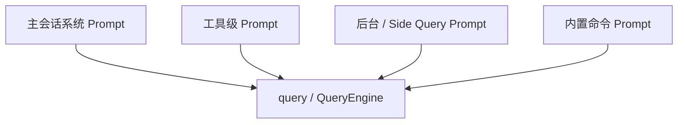

# Claude Code 内置提示词速查表

## 1. 文档目标

这份文档是 `built-in-prompts.md` 的一页速查入口，优先回答三个问题：

- Claude Code 的 prompt 控制面分成哪几层。
- 每层的主入口文件和典型场景是什么。
- 调试某类 prompt 问题时，第一站应该去哪里看。

如果你需要完整清单与细节，读 [built-in-prompts.md](./built-in-prompts.md)。如果你需要函数级调用链，读 [built-in-prompts-source-trace.md](./built-in-prompts-source-trace.md)。

## 2. 一页总览

可以把四层分别理解成：

- 主会话系统 prompt：Claude Code 的长期行为规则与会话环境。
- 工具级 prompt：每个工具的能力边界和调用契约。
- 后台 / Side Query prompt：摘要、记忆、命名、分类等窄任务的作业单。
- 内置命令 prompt：`/review`、`/commit`、`/init` 这类工作流模板。

## 3. 分层速查

| 层级 | 主入口 | 典型场景 | 解决的问题 |
| --- | --- | --- | --- |
| 主会话系统 Prompt | [src/constants/prompts.ts](../../src/constants/prompts.ts), [src/constants/systemPromptSections.ts](../../src/constants/systemPromptSections.ts), [src/utils/systemPrompt.ts](../../src/utils/systemPrompt.ts) | 每一轮主会话、REPL、SDK/bridge 共享前缀 | 定义 Claude Code 身份、工具原则、环境信息、记忆、语言、输出风格和会话特殊规则 |
| 工具级 Prompt | [src/tools](../../src/tools) 下各工具的 `prompt.ts`，经 [src/utils/api.ts](../../src/utils/api.ts) 转成 tool schema | 模型决定是否调用 Read / Edit / Bash / Agent / Skill 等工具时 | 告诉模型某个工具能做什么、如何做、何时不要做 |
| 后台 / Side Query Prompt | [src/services](../../src/services) 下各模块的 `prompts.ts` / `prompt.ts` | compact、memory extraction、tool summary、prompt suggestion、session rename、权限分类 | 把后台维护任务拆成单一目标的小 prompt，避免污染主会话 |
| 内置命令 Prompt | [src/commands](../../src/commands) 中带 `getPromptForCommand(...)` 的命令 | 用户执行 `/review`、`/commit`、`/init`、`/init-verifiers` 等命令 | 把一组专用工作流展开成当前会话或子会话中的 prompt 模板 |

## 4. 主会话层的关键入口

| 入口 | 作用 | 什么时候看 |
| --- | --- | --- |
| [src/constants/prompts.ts](../../src/constants/prompts.ts) `getSystemPrompt()` | 生成默认主系统 prompt 的静态和动态 section | 想知道 Claude Code 默认规则写了什么 |
| [src/constants/systemPromptSections.ts](../../src/constants/systemPromptSections.ts) | 解析和缓存动态 section | 怀疑某个会话级 section 没被拼进去或失效逻辑有问题 |
| [src/utils/systemPrompt.ts](../../src/utils/systemPrompt.ts) `buildEffectiveSystemPrompt()` | 决定 default/custom/append prompt 的优先级 | 怀疑用户自定义 prompt 覆盖关系不对 |
| [src/utils/queryContext.ts](../../src/utils/queryContext.ts) | 拉取 `defaultSystemPrompt`、`userContext`、`systemContext` | 非 REPL 路径、共享前缀或 side question fallback 异常 |
| [src/services/api/claude.ts](../../src/services/api/claude.ts) `buildSystemPromptBlocks()` | 把最终 prompt 转成 API `system` blocks | 想确认真正发给模型的结构 |

## 5. 工具层速查

按功能分组时，最常用的几簇是：

| 工具簇 | 代表入口 | 典型问题 |
| --- | --- | --- |
| 文件 / 代码访问 | [src/tools/FileReadTool](../../src/tools/FileReadTool), [src/tools/FileEditTool](../../src/tools/FileEditTool), [src/tools/FileWriteTool](../../src/tools/FileWriteTool) | 为什么模型优先用结构化读写，而不是直接用 shell |
| 搜索 / 发现 | [src/tools/GlobTool](../../src/tools/GlobTool), [src/tools/GrepTool](../../src/tools/GrepTool), [src/tools/ToolSearchTool](../../src/tools/ToolSearchTool) | 为什么某个文件、符号或 deferred tool 没被正确发现 |
| Shell / 环境 | [src/tools/BashTool](../../src/tools/BashTool), [src/tools/ConfigTool](../../src/tools/ConfigTool) | 为什么某类 shell 动作被允许或被限制 |
| 计划 / 任务 | [src/tools/TodoWriteTool](../../src/tools/TodoWriteTool), [src/tools/EnterPlanModeTool](../../src/tools/EnterPlanModeTool), [src/tools/TaskCreateTool](../../src/tools/TaskCreateTool) | 为什么模型会先计划、记 TODO 或创建任务 |
| 协作 / 多代理 | [src/tools/AgentTool](../../src/tools/AgentTool), [src/tools/SkillTool](../../src/tools/SkillTool), [src/tools/AskUserQuestionTool](../../src/tools/AskUserQuestionTool) | 为什么会 fork agent、命中 skill 或主动向用户提问 |

## 6. 后台任务层速查

| 任务类型 | prompt builder 入口 | 模型调用通道 |
| --- | --- | --- |
| Session memory 更新 | [src/services/SessionMemory/prompts.ts](../../src/services/SessionMemory/prompts.ts) | `runForkedAgent(...)` |
| Magic Docs 更新 | [src/services/MagicDocs/prompts.ts](../../src/services/MagicDocs/prompts.ts) | `runAgent(...)` |
| Compact / partial compact | [src/services/compact/prompt.ts](../../src/services/compact/prompt.ts) | `queryModelWithStreaming(...)` |
| Prompt suggestion | [src/services/PromptSuggestion/promptSuggestion.ts](../../src/services/PromptSuggestion/promptSuggestion.ts) | `runForkedAgent(...)` |
| Tool use summary | [src/services/toolUseSummary/toolUseSummaryGenerator.ts](../../src/services/toolUseSummary/toolUseSummaryGenerator.ts) | `queryHaiku(...)` |
| Session 自动命名 | [src/commands/rename/generateSessionName.ts](../../src/commands/rename/generateSessionName.ts) | `queryHaiku(...)` |
| Auto mode 权限分类 | [src/utils/permissions/yoloClassifier.ts](../../src/utils/permissions/yoloClassifier.ts) | `sideQuery(...)` |

这一层的重点不是“内容多复杂”，而是“它们都不应该直接塞进主系统 prompt”。

## 7. 内置命令层速查

| 命令 | 入口 | 典型场景 |
| --- | --- | --- |
| `/review` | [src/commands/review.ts](../../src/commands/review.ts) | 本地 PR review 工作流 |
| `/commit` | [src/commands/commit.ts](../../src/commands/commit.ts) | 受控 commit 工作流 |
| `/commit-push-pr` | [src/commands/commit-push-pr.ts](../../src/commands/commit-push-pr.ts) | commit + push + PR 一体化工作流 |
| `/init` | [src/commands/init.ts](../../src/commands/init.ts) | 初始化 `CLAUDE.md`、local instructions、hooks |
| `/init-verifiers` | [src/commands/init-verifiers.ts](../../src/commands/init-verifiers.ts) | 生成 verifier skill |
| `/insights` | [src/commands/insights.ts](../../src/commands/insights.ts) | usage insights 和报告生成 |

这层的关键事实是：slash command prompt 一般不会直接变成系统 prompt，而是先被包装成消息，再进入下一轮 `query(...)`。

## 8. 五种最短排查路径

1. Claude Code 的整体行为不对：从 [src/constants/prompts.ts](../../src/constants/prompts.ts) 开始，再看 [src/utils/systemPrompt.ts](../../src/utils/systemPrompt.ts)。
2. 某个工具说明不对：从对应工具目录的 `prompt.ts` 开始，再看 [src/utils/api.ts](../../src/utils/api.ts)。
3. `/command` 工作流不对：从 [src/utils/processUserInput/processSlashCommand.tsx](../../src/utils/processUserInput/processSlashCommand.tsx) 开始，再追到对应命令文件。
4. 后台摘要、记忆、自动命名不对：从对应 [src/services](../../src/services) 子目录的 `prompt.ts` / `prompts.ts` 开始。
5. 如果问题其实是 built-in agents 或 bundled skills，不要继续在本页兜圈子，直接看 [built-in-agents.md](./built-in-agents.md) 和 [built-in-skills.md](./built-in-skills.md)。

## 9. 与其它文档的关系

- 完整 prompt 清单：见 [built-in-prompts.md](./built-in-prompts.md)
- 函数级调用链：见 [built-in-prompts-source-trace.md](./built-in-prompts-source-trace.md)
- built-in agents：见 [built-in-agents.md](./built-in-agents.md)
- bundled skills：见 [built-in-skills.md](./built-in-skills.md)
- 缺失 markdown 资源的逐文件补充：见 [built-in-skills-missing-resource/README.md](./built-in-skills-missing-resource/README.md)