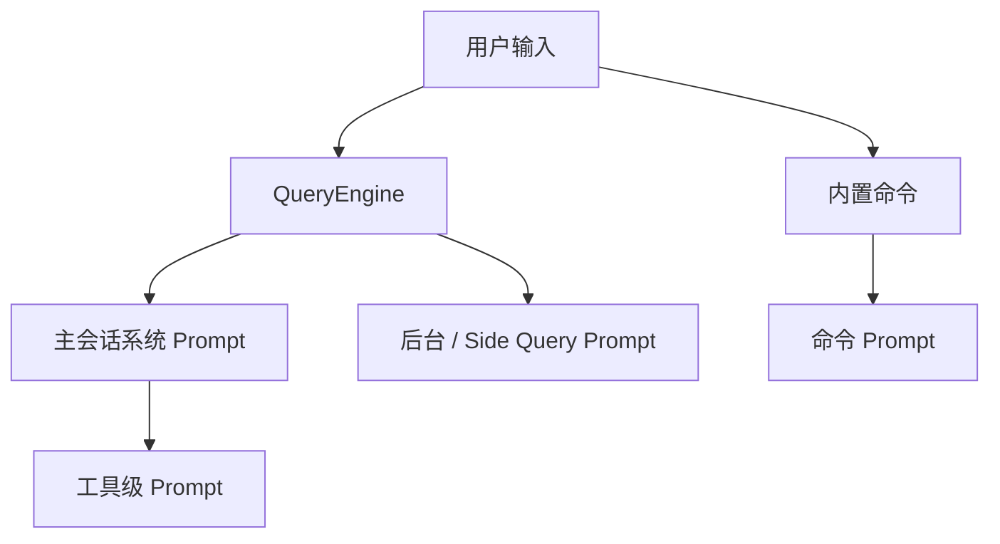

# Claude Code 内置提示词清单

## 1. 文档目标

这份文档只盘点 `src/` 中真正会进入模型上下文的**内置 prompt**，并回答三个问题：

- 它们定义在什么地方。
- 它们在什么场景下工作。
- 它们分别试图解决什么问题。

这里的“内置提示词”只统计两类内容：

1. 会作为 `systemPrompt`、`userPrompt`、`createUserMessage(...content...)` 或工具描述文本发给模型的字符串或模板。
2. 会在运行时被 Claude Code 自动拼进主会话、子查询、后台任务或内置命令执行链的提示词源。

边界说明：

- **built-in agents** 与 **bundled skills** 在本仓库里确实各自携带 prompt 内容，但它们更适合作为“能力面”而不是“prompt 分层”来梳理。
- 因此它们不再并入本页的 prompt 分层；分别见 [built-in-agents.md](./built-in-agents.md) 与 [built-in-skills.md](./built-in-skills.md)。

配套文档：

- 如果只想先看一页速查入口，读 [built-in-prompts-quick-reference.md](./built-in-prompts-quick-reference.md)。
- 如果要顺着函数调用追到模型请求，读 [built-in-prompts-source-trace.md](./built-in-prompts-source-trace.md)。
- 如果要看 built-in agents 的原始细节，读 [built-in-agents.md](./built-in-agents.md)。
- 如果要看 bundled skills 的原始细节，读 [built-in-skills.md](./built-in-skills.md)。

## 2. 提示词系统 Overview

可以把 Claude Code 的 prompt 系统理解成四层：

- **主会话系统 prompt**：像操作系统内核规则，定义 Claude Code 的身份、行为边界、工具使用原则和环境上下文。
- **工具级 prompt**：像每个设备的说明书，告诉模型某个工具能做什么、怎么做、何时不要做。
- **后台 / Side Query prompt**：像 sidecar worker 的作业单，专门服务摘要、记忆提取、自动命名、自动分类等窄任务。
- **内置命令 prompt**：像工作流宏；当用户调用内置 prompt 命令时，CLI 会把一个专用 prompt 展开进当前会话或子会话。

核心装配链路如下：

- [src/QueryEngine.ts](../../src/QueryEngine.ts) 负责每一轮会话的上下文准备与提交。
- [src/utils/queryContext.ts](../../src/utils/queryContext.ts) 负责拉取系统 prompt、用户上下文和系统上下文。
- [src/constants/prompts.ts](../../src/constants/prompts.ts) 负责构建默认主系统 prompt。
- [src/constants/systemPromptSections.ts](../../src/constants/systemPromptSections.ts) 负责把动态 section 做缓存与失效控制。
- [src/utils/systemPrompt.ts](../../src/utils/systemPrompt.ts) 负责在默认 prompt、custom prompt、append prompt 等候选之间决定最终生效版本。

## 3. 主会话系统 Prompt

### 3.1 主链路

主会话 prompt 的根入口是 [src/constants/prompts.ts](../../src/constants/prompts.ts) 中的 `getSystemPrompt()`。它先拼接稳定的静态 section，再在 `SYSTEM_PROMPT_DYNAMIC_BOUNDARY` 之后挂入会话级动态 section。最终结果再由 [src/utils/systemPrompt.ts](../../src/utils/systemPrompt.ts) 的 `buildEffectiveSystemPrompt()` 做优先级合并。

### 3.2 主系统 prompt 清单

| Section / Prompt 源 | 主要源码入口 | 工作场景 | 解决的问题 |
| --- | --- | --- | --- |
| 简介与身份 framing | [src/constants/prompts.ts](../../src/constants/prompts.ts) `getSimpleIntroSection()` | 每一轮主会话都会带上 | 定义 Claude Code 的基本身份、交互目标与 URL 安全边界 |
| System 基础规则 | [src/constants/prompts.ts](../../src/constants/prompts.ts) `getSimpleSystemSection()` | 每一轮主会话 | 统一说明工具结果、系统提醒、prompt injection、hooks、长上下文压缩等基础行为 |
| Doing tasks 行为准则 | [src/constants/prompts.ts](../../src/constants/prompts.ts) `getSimpleDoingTasksSection()` | 默认主会话；部分 output style 会保留 | 约束不要过度设计、不要瞎补错误处理、先读代码再改、准确汇报验证结果 |
| 高风险动作确认规则 | [src/constants/prompts.ts](../../src/constants/prompts.ts) `getActionsSection()` | 每一轮主会话 | 把“哪些动作要先征求用户确认”明确化，降低 destructive action 风险 |
| 通用工具使用原则 | [src/constants/prompts.ts](../../src/constants/prompts.ts) `getUsingYourToolsSection()` | 按当前启用工具集动态生成 | 把“优先用专用工具、并行发工具调用、不要滥用 Bash”等规则注入主会话 |
| 语气与引用风格 | [src/constants/prompts.ts](../../src/constants/prompts.ts) `getSimpleToneAndStyleSection()` | 每一轮主会话 | 限制冗长输出、约束代码引用风格与工具调用前的文本表述 |
| 输出效率规则 | [src/constants/prompts.ts](../../src/constants/prompts.ts) `getOutputEfficiencySection()` | 每一轮主会话 | 抑制废话，控制状态更新与最终回复长度 |
| Session-specific guidance | [src/constants/prompts.ts](../../src/constants/prompts.ts) `getSessionSpecificGuidanceSection()` | 会话里启用了 AskUserQuestion、ToolSearch、verification flow 等能力时 | 告诉模型当前会话有哪些特殊能力，以及何时该用提问、搜索或验证流程 |
| Memory section | [src/constants/prompts.ts](../../src/constants/prompts.ts), [src/memdir/memdir.ts](../../src/memdir/memdir.ts), [src/memdir/teamMemPrompts.ts](../../src/memdir/teamMemPrompts.ts), [src/utils/claudemd.ts](../../src/utils/claudemd.ts) | 开启 auto memory、team memory、CLAUDE.md 时 | 把长期记忆、团队记忆、CLAUDE.md 或 CLAUDE.local.md 指令和记忆写入规则装进主会话 |
| Ant model override | [src/constants/prompts.ts](../../src/constants/prompts.ts) `getAntModelOverrideSection()` | Ant 内部构建且满足条件时 | 给内部构建追加 build-specific 系统后缀 |
| Environment section | [src/constants/prompts.ts](../../src/constants/prompts.ts) `computeSimpleEnvInfo()` | 每一轮主会话 | 告诉模型 cwd、git 或 worktree、平台、shell、模型、知识截止时间，减少环境假设错误 |
| Language section | [src/constants/prompts.ts](../../src/constants/prompts.ts) `getLanguageSection()` | 用户设置了语言偏好时 | 强制模型用指定语言与用户沟通 |
| Output style section | [src/constants/prompts.ts](../../src/constants/prompts.ts) `getOutputStyleSection()` | 用户启用了输出风格配置时 | 把可配置的回答风格注入主会话 |
| MCP instructions | [src/constants/prompts.ts](../../src/constants/prompts.ts) `getMcpInstructionsSection()` | 有已连接 MCP server 且其声明了 instructions 时 | 将 MCP 服务端提供的使用说明拼进主 prompt，帮助模型正确调用外部工具或资源 |
| Scratchpad instructions | [src/constants/prompts.ts](../../src/constants/prompts.ts) | scratchpad 功能启用时 | 提示模型如何使用 scratchpad 目录作为临时思考或中间产物空间 |
| Function result clearing | [src/constants/prompts.ts](../../src/constants/prompts.ts) | 每轮主会话，依模型或模式而定 | 约束模型如何处理函数结果与上下文清理，减少工具结果污染后续生成 |
| Summarize tool results | [src/constants/prompts.ts](../../src/constants/prompts.ts) | 每轮主会话 | 提醒模型将大批工具结果压成对用户有用的摘要，而不是原样转述 |
| Numeric length anchors | [src/constants/prompts.ts](../../src/constants/prompts.ts) | Ant 内部构建 | 用显式数字上限约束工具间文本和最终回复长度 |
| Token budget section | [src/constants/prompts.ts](../../src/constants/prompts.ts) | 打开 token budget 功能时 | 告诉模型把用户给定的 token 预算当作硬目标，而不是建议值 |
| Brief section | [src/constants/prompts.ts](../../src/constants/prompts.ts) 与 [src/tools/BriefTool/prompt.ts](../../src/tools/BriefTool/prompt.ts) | KAIROS / KAIROS_BRIEF 模式 | 给“直接向用户发消息”这条通信通道补专门规则 |
| Proactive prompt 变体 | [src/constants/prompts.ts](../../src/constants/prompts.ts) | PROACTIVE / KAIROS 激活时 | 把主 prompt 切成更轻的 autonomous-agent 版本，服务主动执行模式 |

### 3.3 主系统 prompt 内容摘要

下表不复述完整字符串，而是把真正写进 prompt 的行为约束抽出来：

| 关键 section | 实际内容要点 |
| --- | --- |
| `getSimpleIntroSection()` | 把 Claude Code 定义为“interactive agent”，要求用现有工具完成软件工程任务，并附带 `CYBER_RISK_INSTRUCTION`；同时明确禁止为用户臆造 URL，除非确信 URL 是在帮助用户处理编程问题。 |
| `getSimpleSystemSection()` | 说明“工具外文本都是用户可见输出”；工具运行在 permission mode 下，被拒绝后不能盲目重试；`<system-reminder>` 标签是系统注入信息；若怀疑工具结果存在 prompt injection，要先显式提醒用户；hooks 反馈视为系统输入；会话会自动压缩。 |
| `getSimpleDoingTasksSection()` | 要求把用户的模糊需求具体落到代码操作；先读后改；优先编辑已有文件，不要泛滥新建；不要给时间预估；失败后先诊断再换策略；写安全代码；不要过度抽象、过度注释、过度兼容；验证结果必须如实汇报，不能把失败说成成功。 |
| `getActionsSection()` | 高风险、难回滚、会影响共享状态的动作默认先确认；不要用 destructive action 作为捷径；发现陌生文件、锁、分支或冲突时要先调查根因，再决定如何处理。 |
| `getUsingYourToolsSection()` | 明确优先用 Read、Edit、Write、Glob、Grep 这类专用工具，而不是 Bash；如果有 Todo 或 Task 工具，要显式维护任务推进；独立工具调用应尽量并行。 |
| `getSessionSpecificGuidanceSection()` | 会按当前会话能力补充细则：工具被拒但原因不明时用 AskUserQuestion；需要用户自己执行命令时提示 `! <command>`；Explore 和 verification 这类流程会通过会话级指导暴露给主模型，但具体 agent 本身改在独立文档梳理。 |
| `getOutputEfficiencySection()` | 用户可见文本要像对人汇报而不是写日志；第一次工具调用前先简短说明动作；工作中只在关键节点给短更新；专家用户可以更简洁，新手用户则更解释；同时又要求删掉 filler，优先给行动和结论。 |
| `getSimpleToneAndStyleSection()` | 默认不用 emoji；引用代码位置时使用 `file_path:line_number` 形式；GitHub 问题和 PR 用 `owner/repo#123`；工具调用前不要写冒号式铺垫。 |
| 动态上下文 sections | `Environment` 会注入 cwd、平台、shell、模型等事实；`Memory` 会拼入 auto memory、team memory、CLAUDE.md 规则；`Language`、`Output Style`、`MCP instructions`、`Token budget` 等则按设置或连接状态追加当前会话特定约束。 |

## 4. 工具级 Prompt 清单

这层 prompt 的共同特征是：**不是单独回答用户问题，而是告诉模型“某个工具的能力边界、输入约束、优先使用方式和禁用方式”**。这些提示词大多位于 `src/tools/**/prompt.ts`，会被拼进主会话的工具描述或工具 schema 中。

### 4.1 文件与代码访问类

| Prompt 源 | 工作场景 | 解决的问题 |
| --- | --- | --- |
| [src/tools/FileReadTool/prompt.ts](../../src/tools/FileReadTool/prompt.ts) | 需要读取本地文件、图片、PDF、notebook 时 | 用结构化读文件替代 shell `cat` 或 `sed`，并明确绝对路径、行号、分页限制 |
| [src/tools/FileWriteTool/prompt.ts](../../src/tools/FileWriteTool/prompt.ts) | 需要创建或覆盖本地文件时 | 用结构化写文件替代 heredoc 或重定向，降低误写风险 |
| [src/tools/FileEditTool/prompt.ts](../../src/tools/FileEditTool/prompt.ts) | 需要在已有文件中做 patch 式编辑时 | 用结构化编辑替代 shell 文本处理，保留更强的可审查性 |
| [src/tools/NotebookEditTool/prompt.ts](../../src/tools/NotebookEditTool/prompt.ts) | 需要编辑 Jupyter notebook cell 时 | 给 notebook 场景提供 cell 级编辑协议，而不是把 notebook 当普通文本乱改 |
| [src/tools/GlobTool/prompt.ts](../../src/tools/GlobTool/prompt.ts) | 需要按路径模式找文件时 | 用快速文件匹配替代 `find` 或 `ls` |
| [src/tools/GrepTool/prompt.ts](../../src/tools/GrepTool/prompt.ts) | 需要按文本内容找代码时 | 用结构化内容搜索替代直接 shell grep |
| [src/tools/LSPTool/prompt.ts](../../src/tools/LSPTool/prompt.ts) | 需要 definitions、references、type info 时 | 给模型语言服务视角，而不靠模糊字符串搜索猜代码关系 |

### 4.2 Web、资源与延迟工具发现类

| Prompt 源 | 工作场景 | 解决的问题 |
| --- | --- | --- |
| [src/tools/WebFetchTool/prompt.ts](../../src/tools/WebFetchTool/prompt.ts) | 需要抓取指定网页正文时 | 让模型读取网页内容而不是直接猜网站信息 |
| [src/tools/WebSearchTool/prompt.ts](../../src/tools/WebSearchTool/prompt.ts) | 需要做 Web 搜索时 | 给模型明确的联网搜索入口 |
| [src/tools/ToolSearchTool/prompt.ts](../../src/tools/ToolSearchTool/prompt.ts) | deferred tool 只公布了名字但没加载完整 schema 时 | 让模型按名称或关键词拉取延迟加载工具的完整 schema，再进行调用 |
| [src/tools/ListMcpResourcesTool/prompt.ts](../../src/tools/ListMcpResourcesTool/prompt.ts) | 需要先查看某个 MCP server 暴露了哪些资源时 | 把 MCP resource 访问拆成 list 和 read 两步，避免盲读 |
| [src/tools/ReadMcpResourceTool/prompt.ts](../../src/tools/ReadMcpResourceTool/prompt.ts) | 已知道资源 ID 或先 list 过资源时 | 让模型读取 MCP resource 的实际内容 |

### 4.3 Shell、环境与配置类

| Prompt 源 | 工作场景 | 解决的问题 |
| --- | --- | --- |
| [src/tools/BashTool/prompt.ts](../../src/tools/BashTool/prompt.ts) | 需要执行 shell 命令、git、系统命令时 | 约束 Bash 的使用边界、超时、后台任务、git 安全协议、sandbox 信息 |
| [src/tools/PowerShellTool/prompt.ts](../../src/tools/PowerShellTool/prompt.ts) | Windows 或 PowerShell 场景 | 提供 PowerShell 特定执行说明 |
| [src/tools/SleepTool/prompt.ts](../../src/tools/SleepTool/prompt.ts) | 需要显式等待某段时间时 | 用结构化等待代替随意 shell `sleep` |
| [src/tools/ConfigTool/prompt.ts](../../src/tools/ConfigTool/prompt.ts) | 需要查看或修改 Claude Code 配置时 | 给模型一个受控配置入口，而不是直接瞎改 settings 文件 |
| [src/tools/MCPTool/prompt.ts](../../src/tools/MCPTool/prompt.ts) | 需要通用调用 MCP 工具时 | 作为 MCP 工具调用的统一描述层 |

### 4.4 计划、任务与执行节奏类

| Prompt 源 | 工作场景 | 解决的问题 |
| --- | --- | --- |
| [src/tools/TodoWriteTool/prompt.ts](../../src/tools/TodoWriteTool/prompt.ts) | 需要维护简化的 TODO 列表时 | 让模型显式记录与更新当前任务分解 |
| [src/tools/TaskCreateTool/prompt.ts](../../src/tools/TaskCreateTool/prompt.ts) | coordinator 或 task 系统需要创建任务时 | 提供结构化任务创建入口 |
| [src/tools/TaskGetTool/prompt.ts](../../src/tools/TaskGetTool/prompt.ts) | 需要读取某个任务详情时 | 用 ID 定位已有任务 |
| [src/tools/TaskListTool/prompt.ts](../../src/tools/TaskListTool/prompt.ts) | 需要查看任务清单时 | 把任务状态显式化 |
| [src/tools/TaskUpdateTool/prompt.ts](../../src/tools/TaskUpdateTool/prompt.ts) | 需要更新任务状态或描述时 | 让任务推进可追踪 |
| [src/tools/TaskStopTool/prompt.ts](../../src/tools/TaskStopTool/prompt.ts) | 需要停止任务时 | 给任务生命周期提供中止入口 |
| [src/tools/EnterPlanModeTool/prompt.ts](../../src/tools/EnterPlanModeTool/prompt.ts) | 即将进行非 trivial implementation 时 | 把“先调研、先出方案、再拿用户确认”制度化 |
| [src/tools/ExitPlanModeTool/prompt.ts](../../src/tools/ExitPlanModeTool/prompt.ts) | 已经完成 plan mode 方案整理时 | 明确“何时结束计划阶段并请求用户审批” |

### 4.5 协作、提问与多代理类

| Prompt 源 | 工作场景 | 解决的问题 |
| --- | --- | --- |
| [src/tools/AgentTool/prompt.ts](../../src/tools/AgentTool/prompt.ts) | 需要把复杂任务委派给 subagent 或 fork 时 | 规定何时该 fork、如何写 agent prompt、何时不要用 agent；它是 agent 调度说明，不是各个 agent 本身的内容 |
| [src/tools/SkillTool/prompt.ts](../../src/tools/SkillTool/prompt.ts) | 需要执行 slash skill 时 | 强制“命中 skill 就先调用 SkillTool”，并解释 skill 是如何被加载的；它不是 skills 列表本体 |
| [src/tools/AskUserQuestionTool/prompt.ts](../../src/tools/AskUserQuestionTool/prompt.ts) | 需要结构化向用户提问时 | 让模型用少量、可选项化的问题补足缺失信息 |
| [src/tools/SendMessageTool/prompt.ts](../../src/tools/SendMessageTool/prompt.ts) | 需要向其他 agent 发消息时 | 提供多代理之间的消息桥 |
| [src/tools/BriefTool/prompt.ts](../../src/tools/BriefTool/prompt.ts) | KAIROS 模式需要直接向用户发送消息时 | 把“用户可见消息”从通用 assistant 输出里单独抽象出来 |
| [src/tools/TeamCreateTool/prompt.ts](../../src/tools/TeamCreateTool/prompt.ts) | 需要创建 team 或 agent group 时 | 让多 agent 团队形成结构化实体 |
| [src/tools/TeamDeleteTool/prompt.ts](../../src/tools/TeamDeleteTool/prompt.ts) | 需要删除 team 或 agent group 时 | 给团队生命周期提供回收入口 |

### 4.6 工作区、远程与调度类

| Prompt 源 | 工作场景 | 解决的问题 |
| --- | --- | --- |
| [src/tools/EnterWorktreeTool/prompt.ts](../../src/tools/EnterWorktreeTool/prompt.ts) | 需要切进某个 git worktree 中工作时 | 把 worktree 进入动作结构化 |
| [src/tools/ExitWorktreeTool/prompt.ts](../../src/tools/ExitWorktreeTool/prompt.ts) | 需要退出 worktree 时 | 安全结束 worktree 上下文 |
| [src/tools/RemoteTriggerTool/prompt.ts](../../src/tools/RemoteTriggerTool/prompt.ts) | 需要创建或管理远程触发器时 | 为远程 Claude 会话调度提供统一调用入口 |
| [src/tools/ScheduleCronTool/prompt.ts](../../src/tools/ScheduleCronTool/prompt.ts) | 需要创建、删除、列出 cron 触发任务时 | 给定时执行 prompt 的低层调度接口 |

## 5. 后台与 Side Query Prompt

这层 prompt 不直接服务主对话，而是服务“后台维护、摘要、记忆、分类、推荐”这类窄任务。它们通常通过 `sideQuery(...)`、`queryHaiku(...)`、`queryModelWithoutStreaming(...)` 或 `runForkedAgent(...)` 单独发给模型。

### 5.1 会话维护、记忆与摘要类

| Prompt 源 | 工作场景 | 解决的问题 |
| --- | --- | --- |
| [src/services/SessionMemory/prompts.ts](../../src/services/SessionMemory/prompts.ts) | 需要更新 session memory 文件时 | 指挥后台 agent 只用 Edit 更新会话笔记，并严格保留模板结构 |
| [src/services/MagicDocs/prompts.ts](../../src/services/MagicDocs/prompts.ts) | 需要更新某份 Magic Doc 时 | 指挥后台 agent 用“保持当前文档、就地更新、只保留高信号架构信息”的方式维护文档 |
| [src/services/extractMemories/prompts.ts](../../src/services/extractMemories/prompts.ts) | stop hook 之后自动提取记忆时 | 告诉 memory extraction subagent 只基于最近消息更新 auto 或 team memory |
| [src/services/compact/prompt.ts](../../src/services/compact/prompt.ts) | 主会话上下文过长，需要 compact 时 | 生成详细摘要，让长会话能继续且不丢失关键上下文 |
| [src/services/autoDream/consolidationPrompt.ts](../../src/services/autoDream/consolidationPrompt.ts) | auto dream 或 memory consolidation 时 | 对记忆目录做“睡眠式归档、合并、清理和索引修复” |
| [src/memdir/findRelevantMemories.ts](../../src/memdir/findRelevantMemories.ts) | 需要从 memory headers 中挑选最相关记忆时 | 用小模型把大量记忆文件筛到最多 5 个真正相关项 |
| [src/services/toolUseSummary/toolUseSummaryGenerator.ts](../../src/services/toolUseSummary/toolUseSummaryGenerator.ts) | SDK 或移动端需要为一批工具调用生成单行摘要时 | 把多工具执行结果压成短标签 |
| [src/services/awaySummary.ts](../../src/services/awaySummary.ts) | 用户短暂离开后回到会话时 | 生成 1 到 3 句“while you were away” 回顾 |
| [src/services/AgentSummary/agentSummary.ts](../../src/services/AgentSummary/agentSummary.ts) | coordinator mode 下需要轮询子 agent 进展时 | 让后台 fork 定期生成 3 到 5 词的 progress label |
| [src/services/PromptSuggestion/promptSuggestion.ts](../../src/services/PromptSuggestion/promptSuggestion.ts) | prompt suggestion 功能开启时 | 猜测“用户下一句最可能输入什么”，提升交互续写效率 |

### 5.2 分类、命名与专用生成类

| Prompt 源 | 工作场景 | 解决的问题 |
| --- | --- | --- |
| [src/commands/rename/generateSessionName.ts](../../src/commands/rename/generateSessionName.ts) | 自动为会话生成简短标题时 | 把整段对话压缩成 2 到 4 词的 kebab-case session name |
| [src/utils/permissions/yoloClassifier.ts](../../src/utils/permissions/yoloClassifier.ts) | auto mode 需要判断某次工具调用该自动放行还是阻止时 | 用“基座系统 prompt + 权限规则模板 + 用户自定义覆盖”构建分类器 prompt，做安全决策 |
| [src/cli/handlers/autoMode.ts](../../src/cli/handlers/autoMode.ts) | 用户运行 `claude auto-mode critique` 时 | 让模型审查用户自定义 auto mode 规则是否清晰、完整、互相冲突 |
| [src/components/Feedback.tsx](../../src/components/Feedback.tsx) | 生成 GitHub issue 标题时 | 把较长的 bug 描述压成公开 issue 能直接使用的技术标题 |

> 说明：`yoloClassifier.ts` 会加载 build-time 文本模板（`auto_mode_system_prompt.txt` 与 `permissions_*.txt`），但这些原始文本文件在当前 workspace 快照里不可直接读取；因此这里以 loader 文件 [src/utils/permissions/yoloClassifier.ts](../../src/utils/permissions/yoloClassifier.ts) 作为可验证来源。

## 6. 内置命令 Prompt

内置 prompt 命令的模式是：用户调用 slash command，命令实现通过 `getPromptForCommand(...)` 返回一段 prompt 文本，再让当前会话继续执行这个专用工作流。

| 命令 | 主要源码入口 | 工作场景 | 解决的问题 |
| --- | --- | --- | --- |
| `/review` | [src/commands/review.ts](../../src/commands/review.ts) | 需要本地 review 某个 PR 时 | 展开出一个本地 GitHub PR review prompt，驱动 `gh pr` 查询、diff 分析和代码审查输出 |
| `/commit` | [src/commands/commit.ts](../../src/commands/commit.ts) | 用户明确要求创建 commit 时 | 把 git 安全协议、提交信息写法和允许工具范围封装成一次性 prompt |
| `/commit-push-pr` | [src/commands/commit-push-pr.ts](../../src/commands/commit-push-pr.ts) | 用户要一口气 commit、push、开 PR 时 | 把分支、提交、推送、PR body、reviewer、Slack 后续动作整合成受控工作流 |
| `/init` | [src/commands/init.ts](../../src/commands/init.ts) | 需要初始化 CLAUDE.md、CLAUDE.local.md、hooks 时 | 把“先访谈、再扫仓库、再提案、再落文件”的初始化流程模板化 |
| `/init-verifiers` | [src/commands/init-verifiers.ts](../../src/commands/init-verifiers.ts) | 需要给项目创建 verifier 流程时 | 先自动识别项目形态，再引导用户配置 Playwright、API、CLI verifier 流程 |
| `/insights` | [src/commands/insights.ts](../../src/commands/insights.ts) | 需要生成 Claude Code 使用报告时 | 内部会继续触发多组分析 prompt，对会话做分面提取、分块摘要和最终报告生成 |
| `/ultraplan` | [src/commands/ultraplan.tsx](../../src/commands/ultraplan.tsx) | 需要在 Claude Code on the web 中做大规模远程规划时 | 加载一份远程 planning prompt，把本地任务引导到 CCR 规划通道 |

## 7. 其它会进入模型的分析 Prompt

有些文件不是“独立命令”，但内部确实定义了专用 prompt，然后在执行过程中调用模型：

| Prompt 源 | 工作场景 | 解决的问题 |
| --- | --- | --- |
| [src/commands/insights.ts](../../src/commands/insights.ts) `FACET_EXTRACTION_PROMPT` | 生成 usage insights 时 | 把长会话转成结构化 usage facets |
| [src/commands/insights.ts](../../src/commands/insights.ts) `SUMMARIZE_CHUNK_PROMPT` | transcript 太长需先分块概括时 | 把超长转录切成块后做局部摘要 |
| [src/commands/insights.ts](../../src/commands/insights.ts) `atAGlancePrompt` | 生成最终 “At a Glance” 区块时 | 把结构化统计转成人类可读的四段式总结 |

## 8. 排除项

下面这些名字里虽然也带 `prompt`，但**不计入本清单**：

| 不计入项 | 代表源码入口 | 原因 |
| --- | --- | --- |
| built-in agents 与 bundled skills 的能力清单 | [src/tools/AgentTool/built-in/](../../src/tools/AgentTool/built-in), [src/skills/bundled/](../../src/skills/bundled) | 它们单独落在 [built-in-agents.md](./built-in-agents.md) 与 [built-in-skills.md](./built-in-skills.md)，不与 prompt 分层混写 |
| UI 输入框、overlay、placeholder 文案 | [src/components/PromptInput/PromptInput.tsx](../../src/components/PromptInput/PromptInput.tsx), [src/context/promptOverlayContext.tsx](../../src/context/promptOverlayContext.tsx) | 这些是前端展示文本，不会作为模型提示词发送 |
| Prompt dump 或 debug 工具 | [src/services/api/dumpPrompts.ts](../../src/services/api/dumpPrompts.ts) | 它负责把真实 prompt 转储到磁盘，自己不是 prompt 源 |
| 外部 MCP server 返回的 prompts | [src/services/mcp/useManageMCPConnections.ts](../../src/services/mcp/useManageMCPConnections.ts) | 这些 prompt 来自运行时外部服务，不属于项目内置 prompt |
| 用户自定义覆盖文件 | [src/services/SessionMemory/prompts.ts](../../src/services/SessionMemory/prompts.ts), [src/services/MagicDocs/prompts.ts](../../src/services/MagicDocs/prompts.ts) | `~/.claude/.../prompt.md` 属于用户覆盖，不属于仓库内置默认 prompt |
| 纯 telemetry、log、cache break 文本 | [src/services/api/promptCacheBreakDetection.ts](../../src/services/api/promptCacheBreakDetection.ts) | 这是诊断文本，不是发给模型的任务指令 |

## 9. 结论

从 `src/` 里看，Claude Code 的内置 prompt 不是一套单体模板，而是一组分层系统：

- 主系统 prompt 负责长期稳定规则。
- 工具级 prompt 负责每个能力接口的使用契约。
- 后台 / Side Query prompt 负责摘要、记忆、分类和推荐等窄任务。
- 内置命令 prompt 负责把特定工作流包装成专用模板。

而 **built-in agents** 与 **bundled skills** 虽然各自也带有 prompt 内容，但更适合被视为“能力包”而不是本页的 prompt 分层，因此已经从本页剥离，分别见 [built-in-agents.md](./built-in-agents.md) 与 [built-in-skills.md](./built-in-skills.md)。