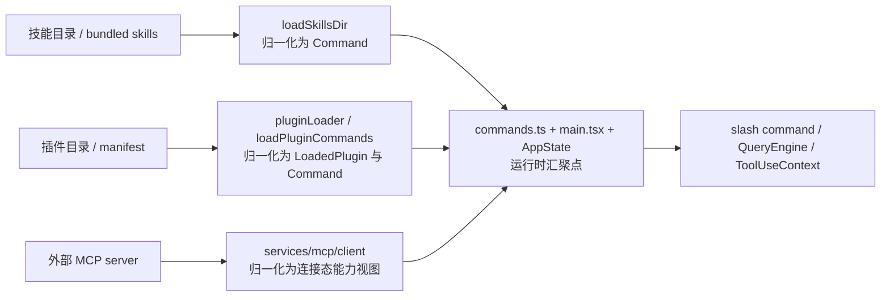
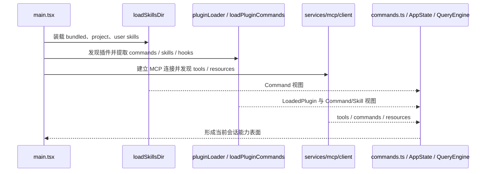

# 技能、插件、MCP 如何汇聚成统一能力装载面

## 1. 文档目标

这篇文档聚焦三类能力来源如何被装配进同一个运行时：

- `skills/` 与 `loadSkillsDir.ts` 代表的文件型技能体系
- `utils/plugins/` 代表的插件体系
- `services/mcp/` 代表的外部协议能力体系

重点不是单个技能、单个插件或单个 MCP server 的实现细节，而是回答三个架构问题：

- 这些能力分别从哪里来。
- 它们先被归一化成什么样的运行时对象。
- 最终由哪些汇聚点把它们暴露给用户入口和会话内核。

### 1.1 Overview 视图



这张图强调的是“统一能力装载面”并不是单个注册表，而是多种来源经过归一化后，在运行时形成几张并行的可消费视图。

### 1.2 数据流视图



这条数据流回答的是三类能力如何在启动装配阶段进入同一个运行时，并在后续会话中以不同视图被消费。

## 2. 一句话结论

这个项目的“统一能力装载面”不是一个单独的总注册表，而是三类来源先被归一化，再汇聚成几张并行的运行时视图：

- 面向用户入口的 `Command` 视图。
- 面向模型执行的 `Tool` / `Resource` 视图。
- 面向扩展生命周期的 `LoadedPlugin` 与连接态 `MCPServerConnection` 视图。

`commands.ts` 负责把本地技能和插件能力汇入统一命令面，`main.tsx` 负责把 MCP 能力和运行时连接态挂到会话上；两者共同形成运行时真正可见的能力表面。

## 3. 分层关系

```text
能力来源层
  - bundled skills
  - 项目/用户/托管技能目录
  - 插件目录与插件 manifest
  - 外部 MCP server
        |
        v
归一化层
  - loadSkillsDir.ts -> Command
  - pluginLoader.ts -> LoadedPlugin
  - loadPluginCommands.ts -> plugin Command / plugin Skill
  - services/mcp/client.ts -> MCP connection / Tool / Command / Resource
        |
        v
汇聚层
  - commands.ts -> 用户可见 Command 面
  - main.tsx -> 会话级 mcp clients/tools/commands/resources
  - state/AppState.tsx -> 交互式运行态中的 mcp/plugin 视图
        |
        v
消费层
  - slash command / REPL
  - SkillTool / prompt 型工作流
  - QueryEngine / query / ToolUseContext
  - hooks / agents / remote/bridge 等运行模式
```

这里最重要的判断是：

- “统一”指的是统一进入同一个运行时，而不是统一成一个数组。
- 这个运行时至少同时维护命令视图、工具视图和插件组件视图三种能力表面。

## 4. 来源层的责任

### 4.1 技能体系是文件型工作流来源

`skills/loadSkillsDir.ts` 负责把本地磁盘上的技能内容装入运行时。它覆盖的来源不止一种，而是多种配置源的统一入口，例如：

- 项目目录中的 `.claude/skills`
- 用户目录和托管目录中的技能目录
- 兼容旧结构的 `commands` 目录
- 启动前已注册的 bundled skills

从架构上看，这一层的职责不是“执行技能”，而是把文件系统里的 Markdown 工作流转换成统一的 `Command` 形态，并为后续汇聚保留来源标记，例如 `loadedFrom`、`userInvocable`、`disableModelInvocation` 等。

这意味着在这个系统里，技能并不是一个独立运行时类型；它首先会被归一化成 prompt 型 command，然后再由上层决定它是给用户直接调用，还是给模型作为可复用能力引用。

### 4.2 插件体系是能力打包与分发来源

`utils/plugins/pluginLoader.ts` 负责发现、校验和描述插件本身。它的核心产物不是 command，也不是 tool，而是 `LoadedPlugin` 这类“插件组件描述符”。

它主要负责把插件目录中的以下组件注册为可被后续消费的路径和元数据：

- `commands/`
- `skills/`
- `agents/`
- `hooks/`
- `output-styles/`
- manifest 中声明的额外路径

这一层的关键边界是：插件加载器只解决“插件里有哪些组件”，并不直接决定这些组件何时出现在用户可见命令面或模型可见能力面里。

### 4.3 MCP 体系是外部协议能力来源

`services/mcp/client.ts` 负责连接外部 MCP server，并把远端能力映射回本地运行时。它处理的不是静态目录，而是动态连接态能力，包括：

- 远端 tools
- 远端 commands
- 基于资源的 MCP skills
- 远端 resources
- 当前连接状态与鉴权状态

这使 MCP 成为三类来源里最动态的一类：插件和技能目录主要在本地装配期决定，而 MCP 能力要等连接建立后才能真正进入会话视图。

## 5. 归一化层的责任

### 5.1 技能先被归一化成 `Command`

不论技能来自本地目录、bundled 包还是插件目录，系统都会优先把它归一化为 prompt 型 `Command`。这一步的价值在于：

- 用户入口和模型入口可以共享同一份技能元数据。
- 技能来源差异被收敛到 `loadedFrom` 这类来源标记，而不是散落到上层调用方。
- `commands.ts`、SkillTool、slash command 菜单都能围绕同一个描述对象工作。

因此，“技能”在这个系统里更像一种语义标签，而不是独立的运行时容器。

### 5.2 插件先被归一化成组件描述，再分流为具体能力

插件体系是两段式归一化：

1. `pluginLoader.ts` 先产生 `LoadedPlugin`，确认插件有哪些组件。
2. `loadPluginCommands.ts` 再把已启用插件中的 `commands/` 和 `skills/` 真正转换成 `Command` 列表。

这组拆分很重要，因为它说明插件不是单一能力来源，而是“能力包”。不同消费者会从同一个 `LoadedPlugin` 派生不同视图：

- 命令视图由 `getPluginCommands()` 暴露。
- 技能视图由 `getPluginSkills()` 暴露。
- hooks、agents、output styles 则由各自装载器读取。

所以插件在架构上更接近“扩展单元”，而不是“命令集合”。

### 5.3 MCP 归一化结果是连接态能力视图

MCP 的归一化结果不是单个 descriptor，而是一组随连接状态变化的运行时对象：

- `MCPServerConnection`
- `Tool[]`
- `Command[]`
- `ServerResource[]`

并且这一步还会做额外的运行时补齐，例如在支持资源的 server 上自动补入资源读取工具，把远端 skill 资源转成与本地技能同形的 prompt commands。

这意味着 MCP 并不是被“静态导入”到系统里，而是被“连接后投影”为统一能力视图。

## 6. 汇聚层的责任

### 6.1 `commands.ts` 负责本地命令面的总汇聚

`commands.ts` 是本地命令面的主要汇聚点。它会把以下来源合并成统一的 `getCommands()` 结果：

- bundled skills
- built-in plugin skills
- 本地技能目录命令
- workflow commands
- plugin commands
- plugin skills
- 内建 slash commands

这里有一个关键边界：

- `commands.ts` 负责汇聚本地文件型技能和插件型命令。
- MCP skill commands 不直接并入 `getCommands()`，而是通过 `getMcpSkillCommands()` 单独从 `AppState.mcp.commands` 中筛出并向下游传递。

这说明统一能力面虽然最终会被同一个运行时消费，但命令汇聚仍然区分“本地静态装载”与“远端动态接入”两条链路。

### 6.2 `main.tsx` 负责把能力真正装到一次会话里

`main.tsx` 是会话级装配入口，它承担两类关键汇聚责任：

1. 在启动早期先注册 bundled skills 和内建插件，再触发 `getCommands()`，确保本地命令面在会话启动时就稳定可见。
2. 解析 MCP 配置、预连接 MCP server，并把 `clients/tools/commands/resources` 挂到交互式或 headless 会话状态里。

因此，`main.tsx` 的作用不是定义能力，而是决定这些能力何时进入当前会话、以什么视图进入当前会话。

### 6.3 `AppState` 承载动态能力视图

在运行时层面，动态接入的能力主要挂在 `AppState` 上，尤其是：

- `mcp.clients`
- `mcp.tools`
- `mcp.commands`
- `mcp.resources`

插件状态也会以操作性视图出现在 `AppState.plugins` 中，但它更偏生命周期和管理面；真正的 plugin command/plugin skill 汇聚仍由 `commands.ts` 和插件专用 loader 完成。

这也解释了为什么统一能力装载面不是单一 store：

- 命令入口需要稳定的聚合列表。
- MCP 能力需要动态连接态。
- 插件管理还需要启用/禁用、错误、刷新等运维信息。

## 7. 消费层如何使用这些能力

### 7.1 用户入口主要消费统一 `Command` 面

REPL、slash command 菜单和命令型工作流主要依赖 `getCommands()` 返回的命令视图。对用户来说，本地技能、插件命令和内建命令会尽量呈现为一个统一入口面。

### 7.2 模型入口同时消费技能面和工具面

模型并不只消费单一来源：

- prompt 型能力来自 skill commands、plugin skills、MCP skills。
- 执行动作来自本地 tools 和 MCP tools。

因此，模型看到的是“技能面 + 工具面”的组合，而不是单独的插件面或单独的 MCP 面。

### 7.3 查询内核消费的是会话级已装载视图

`QueryEngine` 和 `query` 并不直接关心技能来自哪个目录、插件来自哪个市场、MCP server 来自哪个协议地址。它们主要消费的是当前会话已经装配好的：

- commands
- tools
- mcpClients
- agents
- hooks 上下文

这正是汇聚层存在的意义：把来源差异尽量隔离在装配前。

## 8. 不应混淆的边界

### 8.1 `pluginLoader.ts` 不是最终能力面

它只产生插件组件描述和路径，不直接产生最终命令面或工具面。

### 8.2 `getCommands()` 不是全部能力的全集

它主要覆盖本地静态命令面。MCP 的动态 commands 和 skills 需要通过 `AppState.mcp` 这条链路补进运行时。

### 8.3 MCP 接入不是插件加载的特例

插件和 MCP 都能扩展能力，但插件更像本地扩展包，MCP 更像外部连接态能力源。两者的生命周期和失败模式不同。

### 8.4 “统一能力装载面”不是统一数据结构

真正统一的是运行时编排入口，而不是所有能力都共享同一个类型。这个系统至少同时维护：

- `Command` 视图
- `Tool` 视图
- 插件组件视图
- MCP 连接与资源视图

## 9. 设计价值

这种拆分带来三个明显收益：

1. 技能、插件、MCP 可以独立扩展，而不会强迫所有能力走同一种打包方式。
2. 会话内核可以只面向归一化后的能力视图工作，不需要理解每一种来源的装载细节。
3. 本地静态能力和远端动态能力可以并存，既支持离线启动体验，也支持连接后逐步补齐外部能力。

如果只保留一句话，可以这样记：

- 技能负责把工作流定义成可复用 prompt。
- 插件负责把多类扩展打包成可装载组件。
- MCP 负责把外部系统投影成会话期可见能力。
- `commands.ts` 和 `main.tsx` 共同把它们汇入同一个运行时。