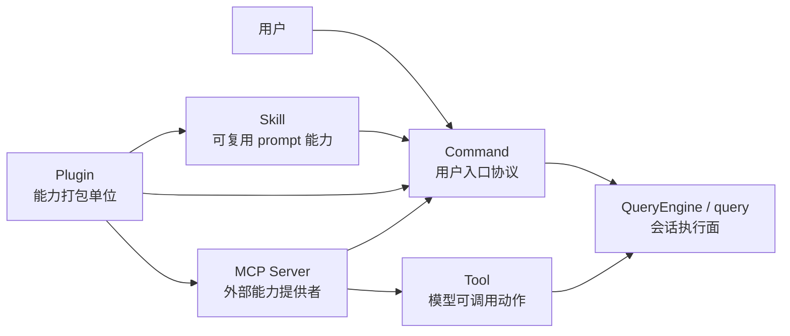
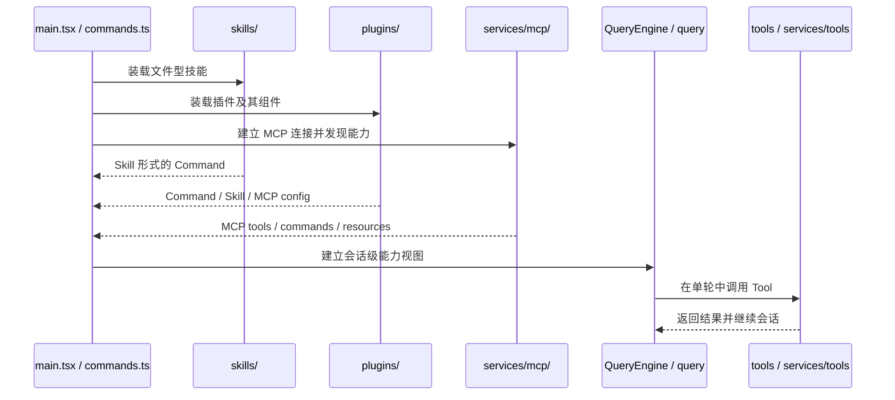

# 核心术语与概念模型

## 1. 文档目标

这篇文档用于固定整套架构文档里的核心术语，避免不同专题对同一概念使用不同口径。

重点回答：

- `Command`、`Skill`、`Tool`、`Plugin`、`MCP` 分别面向谁。
- 它们在启动装配和会话执行时如何相互转换或汇聚。
- 哪些概念看起来相近，但在架构上不应混为一谈。

### 1.1 Overview 视图

这张图强调的是概念之间的角色关系：`Command` 更靠近用户入口，`Tool` 更靠近模型执行，`Plugin` 和 `MCP` 更像能力来源与装配来源，而 `QueryEngine / query` 是把这些能力放进一次会话里的执行面。

### 1.2 数据流视图

这条数据流回答的是这些概念如何在“启动装配”与“单轮执行”两阶段里协作，而不是只给出静态名词表。

## 2. 一句话结论

`Command` 是用户入口协议，`Skill` 是可复用的 prompt 型能力，`Tool` 是模型可调用的执行能力，`Plugin` 是能力打包单位，`MCP Server` 是外部协议能力来源；它们最终都要汇入会话执行面，但并不属于同一层。

## 3. 概念对照表

| 概念 | 面向对象 | 主要载体 | 在系统中的角色 | 最容易混淆的点 |
| --- | --- | --- | --- | --- |
| `Command` | 用户 | `src/types/command.ts`、`src/commands.ts` | 用户显式进入某种能力的统一入口协议 | 不等于 Skill；也不等于单个 CLI 子命令实现。 |
| `Skill` | 用户和模型 | `src/skills/loadSkillsDir.ts`、插件 skills、MCP skills | 可复用的 prompt 型工作流能力 | 常常投影成 `Command`，但本质是能力定义而不是入口层本身。 |
| `Tool` | 模型 | `src/Tool.ts`、`src/tools.ts`、`src/services/tools/` | 单轮对话中真正可执行的动作能力 | 不直接面向用户；也不是插件或技能的同义词。 |
| `Plugin` | 运行时扩展作者 | `src/types/plugin.ts`、`src/utils/plugins/` | 打包与分发能力的单位，可贡献多类组件 | 不是最终能力面，也不是运行中的会话对象。 |
| `MCP Server` | 外部系统 | `src/services/mcp/types.ts`、`src/services/mcp/client.ts` | 通过协议向运行时提供外部 tools、resources、prompts | 不等于插件；插件只能是 MCP 配置或来源之一。 |

## 4. `Command` 的定义

### 4.1 `Command` 是用户入口协议

从 `src/types/command.ts` 看，`Command` 是一个统一入口类型，而不是某一种单一实现。它至少覆盖三类入口：prompt 型命令、本地命令和本地 JSX 命令。这意味着命令层的职责不是“保存帮助文案”，而是统一承载用户如何进入能力。

### 4.2 `Command` 是汇聚后的结果视图

`src/commands.ts` 中的 `getCommands()` 会把 bundled skills、目录技能、workflow commands、plugin commands、plugin skills 和内建命令拼成一个统一命令面。也就是说，`Command` 更像用户可见能力的汇聚视图，而不是单一来源的原始定义。

### 4.3 不是所有 `Command` 都是 `Skill`

有些 `Command` 只是本地动作或 UI 入口，有些 `Command` 才是 prompt 型工作流。`Skill` 经常以 `Command` 的形式暴露，但 `Command` 这个概念本身更宽。

## 5. `Skill` 的定义

### 5.1 `Skill` 是可复用的 prompt 型能力

从 `src/skills/loadSkillsDir.ts` 看，技能的主要载体是 markdown 工作流定义。它关注的是“在什么场景下复用一段能力说明或执行约束”，而不是“如何直接执行某个底层动作”。

### 5.2 `Skill` 通常会投影为 `Command`

技能在装载后通常表现为 prompt 型 `Command`，因此既可能被用户通过 slash command 触发，也可能被模型通过 skill/tool 相关流程间接使用。这个投影关系解释了为什么技能和命令在界面层经常同时出现。

### 5.3 `Skill` 不是 `Tool`

`Skill` 更接近高层工作流定义，它告诉系统“应该如何组织一次能力使用”；`Tool` 才是模型在回合里真正调用的底层执行动作。一个技能可能限制可用工具，但它本身不是工具实现。

## 6. `Tool` 的定义

### 6.1 `Tool` 是模型可调用的执行能力

从 `src/Tool.ts` 看，工具的核心是统一契约和 `ToolUseContext`。它关心输入 schema、执行上下文、进度上报、结果返回和权限语义。这一层面向的是模型执行回路，而不是用户入口。

### 6.2 `Tool` 总是运行在会话上下文里

`ToolUseContext` 里同时携带命令面、工具池、MCP clients、AppState、消息数组和多种状态更新入口。这说明 `Tool` 不是一个独立函数库，而是会话运行时中的受控动作单元。

### 6.3 `Tool` 可以来自本地，也可以来自 MCP

本地工具由 `src/tools.ts` 和 `src/tools/` 提供，外部工具则通过 MCP 接入后映射为统一的工具视图。对 `query` 和 `services/tools` 来说，工具来源可以不同，但执行面会尽量统一。

## 7. `Plugin` 的定义

### 7.1 `Plugin` 是能力打包与分发单位

从 `src/types/plugin.ts` 的 `LoadedPlugin` 看，插件不是一个单一能力，而是一组能力组件的容器。它可以携带 commands、agents、skills、hooks、output styles、MCP servers、LSP servers 和 settings。

### 7.2 `Plugin` 首先是来源层，而不是最终能力面

`pluginLoader` 把插件目录转成 `LoadedPlugin`，随后再由命令、技能、hooks、MCP、LSP 等各自的加载器把这些组件注入运行时。因此插件更像能力来源和装配单位，而不是最终给用户或模型直接消费的唯一注册表。

### 7.3 `Plugin` 不等于运行中的会话对象

插件会影响命令面、技能面和外部连接，但它自身并不直接承担一次会话的运行时状态。运行时状态仍然由 `QueryEngine`、`AppState`、tasks 等会话模块维护。

## 8. `MCP Server` 的定义

### 8.1 `MCP Server` 是外部协议能力提供者

从 `src/services/mcp/types.ts` 看，MCP server 先表现为一组配置和连接状态，再表现为连接后的能力视图。它本质上是一个外部系统接入点，而不是本地代码库里的某个固定模块。

### 8.2 `MCP` 能贡献的不只有工具

当前源码中的 MCP 连接除了 tools，还会向运行时提供 resources 和 commands/prompts。也就是说，MCP 不只是“远程工具列表”，而是一种更完整的外部能力协议面。

### 8.3 `MCP prompt` 与 `MCP skill` 需要区分

`src/services/mcp/utils.ts` 明确区分了 MCP prompts 和 MCP skills：MCP skill 会以 `loadedFrom === 'mcp'` 的 prompt 型 `Command` 出现，而普通 MCP prompt 只是 MCP 命令面的一部分。这也是为什么 MCP 接入既会影响命令面，也会影响技能面。

## 9. 五个概念如何协作

### 9.1 用户入口主线

用户最先接触的是 `Command`。其中一部分命令来自内建实现，另一部分来自技能、插件或 MCP 暴露出来的 prompt/命令能力。

### 9.2 模型执行主线

会话进入 `QueryEngine / query` 后，模型真正可调用的是 `Tool`。技能会影响提示词与工具可用范围，但真正的动作执行仍然要落到工具层。

### 9.3 扩展装配主线

`Plugin` 和 `MCP` 都属于能力来源层。它们进入运行时后，并不会保留为一个单独的“超级注册表”，而是分别投影到命令、技能、工具、资源和外部连接这些并行视图里。

## 10. 不应混淆的边界

### 10.1 `Command` 不等于 `Skill`

技能通常以命令形式出现，但命令层还包含本地动作、UI 入口和其它非技能型命令。

### 10.2 `Skill` 不等于 `Tool`

技能解决的是工作流复用与提示组织；工具解决的是单轮中的具体动作执行。

### 10.3 `Plugin` 不等于 `MCP Server`

插件是本地能力打包单位；MCP server 是外部能力提供者。插件可以声明或携带 MCP 配置，但两者不是同一概念。

### 10.4 `MCP prompt` 不等于 `MCP skill`

两者都可能出现在命令面，但只有 MCP skill 会进入技能语义，普通 MCP prompt 只是 MCP 暴露出的 prompt/command 能力。

### 10.5 统一能力装载面不等于统一数据结构

源码里的统一性体现在运行时视图和装配流程上，而不是体现在所有能力都塞进一个完全相同的数据结构里。

## 11. 设计价值

把这几个概念分开，有三个直接好处：

- 用户入口、模型执行和扩展来源不会混成同一层，文档能稳定描述职责边界。
- 新增插件、技能或 MCP 能力时，可以复用既有装配面，而不必改写会话内核。
- 后续专题文档能围绕固定术语展开，避免同一个词在不同文档里含义漂移。