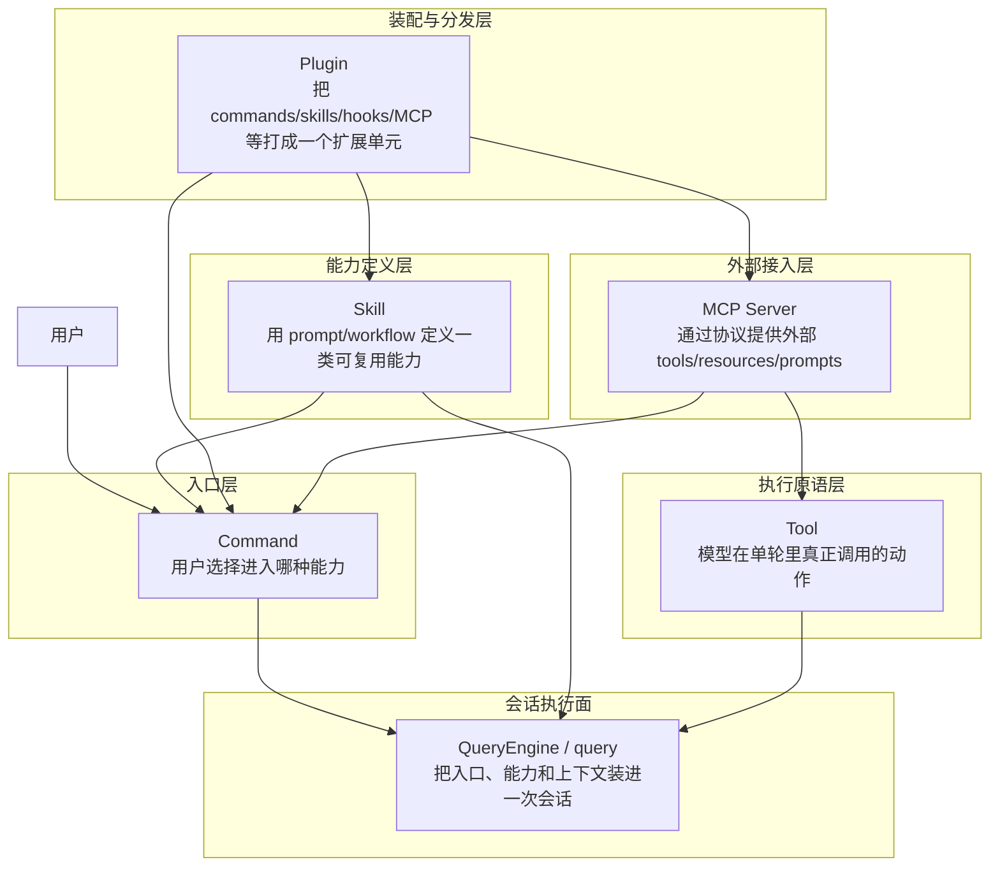
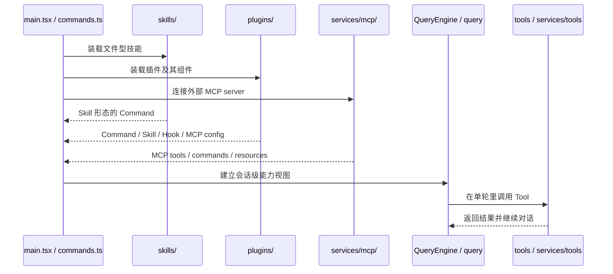

# 核心术语与概念模型

## 1. 文档目标

这篇文档不是做名词对照表，而是要回答一个更关键的问题：Claude Code 里常见的 `Command`、`Skill`、`Tool`、`Plugin`、`MCP Server` 到底分别是什么对象，它们各自解决什么问题，又处在系统的哪一层。

很多困惑都来自同一个误区：把这些词当成同一层级的“能力名称”。实际上它们并不是并列概念，而是分属不同抽象层的系统对象。

这篇文档重点固定四件事：

- 每个术语的定义，而不只是字面翻译。
- 每个术语的用途，也就是它要解决的架构问题。
- 每个术语所属的层次，避免把入口、执行、装配、外部接入混成一层。
- 每个术语的抽象意义，也就是为什么系统必须专门把它单独抽出来。

### 1.1 Overview 视图

这张图最重要的信息不是连线，而是“分层”。`Command`、`Skill`、`Tool`、`Plugin`、`MCP Server` 不属于同一个抽象平面，所以不能用同一种句式去定义它们。

### 1.2 数据流视图

这条数据流揭示了一个常被忽略的事实：系统启动时看到的是“能力来源”，真正进入会话后使用的是“会话视图”。术语之间的区别，很多就是由这两阶段决定的。

## 2. 一句话结论

`Command` 是用户进入能力的协议，`Skill` 是可复用的高层工作流定义，`Tool` 是模型可调用的底层动作，`Plugin` 是能力打包与分发单位，`MCP Server` 是通过协议接入的外部能力来源；它们最终都会汇入 `QueryEngine / query` 的会话执行面，但本质上分属不同层次。

## 3. 先建立一个分层判断框架

如果只记一句话，应该记这个：

> 这些术语不是“同一种东西的不同叫法”，而是系统在不同层面上对能力进行建模时产生的不同对象。

可以把它们放进一个五层模型里理解：

| 层次 | 术语 | 核心问题 | 关心的重点 |
| --- | --- | --- | --- |
| 用户入口层 | `Command` | 用户如何进入某种能力 | 入口、触发、可见性 |
| 能力定义层 | `Skill` | 一类工作流应该如何复用 | 语义、约束、提示组织 |
| 执行原语层 | `Tool` | 模型这一轮到底做了什么动作 | schema、权限、执行结果 |
| 装配分发层 | `Plugin` | 一组能力如何被打包、启用、禁用、分发 | 组件集合、来源、配置 |
| 外部接入层 | `MCP Server` | 外部系统如何以统一协议接入运行时 | 协议、连接、远端能力 |

而 `QueryEngine / query` 不属于上面任何一个术语的同类，它更像“执行面”或“编排面”：负责把这些不同层的对象在一次会话里实际组装起来。

这也是为什么只说“Command 是命令，Tool 是工具，Plugin 是插件”没有解释力。真正有解释力的是：它们分别在解决哪一层的问题。

## 4. 概念对照表

| 概念 | 定义 | 主要用途 | 所属层次 | 核心本质 |
| --- | --- | --- | --- | --- |
| `Command` | 用户可见、可触发的统一入口协议 | 让用户显式进入某项能力 | 用户入口层 | “进入能力”的对象，不是能力本身 |
| `Skill` | 用 markdown/frontmatter 等定义的可复用 prompt/workflow 能力 | 复用工作流、约束工具、表达使用场景 | 能力定义层 | “描述如何完成一类任务”的对象 |
| `Tool` | 模型在单轮里可调用的执行动作 | 真正读文件、跑命令、查资源、发请求 | 执行原语层 | “能做什么动作”的对象 |
| `Plugin` | 一组能力组件的打包单元 | 分发 commands、skills、hooks、MCP、settings | 装配分发层 | “能力从哪里来、如何打包”的对象 |
| `MCP Server` | 通过 MCP 协议接入的外部能力提供者 | 从外部系统引入 tools、resources、prompts | 外部接入层 | “外部能力如何进来”的对象 |

### 4.1 先用一个类比把它们放进同一画面

如果把 Claude Code 想成一家餐厅，这几个术语可以这样理解：

- `Command` 像菜单上的点单入口。用户先说“我要点这个”，系统才知道你要进入哪类能力。
- `Skill` 像这道菜背后的标准做法或厨房 SOP。它规定先做什么、后做什么、允许用哪些材料和步骤。
- `Tool` 像厨房里真正干活的锅、刀、灶台、烤箱，以及“切、炒、煮”这些实际动作。没有它们，菜谱只是纸面说明。
- `Plugin` 像一个整包引入的新菜系方案，比如“日料扩展包”或“咖啡吧扩展包”。它不只带来一道菜，而是可能一起带来菜单项、做法、供应链和店内规则。
- `MCP Server` 像餐厅外部接入的供应商或外包厨房。餐厅通过统一接口向外请求食材、半成品或额外能力，而不是自己本地什么都做。
- `QueryEngine / query` 像后厨调度系统。它接到点单以后，决定调用哪份做法、安排哪些厨具、是否要向外部供应商要东西，并把结果最终端回给用户。

这个类比的关键不是一一精确对应，而是帮助你先抓住层次感：

- `Command` 是“点什么”。
- `Skill` 是“怎么做这类菜”。
- `Tool` 是“真正拿什么去做”。
- `Plugin` 是“整套新能力作为一个包怎么进店”。
- `MCP Server` 是“店外能力怎么接进来”。

### 4.2 再看一个系统里的真实例子

假设用户输入的是：`/review`，希望 Claude Code 审查当前改动。

这时几个术语会这样串起来：

1. 用户首先触发的是 `Command`。
  `Command` 解决的是“用户进入 review 能力”的问题。对用户来说，他看到的是 `/review` 这个入口。

2. 系统随后可能加载与 review 相关的 `Skill`。
  这个 `Skill` 会定义 review 应该关注什么，例如缺陷、风险、回归、测试缺口，以及允许使用哪些工具。也就是说，它给出的是 review 的方法论，而不是直接执行文件读取。

3. 进入会话执行后，模型真正调用的是 `Tool`。
  比如读取 diff、搜索引用、查看错误、执行检查命令。这些都不是 `Skill` 本身完成的，而是落到具体工具上完成的。

4. 如果 review 能力来自某个扩展包，那么它背后的来源是 `Plugin`。
  比如一个插件可能同时带来 `/review` 变体命令、自定义 review skill、额外 hooks，以及一些配套配置。插件表达的是“这一整套 review 能力从哪里来”。

5. 如果 review 过程中还需要访问 GitHub、工单系统或远端知识库，那么这些外部能力可能来自 `MCP Server`。
  例如通过 MCP 暴露的远端工具去拉取 PR 元数据、评论历史或外部资源。这里的重点不是它是不是 review，而是这些能力是通过协议从系统外接进来的。

6. 最后由 `QueryEngine / query` 把这一切串成一次完整执行。
  它接收 `/review` 这个入口，把相关 skill、tools、MCP 能力装进当前会话，驱动模型循环，直到生成最终的 review 结果。

所以在这个例子里，可以用一句话记忆：

> `/review` 是你按下的门铃，`Skill` 是审查方法，`Tool` 是实际检查动作，`Plugin` 是这套能力的打包来源，`MCP Server` 是接进来的外部帮手，而 `QueryEngine / query` 是把整条链路跑完的调度者。

## 5. `Command` 的本质

### 5.1 定义

从 `src/types/command.ts` 看，`Command` 是一个统一入口类型，而不是某一种实现。它至少分成三类：

- `prompt`：本质上是 prompt/workflow 型入口。
- `local`：本地逻辑命令。
- `local-jsx`：带本地 UI 呈现能力的命令。

所以 `Command` 的定义不能写成“一个 slash command”。更准确的说法是：`Command` 是系统暴露给用户的统一进入协议，目的是把不同来源、不同实现方式的能力投影到同一个用户交互面上。

### 5.2 用途

`Command` 解决的是“用户如何进入能力”这个问题。它统一了：

- 用户可见名称。
- 描述、参数提示、别名、可见性。
- 命令是否可立即执行，是否允许模型调用。
- 某个能力是 prompt 型还是本地实现型。

这意味着 `Command` 不是在描述能力内部怎么做，而是在描述“从交互入口看，这个能力怎么被使用”。

### 5.3 所属层次

`Command` 属于用户入口层。它离用户最近，离底层执行最远。

`src/commands.ts` 里的 `getCommands()` 也说明了这一点：系统会把 bundled skills、目录 skills、plugin commands、plugin skills、内建命令等全部汇总成一个统一命令面。这证明 `Command` 是一个汇聚后的入口视图，而不是某种原始能力的唯一来源。

### 5.4 抽象意义

为什么要把 `Command` 单独抽出来？因为“能力的定义”与“能力的入口”不是一回事。

如果没有 `Command` 这一层，那么：

- 用户入口会直接耦合到底层实现。
- 技能、插件、MCP 暴露出来的能力就无法用统一方式展示和触发。
- UI、自动补全、帮助信息、命令分发就会散落在不同实现类型里。

所以 `Command` 的抽象意义是：把“用户如何进入系统能力”从“能力内部如何执行”里分离出来。

### 5.5 不是什么

- 它不等于 `Skill`，因为并非所有命令都是技能。
- 它不等于某个 CLI 文件实现，具体实现只是命令的一种后端。
- 它也不等于一次会话，命令只是进入会话的一种入口。

### 5.6 源码里的最小例子

`src/commands/review.ts` 里的 `review` 就是一个非常典型的 `Command`：

- 它的名字是 `review`。
- 类型是 `prompt`。
- 用户通过 `/review` 这个入口触发它。
- 它返回一段 prompt，告诉系统如何执行一次 review。

这个例子很适合说明 `Command` 的本质：它首先是“用户进入 review 能力的入口对象”。至于后续真正会不会去读 diff、跑命令、调工具，那是进入会话之后的下一层问题，不是 `Command` 自己解决的。

## 6. `Skill` 的本质

### 6.1 定义

从 `src/skills/loadSkillsDir.ts` 看，`Skill` 的核心不是“执行一个动作”，而是通过 markdown 与 frontmatter 定义一类可复用的工作流能力。它通常包含：

- 适用场景与说明。
- 参数约定。
- 允许使用哪些工具。
- 运行上下文，例如 `inline` 或 `fork`。
- hooks、模型偏好、effort、路径适用范围等约束。

因此 `Skill` 的本质不是一个动作，而是一套高层任务语义。它告诉系统和模型：“面对这类问题时，应该用怎样的工作流、约束和提示结构去处理。”

### 6.2 用途

`Skill` 解决的是“高层能力如何复用”这个问题。

如果每次都只暴露原子工具，那么模型虽然能做事，但缺少稳定的方法模板。`Skill` 的作用就是把某类常见任务沉淀成可反复调用的工作流定义，例如：

- 在什么情况下应该使用这类能力。
- 应优先遵循什么步骤。
- 工具边界和执行风格是什么。
- 这类任务应该在当前会话里做，还是 fork 到子代理里做。

换句话说，`Skill` 提供的是“方法”，不是“手”。

### 6.3 所属层次

`Skill` 属于能力定义层。它比 `Command` 更靠近能力本身，比 `Tool` 更高层。

它和 `Command` 的关系可以概括成一句话：`Skill` 经常会投影为一个 `Command`，但那只是它的入口形式，不是它的本体。

### 6.4 抽象意义

为什么系统需要 `Skill`，而不是只保留 `Tool`？因为真实任务不是一串无结构的底层动作，而是有目标、有步骤、有边界的工作流。

`Skill` 的抽象意义在于：

- 把任务语义从原子动作中提取出来。
- 把“怎么组织完成一类任务”变成可复用资产。
- 让 prompt 约束、allowed tools、fork 方式等策略成为一等配置，而不是散落在模型记忆里。

如果没有 `Skill` 这一层，系统只能靠模型临场拼装策略，稳定性和可复用性都会更弱。

### 6.5 不是什么

- 它不是 `Tool`，因为它不直接等于一次底层执行动作。
- 它不是纯文档，虽然常以 markdown 承载，但本质是运行时可装载的能力定义。
- 它也不是单纯的 slash command 文案，因为它描述的是任务方法，而不是入口按钮。

### 6.6 源码里的最小例子

`src/skills/loadSkillsDir.ts` 里的 `createSkillCommand(...)` 是理解 `Skill` 的最好入口。

这个函数会把一个 markdown 技能解析成 prompt 型 `Command`，并把 frontmatter 里的信息挂到这个能力上，例如：

- `allowedTools`：这个技能允许用哪些工具。
- `argumentHint` 和 `argNames`：这个技能接受什么参数。
- `context` / `agent`：它是在当前会话执行，还是 fork 到子代理执行。
- `hooks`、`paths`、`whenToUse`：这个技能在什么情境下出现，以及附带什么约束。

这个最小例子能说明一件关键事实：`Skill` 的本体不是某次工具调用，而是“把一类任务的做法、限制和适用场景定义出来”，然后再投影成系统能消费的运行时对象。

## 7. `Tool` 的本质

### 7.1 定义

从 `src/Tool.ts` 看，`Tool` 是模型在单轮执行中真正可调用的动作契约。它关心的是：

- 输入 schema。
- 执行上下文 `ToolUseContext`。
- 权限模式与批准流程。
- 进度、结果、错误与状态回写。

这说明 `Tool` 不是泛泛的“工具能力”，而是被会话运行时严格管理的可执行动作单元。

### 7.2 用途

`Tool` 解决的是“模型这一轮到底如何对外做事”这个问题。

模型本身只会生成 token，不会直接读文件、跑命令、操作 Git、调用远端系统。真正把语言行为变成系统动作的是 `Tool`。因此工具层承担的是执行桥梁：

- 把模型意图转成结构化输入。
- 在权限与上下文约束下执行动作。
- 把结果再转回消息流供模型继续推理。

### 7.3 所属层次

`Tool` 属于执行原语层。它是最接近实际操作的一层。

在架构上，`Tool` 既不等于用户入口，也不等于能力定义；它是会话内核在单轮里真正能调用的“动作原子”。

### 7.4 抽象意义

为什么系统需要把 `Tool` 单独建模？因为“动作执行”必须是受控的、可审计的、可授权的。

`Tool` 这一层让系统可以把以下问题从 prompt 语义里剥离出来：

- 哪些动作允许模型调用。
- 这些动作的参数格式是什么。
- 什么时候需要用户确认。
- 执行结果如何回流到对话。

所以 `Tool` 的抽象意义是：把语言模型的意图，约束成安全、结构化、可运行的系统动作。

### 7.5 不是什么

- 它不直接面向用户，用户通常先接触的是 `Command`。
- 它不是 `Skill`，技能只是可能调用或限制工具。
- 它不是普通函数库，离开 `ToolUseContext` 和会话运行时，它的语义并不完整。

### 7.6 源码里的最小例子

`src/Tool.ts` 里的 `ToolUseContext` 就体现了 `Tool` 为什么是执行原语，而不是普通帮助函数。

一个工具在运行时会拿到：

- 当前消息数组 `messages`
- 当前可用 `commands`、`tools`、`mcpClients`
- `getAppState` / `setAppState`
- 权限相关上下文
- 文件读取、进度更新、通知、响应长度控制等执行接口

这说明工具不是“传入几个参数就跑完”的纯函数，而是被放进一次会话里、在完整上下文约束下执行的动作单元。也正因为如此，`Tool` 才能承担读文件、跑终端、访问 MCP、更新状态这些真正会改变系统外部世界的动作。

## 8. `Plugin` 的本质

### 8.1 定义

从 `src/types/plugin.ts` 的 `LoadedPlugin` 可以看到，`Plugin` 不是单个能力，而是一组能力组件的容器。一个插件可以携带：

- commands
- agents
- skills
- hooks
- output styles
- MCP servers
- LSP servers
- settings

因此 `Plugin` 的正确定义不是“一个扩展功能”，而是“运行时装配系统识别的能力打包单元”。

### 8.2 用途

`Plugin` 解决的是“能力如何被组织、分发和启停”这个问题。

它把本来分散在多个层次的内容打成一个可管理来源：

- 一组能力从哪来。
- 如何安装、启用、禁用、升级。
- 这些能力的归属和来源信息是什么。
- 不同组件如何随着插件一并进入运行时。

### 8.3 所属层次

`Plugin` 属于装配与分发层。它不直接代表用户入口，也不直接代表模型动作，而是代表“这批能力是作为一个扩展单元进来的”。

### 8.4 抽象意义

为什么 `Plugin` 很重要？因为系统不能把每一类能力都硬编码在主程序里。

`Plugin` 的抽象意义是：

- 把能力来源模块化。
- 让 commands、skills、hooks、MCP 配置等异构组件可以按同一分发单元管理。
- 让运行时装配逻辑与能力内容解耦。

也可以说，`Plugin` 抽象的不是“能力是什么”，而是“能力如何作为一个包进入系统”。

### 8.5 不是什么

- 它不是最终给用户直接消费的唯一对象，用户看到的通常还是命令或技能。
- 它不等于会话中的运行时对象，会话状态仍由 `QueryEngine`、`AppState` 等维护。
- 它也不等于 `MCP Server`，即便插件可以声明 MCP 配置。

### 8.6 源码里的最小例子

`src/types/plugin.ts` 里的 `LoadedPlugin` 就是一个很好的最小例子。

从这个类型可以直接看到，一个插件不是“一个命令”或“一个技能”，而是一个带多种组件路径和配置的容器，例如：

- `commandsPath` / `commandsPaths`
- `skillsPath` / `skillsPaths`
- `agentsPath`
- `hooksConfig`
- `mcpServers`
- `settings`

也就是说，插件在代码里被建模为“一个扩展包的结构化描述”。它的价值不是自己直接执行什么，而是告诉系统：这个扩展包里到底装了哪些可进一步装载的能力组件。

## 9. `MCP Server` 的本质

### 9.1 定义

从 `src/services/mcp/types.ts` 看，`MCP Server` 首先是一组配置与连接状态，然后才在连接后表现为一批可用能力。它可以通过 `stdio`、`sse`、`http`、`ws`、`sdk` 等方式接入。

所以 `MCP Server` 的本质不是“某个远端工具”，而是“一个按 MCP 协议暴露能力的外部系统接入点”。

### 9.2 用途

`MCP Server` 解决的是“外部系统如何以统一协议并入当前运行时”这个问题。

它贡献的不只是工具，还可能包括：

- tools
- resources
- prompts 或 commands
- 技能语义上的能力投影

这意味着 MCP 不是一个“远端工具列表”，而是一套外部能力协议面。

### 9.3 所属层次

`MCP Server` 属于外部接入层。它站在系统边界上，一头连接 Claude Code 运行时，一头连接外部能力提供方。

### 9.4 抽象意义

为什么要把 `MCP Server` 和 `Plugin` 分开？因为“能力来自外部协议”与“能力作为本地扩展单元被分发”是两种完全不同的事情。

`MCP Server` 的抽象意义在于：

- 用统一协议接入外部能力，而不是为每个外部系统写一套私有桥接。
- 让远端 tools/resources/prompts 能与本地能力并列进入运行时视图。
- 把连接状态、认证状态、配置作用域等问题收敛到协议层处理。

### 9.5 不是什么

- 它不等于 `Plugin`，插件只是可能声明某个 MCP server 配置。
- 它不等于单个 `Tool`，一个 server 往往能贡献多种能力。
- 它也不只是 prompt 来源，MCP 在系统里的作用比“远端 prompt”宽得多。

### 9.6 源码里的最小例子

`src/services/mcp/types.ts` 里的 `MCPServerConnection` 是最直观的例子。

它不是一个固定结构，而是一个连接态联合类型，可能是：

- `connected`
- `failed`
- `needs-auth`
- `pending`
- `disabled`

同时，MCP CLI 状态里还会单独维护：

- `tools`
- `resources`
- `configs`
- `clients`

这个例子很能说明 `MCP Server` 的本质：它首先是“一个外部能力连接点”，其次才是在连接成功后向系统投影出工具、资源和命令。也就是说，MCP 天生带有连接生命周期和远端状态，而不是本地静态定义。

## 10. `QueryEngine / query` 为什么必须出现在这篇文档里

虽然 `QueryEngine / query` 不是这五个术语之一，但不把它放进概念模型里，前面的解释会悬空。

它们的作用是：把不同层的对象装进一次真正可运行的会话。

- `QueryEngine` 更像会话外壳和状态拥有者。
- `query` 更像单轮执行内核。

它们共同构成“会话执行面”。

这层的意义在于：

- `Command` 作为入口进入这里。
- `Skill` 在这里影响提示与工作流组织。
- `Tool` 在这里被真正调用。
- `Plugin` 和 `MCP` 提供的能力在这里被汇总成会话可见视图。

所以，从系统运行角度看，前面几个概念都是“能力对象”，而 `QueryEngine / query` 是“能力被消费的执行场”。

## 11. 五个术语如何协作

### 11.1 从用户看

用户直接接触的大多是 `Command`。它给人一种“我在调用某个功能”的感受。

但这个入口背后，真正被激活的可能是：

- 一个内建命令实现。
- 一个 `Skill` 投影出来的 prompt 型命令。
- 一个插件贡献的命令。
- 一个 MCP 暴露出来的 prompt/command 能力。

### 11.2 从模型看

模型在单轮里真正能调用的是 `Tool`，不是 `Command`。`Skill` 只是在更高层上影响它应该怎么用这些工具。

因此从模型视角看：

- `Skill` 是策略和工作流。
- `Tool` 是实际动作。

### 11.3 从装配看

系统启动时不会先问“用户要哪个工具”，而是先问“当前有哪些能力来源”。

这时：

- `Plugin` 提供本地打包的扩展来源。
- `MCP Server` 提供外部协议接入的能力来源。
- `skills/` 目录提供文件型技能来源。

这些来源最后被投影成命令面、技能面、工具面、资源面等多个运行时视图，而不是收敛为一个完全同构的数据结构。

## 12. 最容易混淆的边界

### 12.1 `Command` 不等于 `Skill`

`Skill` 常以 `Command` 形式暴露，但 `Command` 是入口协议，`Skill` 是高层能力定义。前者回答“怎么进”，后者回答“这类任务应该怎么做”。

### 12.2 `Skill` 不等于 `Tool`

`Skill` 是工作流语义，`Tool` 是动作原子。前者负责方法，后者负责执行。

### 12.3 `Plugin` 不等于 `MCP Server`

`Plugin` 是本地装配单元，`MCP Server` 是外部协议接入点。一个插件可以带上 MCP 配置，但两者不是一回事。

### 12.4 `MCP prompt` 不等于 `MCP skill`

从 `src/services/mcp/utils.ts` 可以看到，MCP 普通 prompt/command 与 MCP skill 在运行时是区分的。前者只是 MCP 暴露出的命令面能力，后者会以 `loadedFrom === 'mcp'` 的技能语义进入系统。

### 12.5 “统一能力装载” 不等于 “统一对象类型”

系统确实会把不同来源能力汇入同一运行时，但统一的是装配视图和消费视图，不是说所有概念都应该被压扁成同一种对象。保留分层，正是为了保留语义边界。

## 13. 设计价值

把这些术语分开，不是为了概念洁癖，而是为了让系统能稳定扩展。

直接收益有四个：

- 用户入口、工作流语义、底层执行、能力打包、外部接入各自有独立边界，不会互相污染。
- 新增技能、插件或 MCP 能力时，通常只需要接到既有装配面，不必修改整个会话内核。
- 文档在描述一个模块时，可以明确它讨论的是哪一层，而不是在同一个词上来回漂移。
- 运行时可以同时支持本地能力和外部能力，而不会把“来源差异”强行塞进“执行动作”或“用户入口”里。

## 14. 最后用一句话收束

这几个术语里，`Command` 解决的是“怎么进入”，`Skill` 解决的是“这类任务该怎么做”，`Tool` 解决的是“这一轮具体做什么动作”，`Plugin` 解决的是“能力如何打包进入系统”，`MCP Server` 解决的是“外部能力如何通过协议接入系统”；它们不是同义词，而是同一套运行时从不同抽象层做出的建模。