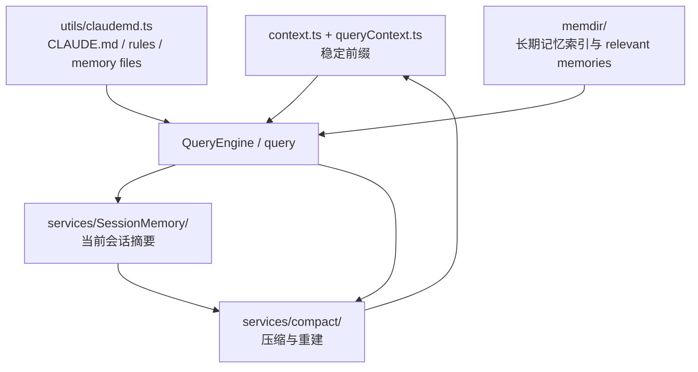
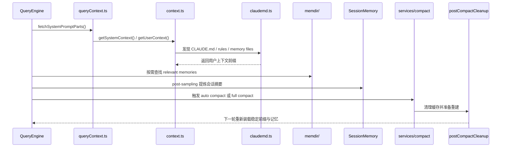

# context、memdir、compact 如何共同控制长会话上下文

## 1. 文档目标

这篇文档聚焦长会话上下文控制链路中的几个核心模块：

- `context.ts`
- `utils/queryContext.ts`
- `utils/claudemd.ts`
- `memdir/`
- `services/SessionMemory/`
- `services/compact/`

重点不是解释每个模块的实现细节，而是回答下面几个架构问题：

- 每一轮查询的稳定上下文前缀由谁构造。
- 长期指令和长期记忆从哪里进入模型上下文。
- 当前会话的摘要与长期记忆有什么区别。
- 会话变长后，系统由谁决定压缩、由谁负责压缩后的重建。

### 1.1 Overview 视图



这张图强调长会话上下文由四层协作完成：稳定前缀、长期指令与记忆、当前会话摘要、压缩后重建。

### 1.2 数据流视图



这条数据流回答的是长会话为什么不是简单截断历史，而是一次“前缀构建、摘要提炼、压缩重建”的循环。

## 2. 一句话结论

Claude Code 的长会话上下文不是由一个“history 截断器”控制，而是由四层协作完成：

- `context.ts` 和 `utils/queryContext.ts` 负责构造稳定、可缓存的上下文前缀。
- `utils/claudemd.ts` 和 `memdir/` 负责把长期指令、长期记忆和按需召回的记忆装入当前回合。
- `services/SessionMemory/` 负责持续提炼“当前会话已经发生了什么”。
- `services/compact/` 负责在窗口逼近上限时重写 transcript，并在压缩后强制重新装载上下文。

它们共同解决的是四个不同问题：稳定前缀、长期记忆、当前会话摘要、压缩后的重建。把这四件事混在一个模块里，反而会让长会话失控。

## 3. 分层关系

```text
稳定前缀层
  - context.ts
  - utils/queryContext.ts
  - constants/prompts.ts
        |
        v
长期指令与记忆装载层
  - utils/claudemd.ts
  - memdir/MEMORY.md
  - memdir/findRelevantMemories.ts
        |
        v
当前会话摘要层
  - services/SessionMemory/
        |
        v
压缩与重建层
  - services/compact/autoCompact.ts
  - services/compact/sessionMemoryCompact.ts
  - services/compact/compact.ts
  - services/compact/postCompactCleanup.ts
        |
        v
下一轮 QueryEngine / query
```

这个关系图有两个关键含义：

- 上下文控制并不等于“把旧消息删掉”，更重要的是决定哪些内容属于稳定前缀、哪些内容属于动态补充。
- compaction 不是链路终点，而是下一轮上下文重建的起点。

### 3.1 先用一个类比把四层上下文看清楚

如果把 Claude Code 的长会话想成一座大型图书馆，这四层可以这样理解：

- `context.ts` 和 `utils/queryContext.ts` 像每次进入阅览室前都会发给你的固定导览卡。它告诉你今天的基本规则、当前系统环境和稳定前缀信息，而且这一份导览卡在同一段会话里会尽量保持稳定。
- `utils/claudemd.ts` 和 `memdir/` 像图书馆里的长期馆藏系统。`CLAUDE.md`、rules、`MEMORY.md` 这些是常驻资料，但不是每本书都同时摊在桌上，很多记忆只会在当前问题明确相关时才被动态调出来。
- `SessionMemory` 像本次研究过程的阶段性笔记本。它记录的是“这一场研究目前推进到了哪里”，而不是整个馆藏本身。
- `services/compact/` 像整理桌面的管理员。当桌上资料太多放不下时，它不会简单把旧资料扔掉，而是会先保留摘要、清理桌面，再把下一轮继续研究真正需要的资料重新摆回来。

这个类比想强调两件事：

- 长会话不是靠“少放点消息”存活，而是靠“稳定前缀 + 长期资料 + 当前摘要 + 重建机制”协作。
- compact 的本质不是截断，而是“带着关键信息重开下一轮”。

### 3.2 再看一个真实长会话场景

假设用户在一个项目里持续工作了很久：

- 一开始系统先读入 `CLAUDE.md` 和一些长期记忆。
- 中途用户做了很多文件读取、工具调用和分析。
- 会话逐渐逼近上下文窗口上限。
- 最后系统自动 compact，但对话又能继续下去。

这条链路大致会这样走：

1. 每轮开始前，`fetchSystemPromptParts()` 先拿到稳定前缀。
  它并行取回 `defaultSystemPrompt`、`userContext`、`systemContext`。这里的重点是先把“每轮都需要但不必每次重新扫描全部环境”的前缀准备好。

2. `getUserContext()` 再通过 `utils/claudemd.ts` 把长期指令装进来。
  这一步并不是只读一个 `CLAUDE.md`，而是会把 managed/user/project/local memory 文件、rules、以及必要的 include 规则一起归一化成用户上下文前缀。

3. 当当前问题和长期记忆高度相关时，`memdir/findRelevantMemories.ts` 会动态召回少量相关 memory 文件。
  这里不会把整库记忆全部塞进 prompt，而是只挑当前 query 明确相关的少量条目补进本轮。

4. 会话持续推进时，`SessionMemory` 在后台提炼“当前这次会话已经做到哪里”。
  它不是长期知识库，而是当前工作过程的滚动摘要，为后面的 compact 做准备。

5. 当 token 接近阈值时，`autoCompactIfNeeded(...)` 决定是否进入 compact。
  系统会优先尝试 `trySessionMemoryCompaction(...)`，也就是尽量利用已经维护好的会话摘要来做更轻的 compact；如果不够，再退回完整 `compactConversation(...)`。

6. compact 完成后，`runPostCompactCleanup()` 清理缓存并触发下一轮重建。
  它会清空 `getUserContext()` 缓存、reset memory file cache、清掉部分 system prompt section 缓存和其它与旧上下文绑定的状态，确保下一轮不是“带着旧缓存假装 compact 完成”，而是真正重新装载前缀与长期资料。

这条路径可以压缩成一句话：

> 长会话不是把消息越堆越长，而是不断在“稳定前缀、长期记忆、当前摘要、compact 重建”之间循环切换，保证窗口有限时仍能继续工作。

## 4. 模块职责对照表

| 层 | 关键模块 | 主要职责 |
| --- | --- | --- |
| 稳定前缀层 | `context.ts`、`utils/queryContext.ts` | 生成 `systemContext`、`userContext` 和 system prompt 前缀，并在会话期缓存。 |
| 指令发现层 | `utils/claudemd.ts` | 发现并归一化 `CLAUDE.md`、rules、managed/user/project/local memory 文件。 |
| 长期记忆层 | `memdir/` | 定义持久记忆目录、`MEMORY.md` 入口、typed-memory 约束和按查询召回的 relevant memories。 |
| 当前会话摘要层 | `services/SessionMemory/` | 在后台提炼当前会话摘要，为后续 compaction 和继续对话提供会话级记忆。 |
| 压缩与重建层 | `services/compact/` | 决定何时 compact、优先采用哪种 compact 策略、compact 后需要重新注入哪些上下文。 |

## 5. `context.ts` 与 `utils/queryContext.ts` 的责任

### 5.1 `context.ts` 负责会话期稳定前缀

`context.ts` 的两个核心入口是：

- `getSystemContext()`
- `getUserContext()`

两者都通过 memoize 在会话期间缓存，这说明它们的定位不是“每次 query 都重新扫描所有环境”，而是“构造一段稳定、可复用的前缀”。

这一层主要承载的是：

- git 状态快照等系统级上下文。
- `CLAUDE.md` 与 memory 文件拼装后的用户级上下文。
- 当前日期这类轻量但全局共享的信息。

因此，长会话的第一道控制线不是压缩，而是尽量把不需要每轮重算的上下文稳定下来。

### 5.2 `utils/queryContext.ts` 负责把前缀变成 cache-safe 参数

`utils/queryContext.ts` 的 `fetchSystemPromptParts()` 会并行取回三块内容：

- `defaultSystemPrompt`
- `userContext`
- `systemContext`

这一层的价值在于：

- 把 cache key 前缀的构造逻辑集中起来。
- 让 `QueryEngine.ts`、side question 之类入口共享同一套前缀装配方式。
- 避免高层 prompt 构造与 `context.ts`、`constants/prompts.ts` 之间形成循环依赖。

需要特别区分的是：

- `context.ts` 负责“前缀里有什么”。
- `utils/queryContext.ts` 负责“这些前缀如何被 query 调用安全复用”。

### 5.3 这一层并不负责完整记忆系统

虽然 `getUserContext()` 会把 `CLAUDE.md` 与 memory 文件注入进去，但它自己并不负责发现这些文件；真正的文件发现与优先级规则在 `utils/claudemd.ts`。

所以不要把 `context.ts` 理解成记忆中心，它更接近“稳定前缀编排层”。

### 5.4 源码里的最小例子

这一层最典型的最小样本有两个：

- `src/context.ts` 里的 `getSystemContext()` / `getUserContext()`，两者都被 `memoize(...)` 缓存。
- `src/utils/queryContext.ts` 里的 `fetchSystemPromptParts()`，它并行取回 `defaultSystemPrompt`、`userContext`、`systemContext`。

这两个样本一起说明了这一层的本质：它要解决的是“每轮 query 之前，怎样稳定地拿到可复用的前缀材料”，而不是负责整个记忆体系本身。

## 6. `utils/claudemd.ts` 与 `memdir/` 的分工

### 6.1 `utils/claudemd.ts` 是总入口，不只是读一个 `CLAUDE.md`

`utils/claudemd.ts` 负责把多种来源的指令文件归一化为当前回合可消费的 memory files。它处理的来源至少包括：

- managed memory
- user memory
- project memory
- local memory
- 兼容 `.claude/rules/*.md` 的规则文件
- feature 打开时的 AutoMem 与 TeamMem 入口

这说明项目里的“用户上下文”并不是单个文件，而是一套有优先级、有来源差异的指令装载规则。

此外，这一层还承担了几项很关键的规范化工作：

- 支持 `@include` 把外部文件并入指令链。
- 解析 frontmatter 路径规则。
- 过滤不应重复注入的 memory files。
- 统一把这些来源拼成 `getClaudeMds(...)` 的输出。

因此，`getUserContext()` 看起来像是在读 `CLAUDE.md`，但真正的复杂性都被压缩在 `utils/claudemd.ts` 里。

### 6.2 `memdir/` 定义的是持久记忆域，而不是所有指令文件

`memdir/` 的职责与 `utils/claudemd.ts` 不同。它不负责整个指令层级，而是负责“持久记忆系统”本身，包括：

- 记忆目录路径与启停规则。
- `MEMORY.md` 作为入口索引的约束。
- typed-memory 的写法和行为提示。
- 记忆入口文件的截断策略。

尤其 `memdir/memdir.ts` 里的 `truncateEntrypointContent()` 很关键，它说明 `MEMORY.md` 被明确设计成“索引”，而不是把全部长期知识直接塞进上下文。

这背后的架构意图很清楚：

- 长期记忆可以很多。
- 但始终自动注入的入口必须保持短、稳、可控。

### 6.3 `findRelevantMemories.ts` 负责按查询动态补充记忆

`memdir/findRelevantMemories.ts` 又补了一层动态机制：

- 它先扫描记忆文件头部信息。
- 再用 side query 选择当前 query 明确相关的少量 memories。
- 最多返回少量高置信记忆，而不是把整库记忆全部塞进 prompt。

这意味着 `memdir/` 有两种上下文进入方式：

- 静态入口：`MEMORY.md` 作为长期索引进入前缀。
- 动态入口：relevant memories 在需要时作为 attachment 进入当前回合。

这套设计避免了“长期记忆越积越多，前缀无限膨胀”的问题。

### 6.4 源码里的最小例子

`utils/claudemd.ts` 这层最典型的最小样本是 `getMemoryFiles(...)`。

从这个函数可以直接看出，它会按来源顺序收集：

- managed memory
- user memory
- project/local memory
- `.claude/rules/*.md`

同时它还负责处理 include、去重、缓存和目录层级遍历。这个最小例子很能说明：`claudemd` 层的复杂性不在“读文件”，而在“把多种长期指令来源归一化成当前回合可注入内容”。

`memdir/` 这层最典型的最小样本有两个：

- `src/memdir/memdir.ts` 里的 `truncateEntrypointContent(...)`，说明 `MEMORY.md` 被设计成短而可控的入口索引，而不是整库全文注入。
- `src/memdir/findRelevantMemories.ts` 里的 `findRelevantMemories(...)`，说明 relevant memories 是在 query 时动态选择的，最多只挑少量高相关文件补进当前回合。

这两个样本一起说明 `memdir/` 的本质：它不是把长期记忆全部塞进 prompt，而是把长期记忆拆成“稳定入口 + 动态召回”两套机制。

## 7. `SessionMemory` 与 `memdir` 不是一回事

### 7.1 `SessionMemory` 面向当前会话，不面向跨会话持久知识

`services/SessionMemory/` 维护的是当前会话的摘要 markdown 文件。它的目标不是长期知识管理，而是把“本次会话已经推进到哪里”持续提炼出来。

这一层和 `memdir/` 的根本区别是：

- `memdir/` 面向长期、跨会话、可沉淀的记忆。
- `SessionMemory` 面向当前会话、持续滚动、为 compaction 服务的摘要。

### 7.2 `setup.ts` 只负责注册，真正执行由 hook 驱动

`setup.ts` 在非 bare 模式下调用 `initSessionMemory()`，后者同步注册 post-sampling hook，但真正的 gate 检查与配置加载是懒执行的。

这说明 `SessionMemory` 的架构定位是：

- 不是启动时立即跑的预处理。
- 而是会话运行过程中的后台服务。

### 7.3 它只在主 REPL 线程按阈值抽取

`extractSessionMemory()` 明确只在 `repl_main_thread` 上运行，并且只有在满足 token 增长与工具调用阈值后才触发。触发后，它会：

- 创建隔离的 subagent context。
- 准备 session memory 文件。
- 用 forked agent 更新摘要内容。
- 记录最近一次已经被摘要覆盖到的消息边界。

这几个动作表明 `SessionMemory` 的核心责任不是“保存历史”，而是“维护一个可被 compact 复用的当前会话摘要”。

### 7.4 源码里的最小例子

`src/services/SessionMemory/sessionMemory.ts` 里最典型的最小样本是 `shouldExtractMemory(...)` 和初始化后的后台抽取主线。

从 `shouldExtractMemory(...)` 可以直接看出，这层状态不是每轮都盲目更新，而是基于：

- 当前 token 增长
- 工具调用数量
- 最近 assistant turn 是否适合抽取

来决定何时更新当前会话摘要。这个最小例子很能说明 `SessionMemory` 的本质是“节流过的会话摘要服务”，而不是另一份 transcript。

## 8. `services/compact/` 如何控制压缩与重建

### 8.1 `autoCompact.ts` 决定何时进入 compact

`autoCompact.ts` 的职责不是实际生成摘要，而是决定：

- 当前 token 使用是否超过阈值。
- 哪些 query source 不允许递归触发 compact，例如 `session_memory` 与 `compact` 自身。
- 在 auto compact 被触发时优先尝试哪条压缩路径。

它本质上是“上下文窗口守门员”。

### 8.2 `sessionMemoryCompact.ts` 是更轻的优先路径

自动 compact 触发后，系统会先尝试 `trySessionMemoryCompaction()`。这条路径的特点是：

- 先等待正在进行中的 session memory extraction 完成。
- 直接读取现成的 session memory 内容。
- 计算一段需要保留的最近消息后缀，而不是把整段历史重新总结一遍。
- 重新跑 session start hooks，确保 `CLAUDE.md` 等上下文在压缩后仍然成立。

所以 SessionMemory 并不只是另一个摘要文件，它还是 auto compact 的第一优先信息源。

### 8.3 `compact.ts` 做的是“压缩后重建”，不只是删消息

当 SessionMemory compact 不可用或不足以满足阈值时，系统会退回 `compactConversation()`。这一步最重要的不是“生成摘要”，而是压缩后的重建动作：

- 先清空 `readFileState` 与 `loadedNestedMemoryPaths`。
- 根据压缩前的读文件状态重建 post-compact file attachments。
- 补回 async agent、plan、plan mode、invoked skills 等附件。
- 重新宣布 deferred tools、agent listing、MCP instructions 这类 delta attachment。
- 重新执行 session start hooks。
- 写入新的 compact boundary 与 summary messages。

这说明在 Claude Code 里，compact 的语义其实是：

- 重写消息边界。
- 补回模型下一轮继续工作所需的关键上下文。

而不是简单地“把旧消息裁掉”。

### 8.4 `postCompactCleanup.ts` 负责把缓存真正重置干净

压缩完成后，`runPostCompactCleanup()` 会进一步清理主线程侧缓存，例如：

- 清空 `getUserContext()` 的 memoized cache。
- 重置 `getMemoryFiles()` 缓存。
- 清理 system prompt section 缓存、classifier approvals、session message cache 等。

这个动作非常关键，因为如果只压 transcript，不清前缀缓存，那么下一轮根本不会重新读取更新后的 `CLAUDE.md` 和 memory files。

因此，compact 真正的闭环是：

- 压缩旧上下文。
- 清掉旧缓存。
- 让下一轮重新装载长期指令和长期记忆。

### 8.5 源码里的最小例子

这一层最典型的最小样本有三个：

- `src/services/compact/autoCompact.ts` 里的 `autoCompactIfNeeded(...)`，它先判断是否该 compact，再优先尝试 `trySessionMemoryCompaction(...)`，最后才退回 `compactConversation(...)`。
- `src/services/compact/sessionMemoryCompact.ts` 里的 `trySessionMemoryCompaction(...)`，说明系统会尽量复用已经维护好的 SessionMemory 做更轻量的 compact。
- `src/services/compact/postCompactCleanup.ts` 里的 `runPostCompactCleanup()`，它会清掉 `getUserContext()` cache、memory file cache 和相关 prompt/cache 状态。

这三个样本一起说明 compact 在这个系统里的本质不是“删掉一些消息”，而是“决定何时压缩、优先走哪条压缩路径、压缩后如何确保下一轮真的用新上下文重建”。

## 9. 一次长会话中的协作顺序

一条典型长会话链路大致如下：

1. `setup.ts` 在合适模式下注册 `SessionMemory` 后台 hook。
2. 每轮 query 前，`utils/queryContext.ts` 取得 system prompt、`userContext`、`systemContext` 作为稳定前缀。
3. `getUserContext()` 通过 `utils/claudemd.ts` 把 `CLAUDE.md`、rules、AutoMem/TeamMem 等文件拼进用户上下文。
4. `memdir/` 通过 `MEMORY.md` 和 relevant memories 附件，把长期记忆静态或动态地补进当前回合。
5. 会话推进后，`SessionMemory` 在后台提炼当前会话摘要，并记录已覆盖的消息边界。
6. 当 token 接近阈值时，`autoCompact.ts` 先尝试 SessionMemory compaction，不够再退回完整 compact。
7. 压缩完成后，`postCompactCleanup.ts` 清理缓存，让下一轮重新加载长期指令、长期记忆和必要附件。

所以长会话不是靠某一次 compact 存活，而是靠“稳定前缀 + 记忆装载 + 会话摘要 + 压缩重建”的循环持续推进。

## 10. 不应混淆的边界

### 10.1 `context.ts` 不是完整记忆系统

它负责稳定前缀，不负责 memory 文件发现规则本身。

### 10.2 `memdir/` 不是当前会话摘要

它负责长期记忆目录和按需召回，不负责当前会话已经走到哪里的滚动摘要。

### 10.3 `SessionMemory` 不是 `CLAUDE.md` 的替代品

它是当前会话服务，不替代 managed/user/project/local instruction hierarchy。

### 10.4 `compact/` 不是单纯的“消息裁剪器” 

它真正负责的是压缩后的上下文重建和缓存刷新。

如果只保留一句话，可以这样记：

- `context.ts` 保证每轮都有稳定前缀。
- `utils/claudemd.ts` 和 `memdir/` 保证长期指令与长期记忆能进来。
- `SessionMemory` 保证当前会话不会在长对话里完全丢失。
- `services/compact/` 保证窗口爆掉之前，系统还能带着正确上下文继续跑下去。