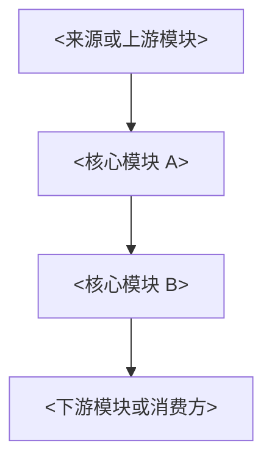
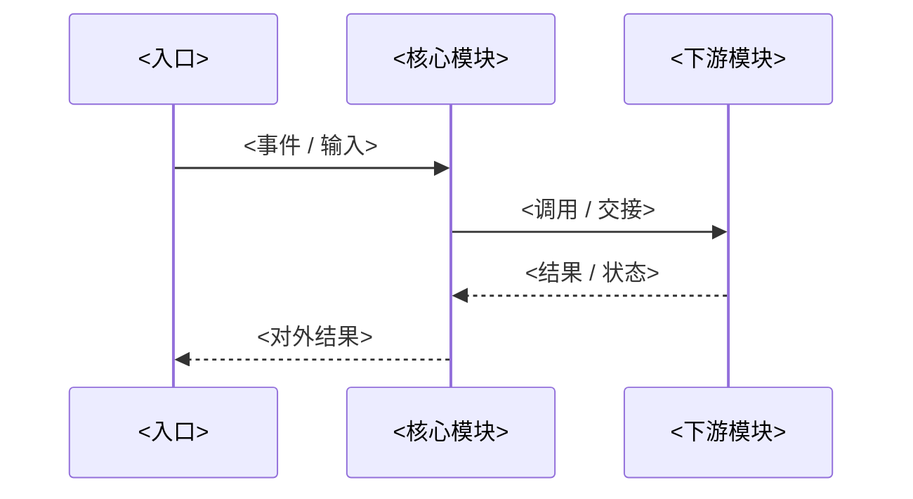

# 架构专题模板

## 1. 模板用途

这份模板用于后续新增重点模块专题文档。它不替代索引页，也不替代概念文档，而是为“某个重点模块或横切主线”提供统一骨架。

适用范围：

- 单个重点模块，如某个运行时内核、某类服务边界、某条关键执行链路。
- 横切专题，如权限体系、能力装载、长会话控制、多代理执行。

不适用范围：

- `docs/architecture/README.md` 这类索引页。
- 纯术语表或名词解释页。
- 单个函数、单个命令、单个工具实现说明。

写作约束：

- 必须包含 Overview 视图和数据流视图。
- 必须包含一个共享类比，帮助读者先建立直觉上的分层认识。
- 必须包含一个真实场景，说明一次请求、一次状态变化或一次生命周期如何穿过这些模块。
- 必须包含“源码里的最小例子”，用真实文件、函数、类型或数据结构把抽象边界钉回源码。
- 重点解释模块和层级以及它们的责任，不写实现细节。
- 明确“负责什么”和“不负责什么”，避免专题之间边界重叠。
- 术语优先复用 [concepts-and-terminology.md](./concepts-and-terminology.md) 的定义。

## 2. 推荐骨架

复制下面的骨架，新建专题文档时替换尖括号占位内容。

````md
# <专题名称>

## 1. 文档目标

这篇文档用于解释 <模块 / 子系统 / 横切主线> 在系统中的职责边界。

重点回答：

- <问题 1>
- <问题 2>
- <问题 3>

### 1.1 Overview 视图



这张图强调的是 <层级、依赖方向、控制权分布>。

### 1.2 数据流视图



这条数据流回答的是 <一次请求 / 生命周期 / 状态变化> 如何穿过这些模块。

## 2. 一句话结论

<用 1 到 2 句话概括此专题的核心边界判断。>

## 3. 分层关系

```text
<主题名>
├── <层 1>
├── <层 2>
├── <层 3>
└── <层 4>
```

### 3.1 先用一个类比把这个专题看清楚

如果把 <主题> 想成 <类比对象>，那么：

- `<层 / 模块 A>` 像 <类比中的角色 A>
- `<层 / 模块 B>` 像 <类比中的角色 B>
- `<层 / 模块 C>` 像 <类比中的角色 C>

这个类比最重要的是说明：

- <边界判断 1>
- <边界判断 2>

### 3.2 再看一个真实场景

假设 <一个真实请求 / 生命周期 / 故障场景>，系统大致会这样走：

1. <步骤 1>
2. <步骤 2>
3. <步骤 3>
4. <步骤 4>

这条场景压缩成一句话就是：

> <用一句话概括真实链路想说明的边界>

## 4. 模块职责对照表

| 模块 | 责任 | 不负责 |
| --- | --- | --- |
| `<模块 A>` | <责任> | <不负责内容> |
| `<模块 B>` | <责任> | <不负责内容> |

## 5. <核心模块 A> 的责任

### 5.1 <子边界 A>

<说明>

### 5.2 <子边界 B>

<说明>

### 5.3 源码里的最小例子

`<文件 A>` 里的 `<函数 / 类型 / 常量>`。

这个例子说明：<该层最核心的边界>。

## 6. <核心模块 B> 的责任

### 6.1 <子边界 A>

<说明>

### 6.2 <子边界 B>

<说明>

### 6.3 源码里的最小例子

`<文件 B>` 里的 `<函数 / 类型 / 常量>`。

这个例子说明：<第二层最核心的边界>。

## 7. 关键交接边界

### 7.1 数据边界

<谁拥有数据、谁只消费数据>

### 7.2 控制边界

<谁驱动流程、谁只是被调用方>

### 7.3 状态边界

<哪些状态是长期的，哪些只存在于单轮或单次调用>

## 8. 典型链路

1. <步骤 1>
2. <步骤 2>
3. <步骤 3>

## 9. 不应混淆的边界

### 9.1 <常见误解 1>

<澄清>

### 9.2 <常见误解 2>

<澄清>

## 10. 设计价值

<解释为什么要这样分层，以及这种设计给后续扩展带来的价值。>

## 11. 开放问题（可选）

- <尚未稳定的边界>
- <后续值得继续拆的专题>
````

## 3. 写作建议

### 3.1 标题应该围绕边界，而不是目录名

标题最好写成“X 与 Y 如何分工”或“X、Y、Z 如何形成某个执行面”，而不是简单把目录名并列出来。这样能逼迫文档先给出架构判断，再展开模块介绍。

### 3.2 Overview 视图只画主干依赖

Overview 视图回答的是层级关系和依赖方向。图中不必包含所有实现模块，只保留真正决定专题结构的 4 到 7 个节点。

### 3.3 数据流视图只讲一条主线

不要把所有分支都塞进一张图里。每篇专题只保留一条最能解释该主题的数据流或生命周期，必要时在正文中补充例外路径。

### 3.4 责任边界优先写“不负责什么”

如果某个模块看起来“什么都管”，通常说明边界写得不够清楚。每个核心模块都应该明确写出至少一条“不负责什么”。

### 3.5 源码例子要小，不要变成代码导读

“源码里的最小例子”只需要拿一个最能说明边界的入口，例如一个类型、一个组装函数、一个注册函数、一个关键分支。目的不是把整段实现复述出来，而是证明文档里的抽象判断在源码中确实有锚点。

### 3.6 专题文档应回链索引页

新增专题后，应同步更新 [README.md](./README.md) 的文档地图和推荐阅读顺序，避免索引页落后于正文。