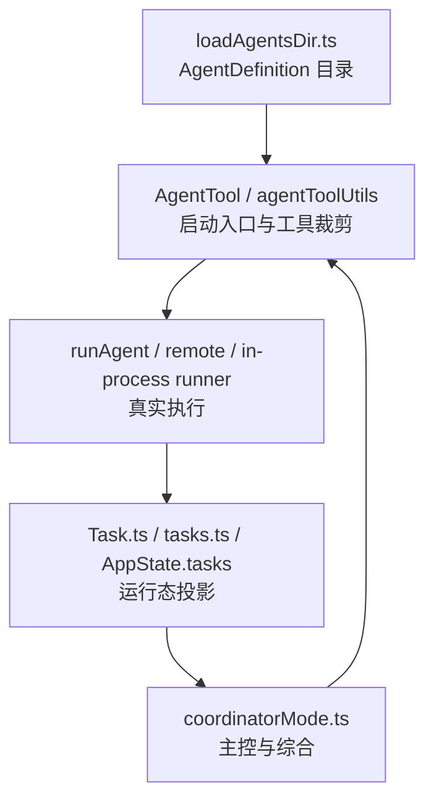
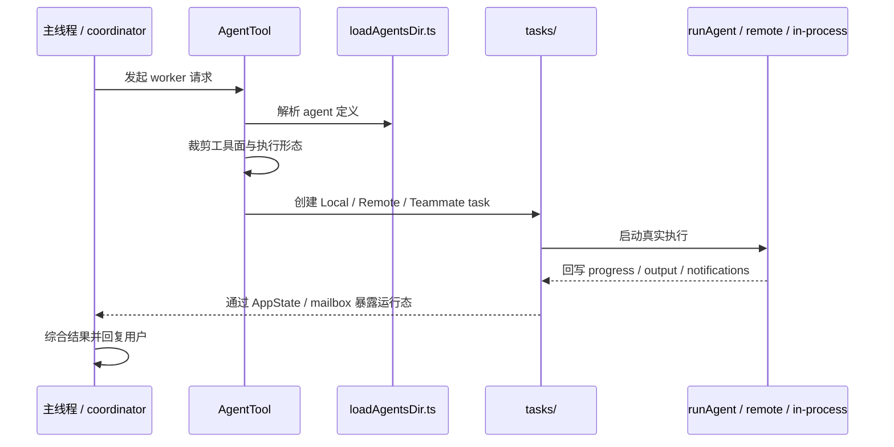

# tasks、coordinator、agents 如何形成多代理执行面

## 1. 文档目标

这篇文档聚焦多代理执行面中的几组核心模块：

- `Task.ts`、`tasks.ts`、`tasks/`
- `coordinator/coordinatorMode.ts`
- `tools/AgentTool/`
- `utils/swarm/`

重点不是解释单个 agent prompt 或某个任务组件的实现细节，而是回答下面几个架构问题：

- agent 定义从哪里来，和运行时任务状态有什么区别。
- 一个 agent 请求如何变成可运行的 worker。
- 本地、远端、同进程 teammate 为什么都要落到任务系统里。
- coordinator mode 如何把主线程变成多代理控制面。

### 1.1 Overview 视图



这张图强调多代理执行面统一的不是 agent 文件本身，而是 agent 定义、执行入口、任务投影和主控层四个层次。

### 1.2 数据流视图



这条数据流说明一次多代理请求如何从主线程决策进入 worker 执行，再以任务状态和结果回流到主线程。

## 2. 一句话结论

Claude Code 的多代理执行面不是单个“agent manager”，而是五层协作：

- `loadAgentsDir.ts` 提供静态 agent 定义面。
- `AgentTool`、`agentToolUtils.ts`、`runAgent.ts` 把定义变成真正可运行的 worker。
- `Task.ts`、`tasks.ts`、`tasks/` 把运行中的 worker 投影为统一任务状态。
- `coordinatorMode.ts` 让主线程从“直接执行者”切换为“调度者和综合者”。
- `spawnInProcess.ts` 与 `inProcessRunner.ts` 则把同进程 teammate 纳入同一套多代理执行面。

因此，这套架构真正统一的不是“agent 文件”，而是“agent 定义、运行入口、任务投影和调度控制面”四个层次。

## 3. 分层关系

```text
Agent 定义层
  - tools/AgentTool/loadAgentsDir.ts
  - built-in / plugin / user / project / policy agents
        |
        v
执行入口层
  - tools/AgentTool/AgentTool.tsx
  - tools/AgentTool/agentToolUtils.ts
  - tools/AgentTool/runAgent.ts
        |
        +--> LocalAgentTask
        +--> RemoteAgentTask
        +--> InProcessTeammateTask
        |
        v
运行态投影层
  - Task.ts
  - tasks.ts
  - AppState.tasks
        |
        v
主控协调层
  - coordinator/coordinatorMode.ts
  - constants/tools.ts
  - tools.ts
```

这张图表达的是：

- `agents` 先定义“有哪些 worker 类型可以被启动”。
- `tasks` 再定义“这些 worker 在运行时如何被追踪、停止、恢复和展示”。
- `coordinator` 则定义“主线程如何使用这些 worker”。

## 4. 模块职责对照表

| 层 | 关键模块 | 主要职责 |
| --- | --- | --- |
| 定义层 | `loadAgentsDir.ts` | 从 built-in、plugin、user、project、flag、policy 等来源装载 `AgentDefinition`。 |
| 能力裁剪层 | `agentToolUtils.ts`、`constants/tools.ts` | 根据 agent 来源、异步模式、permission mode 裁剪可见工具面。 |
| 执行入口层 | `AgentTool.tsx`、`runAgent.ts` | 接收启动请求，准备 system prompt、工具池、MCP 连接、上下文和 query loop。 |
| 任务投影层 | `Task.ts`、`tasks.ts`、`tasks/` | 统一描述运行态任务类型、状态、输出、通知与终止语义。 |
| 主控层 | `coordinatorMode.ts`、`tools.ts` | 把主线程约束为调度者，并为 worker 暴露明确的能力边界。 |
| teammate 扩展层 | `spawnInProcess.ts`、`inProcessRunner.ts` | 让同进程 teammate 共享主进程状态，同时保留身份和权限隔离。 |

## 5. `AgentDefinition` 是静态能力契约

### 5.1 `loadAgentsDir.ts` 负责装载，不负责执行

`loadAgentsDir.ts` 提供的是 `AgentDefinition`，而不是运行中的 task。它把 agent 的静态信息集中在一个定义对象里，例如：

- `tools` / `disallowedTools`
- `skills`
- `mcpServers`
- `permissionMode`
- `background`
- `isolation`
- `memory`
- `model`、`effort`、`maxTurns`

这说明 agent 在架构上首先是一份“能力契约”，而不是一个活跃会话。

### 5.2 多来源 agent 先汇成统一目录，再按优先级覆盖

这一层会把多种来源的 agent 合并到同一张定义表里：

- built-in agents
- plugin agents
- user settings agents
- project settings agents
- flag settings agents
- policy settings agents

`getActiveAgentsFromList()` 用后写覆盖前写的方式决定最终生效版本，因此它解决的是“同名 agent 到底以哪份定义为准”。

所以这里的统一，本质上是统一 agent catalog，而不是统一运行状态。

### 5.3 这一层只回答“能不能启动”，不回答“现在怎么样”

例如 required MCP server 检查会决定一个 agent 是否应当出现在可用列表中，但它不追踪这个 agent 的当前进度、输出文件或通知状态。

这也是为什么多代理系统必须再有独立的 `tasks/` 层。

## 6. `AgentTool` 与 `runAgent.ts` 是执行内核

### 6.1 `AgentTool` 是多代理能力的外部入口

无论调用者是主线程模型、coordinator，还是 team 场景中的其它 worker，真正的启动入口都是 `AgentTool`。

这一层的职责包括：

- 解析要启动哪种 agent。
- 校验权限与可用 agent 类型。
- 判断是同步执行、后台执行、远端执行还是 teammate spawn。
- 为后续运行准备 task id、agent id、output file 等运行时句柄。

因此，`AgentTool` 才是“多代理执行面”的门面层，而不是 `loadAgentsDir.ts`。

### 6.2 `agentToolUtils.ts` 负责把 agent 能力收敛成可执行工具面

`filterToolsForAgent()` 与 `resolveAgentTools()` 共同完成工具面裁剪。它们会考虑：

- 这是 built-in agent 还是 custom agent。
- 这是同步 worker 还是 async worker。
- 当前 permission mode 是什么。
- 是否处于 in-process teammate 场景。

同时，`constants/tools.ts` 提供几组关键白名单与黑名单：

- `ALL_AGENT_DISALLOWED_TOOLS`
- `ASYNC_AGENT_ALLOWED_TOOLS`
- `IN_PROCESS_TEAMMATE_ALLOWED_TOOLS`
- `COORDINATOR_MODE_ALLOWED_TOOLS`

这意味着多代理执行面的关键边界之一是：

- 不是所有 worker 都能看到主线程能看到的全部工具。
- 不同 worker 形态有不同的工具表面。

### 6.3 `runAgent.ts` 把静态 agent 定义变成真实 query loop

`runAgent.ts` 是 agent 执行内核。它负责把一份 `AgentDefinition` 转成一次真正运行的 worker，会处理：

- agent-specific system prompt 组装。
- agent-specific MCP servers 的初始化与清理。
- subagent context 与文件状态隔离。
- 工具池解析与 allowed tools 约束。
- query source、abort、metadata、transcript 等运行时信息。

所以 `runAgent.ts` 的角色不是“管理 task”，而是“执行 agent 本体”。

## 7. `Task.ts`、`tasks.ts` 与 `tasks/` 负责运行态投影

### 7.1 `Task.ts` 定义统一任务基座

`Task.ts` 统一定义了：

- `TaskType`
- `TaskStatus`
- 基础 task state 字段
- task id 生成规则
- `kill(...)` 这类最小公共契约

这一层的核心价值是：

- 让本地 agent、远端 agent、shell、workflow、teammate 等异步实体共享同一种运行时抽象。

### 7.2 `tasks.ts` 是任务注册表，不是调度算法

`tasks.ts` 做的事情很简单但很重要：

- 聚合所有 task 实现。
- 按 `TaskType` 找到对应实现。

所以它更像运行时索引，而不是复杂调度器。真正的生命周期处理还是散落在各个具体任务实现里。

### 7.3 `LocalAgentTask` 负责本地 agent 的生命周期投影

`LocalAgentTask` 承接的是本地 agent 的运行态，它主要负责：

- progress 统计与最近 activity 跟踪。
- 前台/后台切换。
- output file 和 transcript 视图。
- 任务完成、失败、终止时的通知。

也就是说，本地 agent 真正“活着”的状态主要体现在 `AppState.tasks` 里的 `local_agent` task，而不是 `AgentDefinition` 本身。

### 7.4 `RemoteAgentTask` 负责远端 worker 的会话型生命周期

`RemoteAgentTask` 管理的是远端 session 型 worker。它关心的是：

- remote session id
- poll 日志和事件
- sidecar metadata 持久化与恢复
- 远端 review / ultraplan 这类长时任务状态

因此，远端 worker 并不是 `runAgent.ts` 的一个小分支，而是一套需要独立轮询和恢复语义的任务壳。

### 7.5 `InProcessTeammateTask` 负责同进程 teammate 的运行态

`InProcessTeammateTask` 跟 `LocalAgentTask` 的区别很大。它额外处理的是：

- team-aware identity
- idle / active / shutdown 生命周期
- pending user messages
- teammate transcript 视图
- 与 team context 的联动

这说明 in-process teammate 不是“agent 的另一种 UI 展示”，而是独立的运行形态。

## 8. `coordinatorMode.ts` 把主线程变成控制面

### 8.1 coordinator mode 改变的是主线程职责

`coordinatorMode.ts` 的核心不是再定义一批 worker，而是改变主线程的角色：

- 主线程负责拆任务、调度 worker、综合结果、回复用户。
- 真正的检索、改代码、验证工作优先下沉到 worker。

因此，coordinator mode 是“控制面切换”，不是“agent 目录切换”。

### 8.2 它通过专门的 userContext 与 system prompt 注入调度约束

`getCoordinatorUserContext()` 会把 worker tool 能力、MCP server 能力以及可选 scratchpad 信息注入当前 user context。

`getCoordinatorSystemPrompt()` 则明确规定 coordinator 的工作流：

- 研究可并发。
- 综合必须由 coordinator 自己完成。
- 实现和验证应尽量交给 worker。
- worker 结果是内部信号，不是新的对话参与者。

这让多代理系统的“谁负责综合”变得明确，而不是完全依赖模型临场决定。

### 8.3 `tools.ts` 与 `constants/tools.ts` 收紧 coordinator 的工具面

在标准模式下，coordinator 主线程会被收敛到以 agent 管理和输出为主的工具面；核心白名单由 `COORDINATOR_MODE_ALLOWED_TOOLS` 定义，包括：

- `AgentTool`
- `TaskStopTool`
- `SendMessage`
- `SyntheticOutput`

在 simple mode 下，路径稍有不同，主线程仍保留简化版 Bash/Read/Edit，同时附加 agent 管理工具。

无论哪条路径，本质都一样：

- coordinator 不再被设计成“自己做完所有事”。
- 它被设计成“掌控 worker 并整合结果”。

## 9. 同进程 teammate 路径为什么是独立执行面

### 9.1 `spawnInProcess.ts` 负责把 teammate 注册成共享进程中的一个任务

`spawnInProcessTeammate()` 会为 teammate 创建：

- 确定性的 `agentId`
- 独立 `taskId`
- 独立 `AbortController`
- `TeammateContext`
- `InProcessTeammateTaskState`

并把这些内容注册到 `AppState.tasks` 与 `teamContext` 里。

这说明 teammate 并不是 UI 临时对象，而是正式的运行时实体。

### 9.2 `inProcessRunner.ts` 让 teammate 共享主进程但不共享身份

`inProcessRunner.ts` 会用 `runWithTeammateContext()` / `runWithAgentContext()` 把 teammate 拉进同一个 Node.js 进程执行，同时通过 AsyncLocalStorage 做身份隔离。

因此同进程 teammate 的特征是：

- 共享主进程和 `AppState`。
- 但拥有独立 agent 身份、独立权限等待、独立消息邮箱。

### 9.3 它通过 mailbox 和 permission bridge 与 leader 协作

这一层额外实现了两种关键协作机制：

- leader 的 ToolUseConfirm 队列与 permission bridge。
- teammate mailbox、idle notification、shutdown request 等协作信号。

这意味着 in-process teammate 不只是“更快的 subagent”，而是一种能与主线程持续协作的 worker 形态。

## 10. 一次多代理执行的实际流向

一条典型多代理链路大致如下：

1. 启动阶段先由 `loadAgentsDir.ts` 汇总当前可用 agent 定义。
2. 如果当前会话处于 coordinator mode，主线程先被切换为调度者，并获得 coordinator 专用 prompt 与工具面。
3. 主线程或上层 worker 通过 `AgentTool` 发起启动请求。
4. `agentToolUtils.ts` 根据 agent 定义、异步模式和权限规则解析出真正可用的工具池。
5. 系统把这次执行投影为 `LocalAgentTask`、`RemoteAgentTask` 或 `InProcessTeammateTask`。
6. `runAgent.ts`、remote poller 或 `inProcessRunner.ts` 驱动真实执行。
7. 进度、输出、通知再通过 `AppState.tasks`、task notification 或 teammate transcript 回流到主线程。

所以多代理系统真正闭环的是：

- agent 定义
- 工具裁剪
- 运行态任务
- coordinator 综合

而不是“多写几个 prompt 文件”。

## 11. 不应混淆的边界

### 11.1 `AgentDefinition` 不等于运行中的 worker

前者是静态契约，后者必须通过 `AgentTool`、`runAgent.ts` 和 `tasks/` 才会变成活跃执行体。

### 11.2 `tasks.ts` 不是 agent catalog

它注册的是任务实现，不是可选 agent 类型。

### 11.3 `coordinator mode` 不是另一套 agent 系统

它改变的是主线程的 prompt 和工具面，而不是重新定义 worker 本身。

### 11.4 `InProcessTeammateTask` 不是 UI 装饰

它是共享进程中的正式 worker 容器，带有自己的身份、权限桥接和邮箱协作语义。

如果只保留一句话，可以这样记：

- `agents` 决定“有哪些 worker 可以被启动”。
- `AgentTool` 和 `runAgent.ts` 决定“这些 worker 怎么跑起来”。
- `tasks/` 决定“跑起来之后如何被追踪和控制”。
- `coordinator` 决定“主线程如何把这些 worker 组织成一套多代理执行面”。