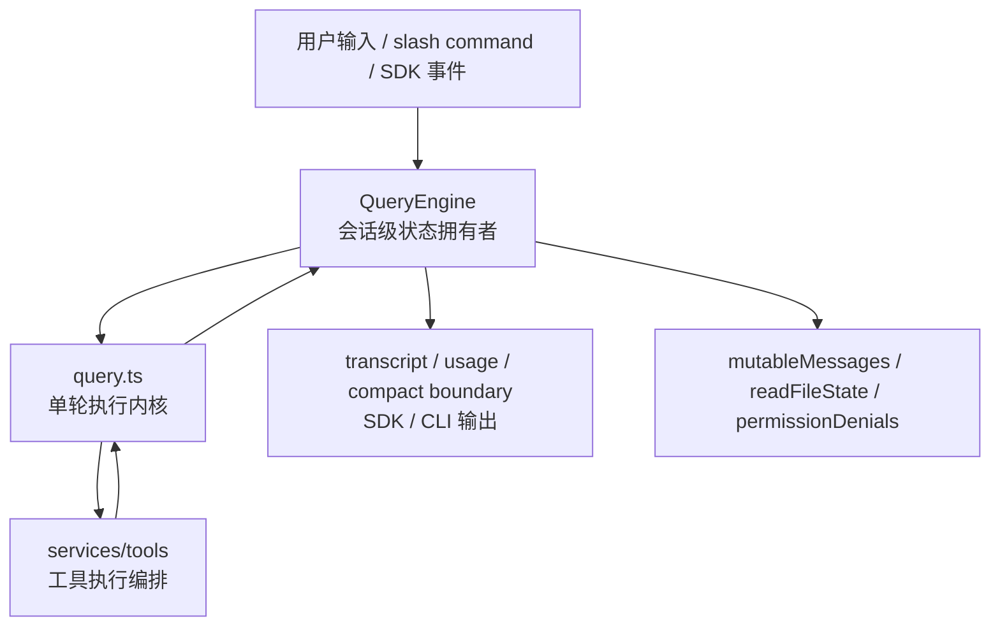
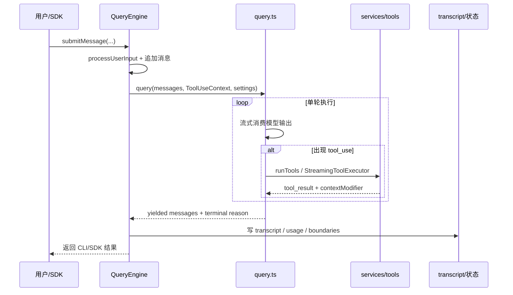

# QueryEngine 与 query 职责边界

## 1. 文档目标

这篇文档只解释 `QueryEngine.ts` 与 `query.ts` 的架构边界、依赖方向和协作关系，不展开具体 API 调用细节或消息格式细节。

要回答的问题只有三个：

- 谁持有会话级状态。
- 谁负责驱动单轮 agent 循环。
- 两者如何通过统一上下文交接。

### 1.1 Overview 视图



这张图强调的是所有权边界：`QueryEngine` 持有会话级状态，`query.ts` 负责把当前轮次跑完整，工具执行只是内核中的一个阶段。

### 1.2 数据流视图



这条数据流回答的是一次用户输入如何从会话外壳进入单轮内核，再回到持久化与外部结果层。

## 2. 一句话结论

`QueryEngine` 是“会话外壳”和“状态拥有者”，负责把一轮输入接入既有会话；`query` 是“单轮执行内核”，负责把当前输入跑完整个模型-工具-恢复-继续的闭环。

换句话说：

- `QueryEngine` 关心“这条会话现在是什么状态，以及这一轮开始前后要写回什么”。
- `query` 关心“给定当前消息和上下文，这一轮应该如何继续直到结束或继续下一跳”。

## 3. 分层关系

```text
用户输入 / slash command / SDK 输入
        |
        v
QueryEngine
  - 持有 mutableMessages / usage / transcript 边界
  - 预处理输入、装配 ToolUseContext
  - 调用 query(...)
        |
        v
query
  - 跑单轮模型循环
  - 收集 assistant/tool_use/tool_result
  - 执行 compact / recovery / follow-up
        |
        v
QueryEngine
  - 接收 yield 出来的消息
  - 写回 transcript / usage / SDK 结果
  - 更新会话状态并决定下一轮入口
```

这层拆分让系统同时满足两件事：

- 内核可以围绕“单轮查询”保持集中，不掺入太多 UI/SDK/持久化职责。
- 会话层可以在不改动单轮循环的前提下，对接 headless、SDK、远程、恢复、日志持久化等外层需求。

### 3.1 先用一个类比把两层关系看清楚

如果把一次对话想成“电视剧拍摄”，`QueryEngine` 和 `query` 的关系可以这样理解：

- `QueryEngine` 像整部剧的制片与场记系统。它知道前面拍过什么、预算用了多少、素材存在哪、这一场拍完后要不要归档、怎么把结果交付给平台。
- `query` 像当前这一场戏的导演。它拿到这一场的剧本和现场资源后，决定这一镜怎么拍、什么时候调用道具、拍崩了是否要重来、是否需要补拍下一镜。
- `Tool` 像片场里真正被调用的灯光、道具、摄影机、外援团队。导演会调度它们，但制片系统不会在镜头里直接指挥每一次打光。

这个类比最重要的地方在于区分“跨场次持续存在的东西”和“只属于当前这一场的东西”：

- 跨多轮持续存在的，更接近 `QueryEngine`。
- 只在当前轮次成立的，更接近 `query`。

### 3.2 再看一个真实执行场景

假设用户在当前会话里发出一句话：请帮我审查最近改动，并指出风险。

这时系统大致会这样走：

1. 输入先进入 `QueryEngine.submitMessage(...)`。
  这一步不是简单地“把 prompt 发给模型”，而是把这条新输入接到已有会话上。`QueryEngine` 会先读取当前已有消息、usage、文件状态、权限拒绝记录等会话级状态。

2. `QueryEngine` 预处理输入。
  它会调用 `processUserInput(...)`，处理 slash command、附件、可能的 prompt 改写、模型覆盖等逻辑，然后把这次用户输入真正写进 `mutableMessages`。

3. `QueryEngine` 构造本轮上下文并调用 `query(...)`。
  到这一步，它把当前消息快照、可用 tools、mcpClients、权限上下文、AppState 接口等装进 `ToolUseContext`，然后把“这一轮需要的全部材料”交给单轮内核。

4. `query(...)` 开始跑这一轮。
  它会消费模型流式输出，判断有没有 `tool_use`，如果需要就调用 `runTools(...)` 或 `StreamingToolExecutor`，然后再把工具结果接回消息流，决定是否继续 follow-up、是否 compact、是否因为 token/budget 等原因调整策略。

5. `query(...)` 把这一轮产出的消息和终止原因吐回给 `QueryEngine`。
  注意它只回答“这一轮为什么结束”，不回答“整个会话最后怎么存、怎么对外展示”。

6. `QueryEngine` 再把结果写回会话和外部世界。
  它会更新 `mutableMessages`、usage、transcript、compact boundary，并把消息转成 SDK/CLI 能理解的输出格式。

这个场景可以压缩成一句话：

> `QueryEngine` 负责把“这段对话到目前为止是什么状态”管理好，`query` 负责把“这一轮接下来怎么跑完”执行好。

## 4. QueryEngine 的责任

`QueryEngine` 的角色更接近“每个会话一个实例的运行时控制器”。它主要负责以下几类事情。

### 4.1 持有会话级状态

`QueryEngine` 持有跨多轮持续存在的状态，包括：

- `mutableMessages`：当前会话的消息主存。
- `readFileState`：文件读取缓存和相关状态。
- `totalUsage`：累计 usage/cost 统计。
- `permissionDenials`：本次会话中被拒绝的工具调用记录。
- `discoveredSkillNames`、`loadedNestedMemoryPaths`：和技能发现、记忆注入相关的会话级辅助状态。

这些状态都不属于单轮循环本身，因此由 `QueryEngine` 持有，而不是放在 `query` 内部。

### 4.2 把输入接入现有会话

每次 `submitMessage(...)` 并不是启动一段全新 agent，而是把新的输入接入当前会话。为此 `QueryEngine` 会：

- 获取 system prompt 的组成部分。
- 构造本轮 `ProcessUserInputContext`。
- 调用 `processUserInput(...)` 处理 slash command、附件、prompt 预处理和模型覆盖。
- 把用户输入、系统补充消息和附件写回 `mutableMessages`。

这说明 `QueryEngine` 不只是简单地“转发 prompt”，而是负责把用户输入编织进会话历史。

### 4.3 管理持久化与恢复边界

在进入 `query(...)` 之前，`QueryEngine` 就会把用户消息写入 transcript；在 `query(...)` 持续 yield 消息时，它会继续负责：

- 为本轮先建立可恢复边界，避免请求尚未返回时会话就丢失最新输入。
- transcript 记录与必要的 flush。
- file history snapshot。
- compact boundary 的持久化处理。
- progress、attachment、assistant 等消息的会话级落盘策略。
- SDK/headless 路径上的 replay、事件过滤和结果整形。

因此，`QueryEngine` 是“会话可恢复性”和“外部可观察结果”的主要边界。

### 4.4 构造单轮可执行上下文

`QueryEngine` 并不自己执行工具或模型调用，但它负责把执行所需上下文装配成 `ToolUseContext` 和 `query(...)` 参数，包括：

- 处理过 slash command 和附件后的最新消息快照。
- 可用 commands、tools、mcpClients、agents。
- `getAppState` / `setAppState`。
- abort controller。
- file cache、memory 相关状态。
- 当前模型、thinking 配置、权限上下文。

这一步是 `QueryEngine` 与 `query` 的主要交接点。

### 4.5 汇总内核输出并对外暴露

`query(...)` 只负责产出消息流和终止原因，而 `QueryEngine` 负责把它们整理为对外可消费结果，例如：

- SDK message stream。
- progress、attachment、compact boundary 等内部消息到 SDK 语义的映射。
- 最终 result message。
- usage/cost 汇总。
- permission denial 报告。

所以 `QueryEngine` 更像“会话 API 外壳”，而不是“对话算法本身”。

### 4.6 源码里的最小例子

`src/QueryEngine.ts` 里最能代表 `QueryEngine` 本质的最小样本有两段。

第一段是类上的长期字段：

- `mutableMessages`
- `readFileState`
- `permissionDenials`
- `totalUsage`

这直接说明 `QueryEngine` 是跨多轮持有状态的对象，而不是一次性函数。

第二段是 `submitMessage(...)` 的主线：

- 先调用 `processUserInput(...)`
- 再把新消息 push 到 `mutableMessages`
- 然后调用 `query(...)`
- 最后把 yield 回来的结果继续写回 `mutableMessages` 和 transcript

这段流程非常适合作为最小例子，因为它完整体现了 `QueryEngine` 的角色：接入新输入、维护会话主存、把本轮委托给内核，再把结果收回来。

## 5. query 的责任

`query.ts` 的职责更窄，但更接近核心内核。它围绕当前输入的消息快照和上下文，执行完整的一轮 agent 循环。

### 5.1 驱动单轮主循环

`query(...)` 内部维护当前轮次的局部状态，例如：

- 当前可见消息集。
- 当前 `ToolUseContext`。
- auto compact 跟踪状态。
- max output tokens 恢复状态。
- stop hook 状态。
- turn 继续原因。

这些状态只在当前用户轮次内有效，所以放在 `query` 的局部循环中，而不是提升到 `QueryEngine`。

### 5.2 决定是否 compact、retry 或继续

`query` 会在真正调用模型之前和之后处理多种“继续策略”，包括：

- auto compact。
- reactive compact。
- context collapse。
- max output tokens 恢复。
- fallback model 切换。
- token budget continuation。
- stop hook 触发的继续或中止。

这些都属于“单轮如何收敛”的问题，因此由 `query` 集中负责。

### 5.3 处理模型流式输出

`query` 直接消费模型流式响应，并在流中完成以下动作：

- 收集 assistant messages。
- 识别 `tool_use` block。
- 判断当前轮次是否需要 follow-up。
- 在开启流式工具执行时，边接收边投喂 `StreamingToolExecutor`。

这使得 `query` 成为“模型输出解释层”，而不是简单的 API 包装器。

### 5.4 组织工具执行并把结果接回对话

当 assistant 产出工具调用后，`query` 负责：

- 选择 `StreamingToolExecutor` 或普通 `runTools(...)`。
- 在 streaming 阶段尽早接管工具执行，并在收尾阶段统一吐回剩余结果。
- 收集工具结果消息。
- 合并工具执行产生的上下文更新。
- 让工具结果重新进入消息流。
- 决定是否进入下一次 follow-up 请求。

也就是说，`query` 不直接执行每个工具的细节，但它决定“何时执行工具，以及工具结果如何回到模型循环”。

### 5.5 给出终止语义

`query` 返回的是“本轮为什么结束”，而不是“整个会话结束”。典型原因包括：

- 正常完成。
- 被用户中断。
- prompt 过长或媒体错误。
- stop hook 阻止继续。
- 触发 token budget 收口。

这个边界很重要：`query` 只报告本轮终态，如何把终态变成最终 SDK/CLI 行为，是 `QueryEngine` 的事。

### 5.6 源码里的最小例子

`src/query.ts` 里最典型的最小样本是 `query(...)` 和内部的 `queryLoop(...)`。

从这段代码可以直接看到几件事：

- 它以 `state` 形式维护当前轮次局部状态，而不是长期会话状态。
- 它会在每轮里重建 `messagesForQuery`，并按顺序处理 snip、microcompact、context collapse、autocompact。
- 它会在发现 `tool_use` 后接入 `StreamingToolExecutor` 或工具执行编排。
- 它最终返回的是一个 `Terminal` 终止语义，而不是整个会话对象。

这个例子非常能说明 `query` 的本质：它不是“保存对话历史的人”，而是“把这一轮模型-工具-继续执行闭环跑完的人”。

## 6. 两者的交接边界

两者之间最关键的交接对象有三个。

### 6.1 消息数组

- `QueryEngine` 持有会话主消息数组 `mutableMessages`。
- 调用 `query(...)` 时，会把当前消息快照传进去。
- `query` 在本轮里基于该快照不断衍生新消息。
- `QueryEngine` 再把 yield 出来的最终消息写回自己的会话主状态。

因此，消息的“长期所有权”在 `QueryEngine`，消息的“本轮推进权”在 `query`。

### 6.2 ToolUseContext

- `QueryEngine` 负责第一次构造 `ToolUseContext`。
- `query` 会在本轮过程中不断更新其中的 `messages`、`queryTracking` 等局部值。
- 工具执行后返回的 `contextModifier` 也会经过 `query` 合并回新的上下文。

所以 `ToolUseContext` 是两者之间的共享执行载体。

### 6.3 结果输出

- `query` 输出的是内部消息流和本轮 terminal reason。
- `QueryEngine` 输出的是会话层结果，例如 transcript、SDK 事件、最终 result。

这解释了为什么 `query` 可以保持相对纯粹，而 `QueryEngine` 更接近 I/O 编排层。

## 7. 不应混淆的边界

### 7.1 QueryEngine 不负责什么

`QueryEngine` 不直接负责：

- 工具并发策略。
- compact/retry 细节。
- 单轮 stop hook 决策。
- 模型流式输出解释。

这些都属于 `query` 的内核职责。

### 7.2 query 不负责什么

`query` 不直接负责：

- 会话长期状态持有。
- transcript 持久化策略。
- SDK/headless 输出封装。
- slash command 和用户输入预处理。

这些都属于 `QueryEngine` 的外壳职责。

## 8. 典型调用链路

```text
submitMessage()
  -> QueryEngine 预处理输入与会话状态
  -> QueryEngine 建立本轮 transcript / 恢复边界
  -> QueryEngine 调用 query(...)
  -> query 流式请求模型
  -> query 触发 tool_use / compact / recovery / follow-up
  -> query 选择 StreamingToolExecutor 或 runTools
  -> query yield assistant/user/system 消息
  -> QueryEngine 持久化并转成 SDK/CLI 结果
```

如果只记一个判断标准，可以这样记：

- 需要跨多轮保留，就更可能属于 `QueryEngine`。
- 只在当前轮次里成立，就更可能属于 `query`。

## 9. 设计价值

这组拆分的主要价值不是“代码文件更整齐”，而是让系统天然支持多种外层入口：

- headless/SDK 入口可以直接复用 `QueryEngine`。
- 交互式 REPL 后续也可以复用同一个单轮内核。
- compact、tool execution、stop hooks、budget 这些复杂逻辑集中在 `query`，避免散落到入口层。

因此，这不是简单的“大文件拆小文件”，而是把“会话管理”和“单轮执行”拆成两个稳定层级。