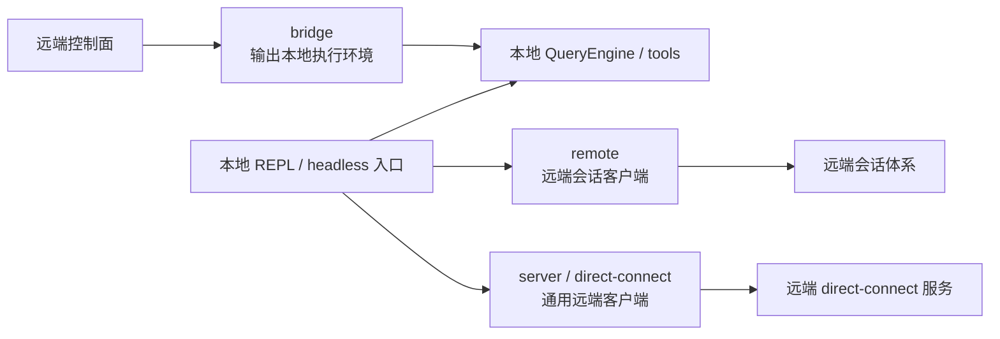
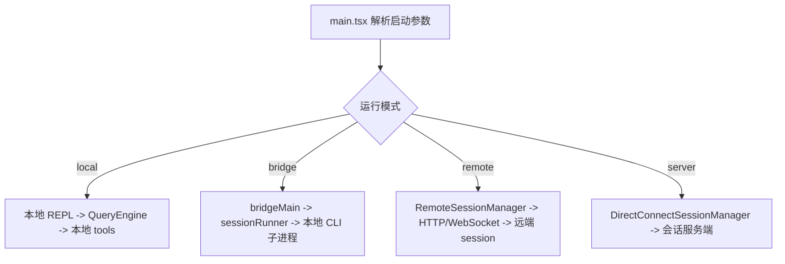

# bridge、remote、server 运行模式关系

## 1. 文档目标

这篇文档说明三种重要运行模式的关系：

- `bridge/`
- `remote/`
- `server/`

重点不是 CLI 参数细节，而是它们分别把“本地 UI、会话控制权、工具执行位置、外部控制面”放在了哪里。

### 1.1 Overview 视图

这张图关注的是控制权和执行位置，而不是命令名。`bridge` 把本地执行输出给远端控制面，`remote` 和 `server` 则把远端执行接回本地客户端。

### 1.2 数据流视图

这条数据流只回答一个问题：`main.tsx` 在决定模式后，会把本地 UI 或 headless 入口接到哪一类会话后端上。

## 2. 一句话结论

这三种模式不是同一件事的不同命名，而是三种不同的控制面关系：

- `bridge`：把本地运行时暴露给远端控制面。
- `remote`：把本地 REPL 变成远端会话的客户端。
- `server`：把本地 CLI 接到一个独立会话服务端，协议上更通用。

其中最关键的理解是：

- `bridge` 是“把本地执行环境输出出去”。
- `remote` 和 `server` 是“把远端执行结果接回来”。

## 3. 对照表

| 运行模式 | 本地进程扮演的角色 | 会话主循环在哪里 | 工具主要在哪里执行 | 关键模块 |
| --- | --- | --- | --- | --- |
| 本地交互式模式 | 标准 REPL 与本地执行器 | 本地 | 本地 | `main.tsx`、`replLauncher.tsx`、`QueryEngine.ts` |
| `bridge` | 环境导出器、worker 管理器 | 本地子进程 | 本地 | `bridge/bridgeMain.ts`、`bridge/sessionRunner.ts` |
| `remote` | 远端会话客户端、UI 适配层 | 远端 | 远端 | `remote/RemoteSessionManager.ts`、`remote/sdkMessageAdapter.ts` |
| `server` / direct-connect | 通用远端会话客户端，可接本地 TUI 或 headless runner | 远端服务端 | 远端服务端 | `server/createDirectConnectSession.ts`、`server/directConnectManager.ts` |

这张表体现了一个重要差异：

- `bridge` 复用的是本地 agent 内核，只是把控制面移到外部。
- `remote`、`server` 复用的是本地 UI 和控制逻辑，但 agent 内核在远端。

### 3.1 先用一个类比把几种运行模式看清楚

如果把 Claude Code 想成一套“控制室和机房分离”的系统，这几种模式可以这样理解：

- 本地模式：你本人坐在本地控制室里，直接操作本机机房里的设备。UI 和执行都在本地。
- `bridge`：远端控制室接管了你这边的本地机房。控制在远端，但真正干活的机器仍在你本地。
- `remote`：你还坐在本地控制室里，但实际操作的已经是远端机房。你的终端主要负责显示状态、转发输入和处理权限反馈。
- `server` / direct-connect：和 `remote` 同样是“本地控制远端机房”，但接的不是项目自己的远端会话体系，而是一台更通用的会话服务端。

这个类比里最重要的是两条轴：

- 控制面在哪里。
- agent 回路和工具执行在哪里。

一旦这两条轴分清，`bridge` 和 `remote/server` 的区别就不会再混淆。

### 3.2 再看一个真实启动场景

假设同一个用户都在本地终端输入 Claude Code，但目标完全不同：

1. 如果只是普通本地开发，`main.tsx` 会直接把本地 REPL 接到本地 `QueryEngine` 和本地 tools。
2. 如果用户使用 `claude assistant` 或 `--remote`，`main.tsx` 会先构造 `RemoteSessionConfig`，再把本地 TUI 接到远端 session 上；这时本地终端主要扮演远端会话客户端。
3. 如果用户使用 `claude connect <url>`，`main.tsx` 会先调用 `createDirectConnectSession(...)` 去远端服务端创建 session，再把 REPL 或 headless runner 接到 `DirectConnectSessionManager`。
4. 如果用户使用 `remote-control`，则不会把本地终端接到远端 agent 上，而是进入 `bridgeMain(...)`，把本地环境注册成一个可被外部控制面调度的执行环境。

这条场景最能说明一个本质区别：

> `bridge` 是把本地执行环境输出给远端控制面；`remote` 和 `server` 是把远端执行结果接回本地终端。

## 4. bridge 的职责

### 4.1 bridge 是本地环境的对外暴露层

`bridgeMain.ts` 的核心职责不是直接运行单个对话，而是把本地环境注册成一个可被外部控制面调度的执行环境。它负责：

- 环境注册和 worker 生命周期管理。
- poll / heartbeat / reconnect。
- 多 session 容量控制。
- worktree、token、会话状态等环境级资源管理。
- 在接到 work 后，生成本地 session 子进程。

因此，`bridge` 的重心是“环境编排”，不是“消息级查询循环”。

### 4.2 sessionRunner 负责启动真正执行会话的子进程

`sessionRunner.ts` 进一步把 bridge 和真实会话执行解耦：

- 它负责 spawn 子进程运行 Claude Code 会话。
- 它捕获子进程发出的活动、权限请求和结果。
- 它把这些信号回传给 bridge 控制面。

这说明 `bridgeMain` 本身并不替代 `QueryEngine`；它更像一个 supervisor，而真正的会话执行仍然发生在被拉起的标准 CLI 进程里。

### 4.3 createSession 是 bridge 面向控制面的会话创建边界

`bridge/createSession.ts` 负责通过 Sessions API 创建和查询 bridge session，作用是：

- 把远端控制面上的 session 与本地环境实例绑定。
- 为远端入口提供可恢复、可展示的 session 身份。
- 把 git/source 等环境上下文带到会话级元数据里。

所以 bridge 不是“远端运行 Claude Code”，而是“远端控制本地 Claude Code 环境”。

补充一点：`main.tsx` 里的 `remote-control` 命令注册主要用于帮助信息，真正的 bridge 进入路径是更早的 fast-path，最后才委托到 `bridgeMain(...)`。这也说明 bridge 更像独立运行模式，而不是普通 commander 子命令。

### 4.4 源码里的最小例子

这一层最典型的最小样本有三个：

- `src/bridge/bridgeMain.ts` 里的 `runBridgeLoop(...)`：能直接看出 bridge 的重心是环境注册、poll、heartbeat、session 管理，而不是单轮 query。
- `src/bridge/sessionRunner.ts` 里的 `createSessionSpawner(...)`：把真正的 Claude Code 会话放进子进程里跑，并把 activity、permission request、结果这些信号回送给 bridge 层。
- `src/main.tsx` 里动态导入 `bridgeMain(...)` 的 remote-control 入口：说明 bridge 在启动路径上是一个独立模式，而不是普通命令实现细节。

这几个例子一起说明，bridge 本质上是“本地执行环境的对外导出层”。

## 5. remote 的职责

### 5.1 remote 是远端会话的本地客户端

`remote/RemoteSessionManager.ts` 管理的是一个已经存在于远端的 session。它负责：

- 建立 WebSocket 订阅接收消息。
- 通过 HTTP 发送用户消息。
- 接收远端 permission request，并把结果再发回去。
- 管理 reconnect、disconnect、interrupt。

这意味着本地 REPL 在 remote 模式下不再拥有会话内核，它主要承担“显示”和“转发输入”的职责。

### 5.2 sdkMessageAdapter 把远端 SDK 消息映射到本地 REPL 消息

`remote/sdkMessageAdapter.ts` 的存在说明 remote 模式并不是把所有远端协议直接暴露给前端，而是做了一层适配：

- 远端发送 SDK 风格消息。
- 本地 REPL 需要内部 `Message` 类型。
- adapter 负责把 assistant、result、tool progress、compact boundary 等事件翻译成本地可渲染消息。

因此，`remote` 是“协议适配后的薄客户端”，而不是简单的 WebSocket 直通。

### 5.3 remote 支持 viewer-only 变体

从代码可以看出，remote 还支持 viewer-only 这类“纯观察者客户端”语义。也就是说，remote 不只服务于完整交互式控制，还支持以客户端身份附着到已有会话。

这进一步说明 remote 关注的是“客户端视角的会话接入”，而不是环境运行。

### 5.4 remote 在 main.tsx 中有两类入口

`main.tsx` 里至少有两条 remote 入口会汇聚到同一类远端会话客户端：

- `claude assistant` 这类 viewer-only 附着模式，连接已有远端 session。
- `--remote` 这类先创建远端 session，再用本地 TUI 接入的模式。

因此，remote 不是单一命令，而是一组“本地 UI 接远端 session”的入口族。

### 5.5 源码里的最小例子

这一层最典型的最小样本有三个：

- `src/remote/RemoteSessionManager.ts` 里的 `connect()`：建立 WebSocket 订阅并接收远端 SDK 消息。
- 同一个文件里的 `sendMessage(...)` 和 `respondToPermissionRequest(...)`：分别对应“把本地输入发到远端”和“把本地权限决定回传给远端”。
- `src/main.tsx` 里 `createRemoteSessionConfig(...)` 加 `launchRepl(... remoteSessionConfig)` 的分支：说明 remote 模式的本质是给本地 REPL 接一个远端后端。

这个最小例子组合能直接看出：remote 模式下，本地终端不再拥有 agent 回路，它只是远端 session 的客户端外壳。

## 6. server / direct-connect 的职责

### 6.1 createDirectConnectSession 负责建立服务端会话

`server/createDirectConnectSession.ts` 会先向远端服务端 `POST /sessions`，拿回：

- session ID
- WebSocket URL
- 可能的工作目录

这说明 server 模式的第一步是“建立服务端 session”，而不是像 bridge 那样先注册本地环境再等 work 下发。

### 6.2 DirectConnectSessionManager 负责通用会话连接

`server/directConnectManager.ts` 负责 direct-connect 会话期间的实时连接：

- 建立 WebSocket。
- 发送用户消息。
- 转发 permission request/response。
- 发送 interrupt。
- 透传 SDK 消息给本地 UI 或 headless runner。

从职责上看，它和 `RemoteSessionManager` 很像，但协议前提不同：

- `remote` 偏 Claude.ai/CCR 场景，有组织、token、session 订阅语义。
- `server` 更像一个通用“远端 Claude Code 会话服务”。

### 6.3 server 模式不等于 bridge

它们最大的差异在于控制权方向：

- `server` 是本地连到远端服务端，执行发生在远端。
- `bridge` 是远端控制面连到本地环境，执行发生在本地。

两者都涉及网络和会话中继，但方向刚好相反。

### 6.4 direct-connect 同时支持交互式和 headless 入口

从 `main.tsx` 可以看到，direct-connect 至少有两种使用方式：

- 交互式模式下，本地 TUI 先调用 `createDirectConnectSession(...)`，再把会话交给本地 REPL。
- headless 模式下，`open <cc-url> -p` 这类入口同样先创建 direct-connect session，再把消息流接到专门的 headless runner。

所以 `server/` 并不是只服务 REPL，它提供的是一套更通用的远端会话连接能力。

### 6.5 源码里的最小例子

这一层最典型的最小样本有三个：

- `src/server/createDirectConnectSession.ts` 里的 `createDirectConnectSession(...)`：直接向 `${serverUrl}/sessions` 发请求，拿回 `sessionId` 和 `wsUrl`。
- `src/server/directConnectManager.ts` 里的 `DirectConnectSessionManager`：维护 WebSocket、转发用户消息、处理 permission request/response 和 interrupt。
- `src/main.tsx` 里 `createDirectConnectSession(...)` 之后再 `launchRepl(...)` 或进入 headless connect runner 的分支：说明 direct-connect 是一套既能喂给 TUI，也能喂给 headless 的通用远端连接层。

这个最小例子组合说明，`server` 不是 bridge 的别名，而是一种“本地 CLI 连接远端会话服务端”的标准客户端模式。

## 7. 三者关系

### 7.1 bridge 与 remote 是镜像关系

如果用“执行在哪里、控制在哪里”来概括：

- `bridge`：执行在本地，控制在远端。
- `remote`：执行在远端，控制和展示在本地。

这两种模式看起来都叫“远程”，但架构作用完全不同。

### 7.2 remote 与 server 是同向的两种客户端模式

`remote` 和 `server` 都属于“本地客户端连接远端会话”，但面向的后端不同：

- `remote` 面向项目自己的远端会话体系和会话订阅模型。
- `server` 面向 direct-connect 风格的独立会话服务端。

因此它们共享“本地 UI + 远端执行”的总体形态，但协议边界和产品定位不同。

### 7.3 bridge 不替代本地内核

bridge 最容易被误解成“另一套执行引擎”。实际上它只是把标准本地执行内核包在 worker/supervisor 外层：

- 查询循环、工具调用、权限系统仍然复用主运行时。
- bridge 主要增加的是环境注册、poll、spawn、heartbeat、远端权限回调。

所以 bridge 是“控制面扩展”，不是“业务内核分叉”。

## 8. 与 main.tsx 的关系

`main.tsx` 的作用是根据启动参数决定进入哪种模式，并把 REPL 或 headless runner 接到对应后端：

- 本地模式：直接进入本地会话。
- remote 模式：要么附着已有 session，要么先创建远端 session，再创建 `RemoteSessionConfig` 让本地 REPL 驱动远端会话。
- direct-connect 模式：先创建远端 session，再把 REPL 或 headless runner 接到 `DirectConnectSessionManager`。
- bridge 模式：切换到 `bridgeMain(...)`，进入环境导出与 worker 管理流程。

因此，`main.tsx` 是模式选择器，而不是这三种模式的业务实现主体。

## 9. 推荐理解方式

理解这三者最稳妥的方式不是看命令名，而是看“谁拥有 agent 回路”。

### 9.1 如果 agent 回路在本地

那就是本地模式或 bridge 模式。

- 本地模式：本地 UI 驱动本地回路。
- bridge 模式：远端控制面驱动本地回路。

### 9.2 如果 agent 回路在远端

那就是 remote 或 server/direct-connect 模式。

- remote：接入项目自己的远端 session 体系。
- server：接入一个独立的会话服务端。

## 10. 设计价值

把这三种模式拆开，而不是混成一个“远程模式”，有三个明显好处：

1. 本地执行环境可以被安全地暴露给外部控制面，而不污染普通本地 REPL 逻辑。
2. 本地 REPL 可以作为远端会话的统一客户端，复用现有 UI 和输入体验。
3. 项目可以同时支持自有远端平台和更通用的 direct-connect 服务端，而不把协议细节塞进核心会话编排层。

如果只记一句话，可以这样记：

- `bridge` 解决“把本地 agent 变成远端可调度 worker”。
- `remote` 解决“把本地 REPL 变成远端 session 客户端”。
- `server` 解决“把本地 CLI 接到独立会话服务端”。