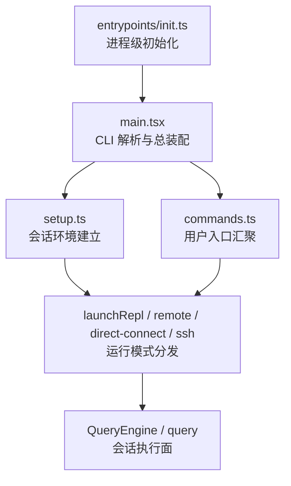
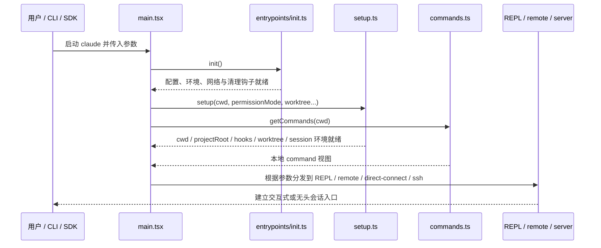

# 启动装配与入口分发

## 1. 文档目标

这篇文档解释 Claude Code 在真正进入一次会话之前，如何完成全局初始化、运行时装配、命令入口汇聚和运行模式分发。

重点回答：

- 哪些模块负责进程级初始化，哪些模块负责一次会话的启动装配。
- 本地命令、技能、插件和运行模式是如何在启动时被汇聚起来的。
- 为什么 `init`、`main`、`setup`、`commands` 需要分成多层，而不是堆在一个入口文件里。

### 1.1 Overview 视图



这张图强调的是启动主线的层次关系：`init` 负责进程级前置条件，`main` 负责一次启动的总装配，`setup` 负责把当前目录和会话环境落稳，`commands` 负责用户入口汇聚，之后才进入具体运行模式。

### 1.2 数据流视图



这条数据流回答的是启动不是“解析参数后直接跑 QueryEngine”，而是一次先建立进程前提、再建立会话环境、再选择运行模式的装配链路。

## 2. 一句话结论

Claude Code 的启动并不是单一入口函数直接拉起会话，而是四段式流水线：`init` 负责进程级初始化，`main` 负责参数解析和总装配，`setup` 负责把当前工作目录与会话环境稳定下来，`commands` 负责汇聚用户入口能力，最后才由不同运行模式把这些能力接到具体的会话执行面。

这种分层的直接价值是：进程级初始化、当前会话装配、命令入口组织和运行模式分发可以独立演化，而不把所有副作用堆进一个巨大入口函数。

## 3. 分层关系

```text
启动装配主线
├── 进程级初始化层
│   └── entrypoints/init.ts
├── 启动总装配层
│   └── main.tsx
├── 会话环境建立层
│   └── setup.ts
├── 用户入口汇聚层
│   └── commands.ts
└── 运行模式分发层
    ├── launchRepl
    ├── remote session
    ├── direct-connect session
    └── ssh / bridge / assistant viewer 等入口
```

这组分层说明 Claude Code 的启动逻辑天然包含两个维度：

- 纵向维度是“把一次进程启动逐步收敛成可运行会话”。
- 横向维度是“把不同运行模式接到同一套能力装配结果上”。

### 3.1 先用一个类比把启动链路看成“机场安检到登机”

如果把 Claude Code 的启动过程类比成一次机场登机流程，可以这样理解：

- `init` 像机场在你到达柜台前就必须完成的基础设施检查。安检系统、跑道、广播、值机系统都要先处于可用状态，否则后面什么都谈不上。
- `main` 像总值机柜台。它先确认你是谁、拿的是什么票、要走哪条通道，然后把你分发到合适的后续流程。
- `setup` 像登机前对你这次行程做的现场确认。比如你到底从哪个登机口走、有没有转机、有没有特殊通道、行李是不是要切换到另一个航站楼。
- `commands` 像机场里的航班面板和登机入口目录。它负责告诉你“有哪些入口可以走”，而不是负责开飞机。
- `launchRepl`、remote、direct-connect、ssh 等模式，像最终把你送上不同航班或不同接驳通道。前面准备好的东西在这里才真正接到实际执行路径上。

这个类比最想强调的是：启动装配不是一个动作，而是一串分工明确的关口。`init`、`main`、`setup`、`commands` 看起来都发生在“启动时”，但它们解决的根本不是同一个问题。

### 3.2 再看一个真实启动场景

假设用户在一个项目目录里直接运行 `claude`，没有指定特殊子命令，但开启了常规交互式会话。

这时典型链路大致是这样的：

1. 进程先进入 `main.tsx`。
  这时它还没有真正开始会话，而是在解析 CLI 参数、stdin 状态、恢复参数、权限模式、远端模式等总控信息。

2. `main.tsx` 调用 `init()`。
  `init` 会先启用配置系统、应用安全环境变量、配置全局网络/mTLS、注册清理逻辑，并启动一些不依赖当前会话目录的后台准备工作。这一步的目标是先让“整个进程能安全运行”。

3. `main.tsx` 接着准备一次具体启动的上下文。
  它会根据 CLI 参数判断这次是普通 REPL、resume、remote、ssh，还是其它特殊入口；同时预先注册 bundled skills 和 built-in plugins，确保后面的命令加载不会拿到空结果。

4. `main.tsx` 调用 `setup(...)`，并尽量和 `getCommands(...)` 并行。
  `setup` 会固定 cwd、捕获 hooks 快照、初始化文件变化监听；如果启用了 worktree，还会切换仓库和工作目录。与此同时，`commands.ts` 会开始汇聚 built-in commands、skills、plugin skills 等用户入口。

5. `setup` 结束后，`main.tsx` 再等待命令和 agents 一起就绪。
  这时系统拿到的已经不只是“一个 cwd”，而是一整套本次会话真正能用的启动结果：最终工作目录、命令面、agent definitions，以及后续模式分发所需的环境。

6. 最后 `main.tsx` 把结果交给具体运行模式。
  如果是普通交互式会话，就进入 `launchRepl`；如果是 remote 或 direct-connect，就走对应路径。到这里，启动装配才真正结束，系统才从“准备阶段”进入“会话执行阶段”。

这个场景可以压缩成一句话：

> `main.tsx` 像总调度，`init` 先把机场通电，`setup` 确认这趟行程的现场环境，`commands` 摆出可走入口，最后运行模式把这些结果真正接到会话上。

## 4. 模块职责对照表

| 模块 | 责任 | 不负责 |
| --- | --- | --- |
| `entrypoints/init.ts` | 启用配置系统、应用安全环境变量、配置网络/代理/mTLS、注册清理与后台初始化前提 | 不负责具体 CLI 选项解析，也不决定进入哪种会话模式。 |
| `main.tsx` | 解析 CLI、触发 `init`、协调 `setup` 与命令加载、装配能力并选择运行模式 | 不负责长期持有会话内部状态，也不直接实现单轮查询内核。 |
| `setup.ts` | 固定 cwd / projectRoot / hooks / worktree / tmux / session 前置环境，并启动必要后台子系统 | 不负责决定用户可见命令列表，也不负责最终 UI/远端模式分支。 |
| `commands.ts` | 汇聚 built-in commands、skills、plugin commands、workflow commands、动态 skills，形成统一命令视图 | 不负责真正执行单轮模型循环，也不管理远端连接状态。 |
| `launchRepl` / remote / direct-connect 入口 | 把已装配好的命令、工具、状态和连接配置接到具体运行模式 | 不负责重新定义能力来源或重做基础配置初始化。 |

## 5. `entrypoints/init.ts` 的责任

### 5.1 建立进程级前置条件

`init()` 是启动链路的第一层稳定边界。它主要处理整个进程都要共享的基础前提，例如：

- 启用配置系统并校验配置可读性。
- 在 trust 之前仅应用安全环境变量。
- 配置全局 mTLS、HTTP agents、代理与证书行为。
- 注册全局 graceful shutdown 和资源清理逻辑。
- 初始化远程托管设置与策略限制的加载 promise。
- 预热部分不会改变会话语义的后台能力，例如 OAuth 账户信息、IDE 探测、仓库识别等。

这些动作的共同点是：它们面向整个进程，而不是面向某一次具体会话。

### 5.2 把危险初始化留到更晚的阶段

`init()` 明确区分了“可以在 trust 前做的事”和“必须在 trust 后做的事”。例如：

- 先调用 `applySafeConfigEnvironmentVariables()`，而不是一次性应用全部环境变量。
- 把 `initializeTelemetryAfterTrust()` 分成独立步骤。
- 把真正依赖会话或交互模式的逻辑留给 `main.tsx` 与后续分支。

这说明 `init` 的设计目标不是“尽量多做”，而是“只做所有路径都需要、且适合在这一时机做的事”。

### 5.3 源码里的最小例子

`src/entrypoints/init.ts` 里的 `init()` 本身就是最好的最小例子。

从这个函数可以直接看到，`init` 做的都是进程级准备动作，例如：

- `applySafeConfigEnvironmentVariables()`
- `setupGracefulShutdown()`
- `configureGlobalMTLS()`
- `configureGlobalAgents()`
- `registerCleanup(...)`

这些动作有一个共同点：它们不依赖某次具体会话的消息，也不关心用户最终会进入哪个运行模式。这个例子正好说明 `init` 的本质是“把整个进程的基础设施准备好”，而不是“开始一段对话”。

## 6. `main.tsx` 的责任

### 6.1 作为启动总装配器

`main.tsx` 是整个启动主线的总装配器。它负责：

- 解析 CLI 参数、stdin 模式、交互式与无交互模式。
- 处理深链路、assistant、ssh、direct-connect 等特殊入口重写。
- 在 `preAction` 阶段保证 `init()` 和迁移、settings、sink 初始化发生在真正执行命令前。
- 计算 permission mode、model、session 恢复方式、remote 参数等一次启动的策略输入。

它的职责更接近“控制台总调度器”，而不是“会话内核本身”。

### 6.2 协调 setup 与能力装配的时序

在默认 action 中，`main.tsx` 会显式协调几个关键装配点：

- 先注册 bundled skills 和 built-in plugins。
- 并行触发 `setup(...)`、`getCommands(...)`、agent definitions 加载。
- 在 `setup` 完成后，再基于最终 cwd 和运行配置组装会话输入。

这里的关键架构判断是：`main.tsx` 不自己去遍历所有能力来源，而是协调各个子系统在正确的时机被拉起，并确保它们在进入运行模式前已经稳定可用。

### 6.3 负责运行模式分发

在拿到命令、agent、会话配置和工作目录后，`main.tsx` 才真正决定当前启动会进入哪一条路径，例如：

- 本地交互式 REPL。
- `--remote` 对应的远端会话客户端路径。
- `direct-connect` 对应的服务端会话路径。
- `ssh` 远程执行路径。
- `assistant` viewer 路径。
- `--continue` / `--resume` 对应的恢复路径。

这说明运行模式不是 setup 的一部分，也不是命令注册表的一部分，而是 `main.tsx` 在所有前提准备完之后做出的最终分发决策。

### 6.4 源码里的最小例子

`src/main.tsx` 里有一段非常关键的启动代码：先调用 `initBuiltinPlugins()` 和 `initBundledSkills()`，然后并行启动 `setup(...)`、`getCommands(...)` 和 agent definitions 加载，最后再统一等待结果。

这一小段代码最能说明 `main.tsx` 的角色：

- 它不自己实现技能解析。
- 它不自己实现 worktree 切换。
- 它不自己持有会话消息。

它做的是“把几个子系统在正确时机拉起来，并把结果接成一次完整启动”。这正是总装配器，而不是执行内核。

## 7. `setup.ts` 的责任

### 7.1 固定当前会话的物理运行环境

`setup.ts` 的重点不是“解析命令”，而是把当前会话真正运行所依赖的目录、工作树和钩子环境稳定下来。它主要负责：

- 设置 cwd，并同步到运行时全局状态。
- 捕获 hooks 配置快照并启动文件变化监听。
- 按需创建 worktree、tmux session，并在必要时切换到新的工作目录。
- 更新 project root、session worktree 状态和相关缓存。

这些动作的共同点是：它们会改变当前会话所处的真实工作环境，因此必须在会话正式开始前统一完成。

### 7.2 启动与当前会话绑定的后台子系统

在环境稳定后，`setup.ts` 还会负责启动一些与当前会话密切相关、但不属于单轮内核的后台子系统，例如：

- `SessionMemory` 初始化。
- context collapse 初始化。
- plugin hooks 的预加载与热重载。
- 命令与插件相关的预取。

因此 `setup.ts` 更接近“会话启动脚手架”，而不是仅仅一个目录切换助手。

### 7.3 源码里的最小例子

`src/setup.ts` 里最典型的一段是：先 `setCwd(cwd)`，然后 `captureHooksConfigSnapshot()`，再 `initializeFileChangedWatcher(cwd)`，必要时继续 `createWorktreeForSession(...)`，最后初始化 `SessionMemory` 和相关后台子系统。

这段代码特别能说明 `setup` 和 `init` 的区别：

- `init` 在准备整个进程。
- `setup` 在准备“这一次会话到底站在哪个目录、使用哪套 hooks、是否切进 worktree、要启动哪些会话级后台能力”。

所以 `setup` 的本质不是通用初始化，而是“把当前会话的物理运行环境落稳”。

## 8. `commands.ts` 的责任

### 8.1 把多种能力来源汇聚成统一用户入口

`commands.ts` 的核心职责是把多个来源的能力整理为统一 `Command[]` 视图。它汇聚的来源包括：

- built-in commands。
- bundled skills。
- 本地 skills 目录。
- plugin commands。
- plugin skills。
- workflow commands。
- 运行中发现的 dynamic skills。

这使 `commands.ts` 成为“用户如何进入系统能力”的统一边界。

### 8.2 保持入口层与执行层解耦

虽然 `commands.ts` 汇聚了很多来源，但它并不负责：

- 执行工具。
- 建立 MCP 连接。
- 持有会话状态。
- 决定进入 remote 还是 local 模式。

这说明命令层的真正角色是入口组织，而不是能力执行或连接管理。

### 8.3 源码里的最小例子

`src/commands.ts` 里有两个特别典型的最小样本：

- `COMMANDS = memoize(() => [...])`：汇总 built-in commands。
- `getSkills(cwd)`：把 `getSkillDirCommands(cwd)`、`getPluginSkills()`、`getBundledSkills()`、built-in plugin skills 汇成技能入口视图。

这两个样本很能说明 `commands.ts` 的本质。它不是执行某个命令，而是在做入口汇总：把来自内建、技能目录、插件、workflow 的能力整理成统一 `Command[]`，供上层模式选择和用户交互使用。

## 9. 关键交接边界

### 9.1 数据边界

- `init.ts` 持有的是进程级配置、环境和基础设施前提。
- `setup.ts` 固定的是当前会话的目录、hooks、worktree 和后台子系统前提。
- `commands.ts` 产出的是用户入口视图，而不是会话内部状态。
- 会话内部状态真正进入长期持有阶段，要等到 REPL / QueryEngine 启动之后。

### 9.2 控制边界

- `main.tsx` 驱动整个启动流程。
- `init.ts` 和 `setup.ts` 都是被 `main.tsx` 编排的子阶段。
- `commands.ts` 只提供能力汇聚结果，不驱动流程本身。
- 最终具体控制权会交给 `launchRepl`、remote session manager 或 direct-connect session。

### 9.3 状态边界

- `init` 只建立进程级共享前提，不持有会话消息。
- `setup` 只处理会话启动期环境，不持有单轮执行状态。
- `commands` 持有的是命令定义与缓存，而不是执行中状态。
- 真正长期持有会话消息、usage、permissions 的模块仍然是 `QueryEngine` 与状态子系统。

## 10. 典型链路

1. 用户启动 `claude`，`main.tsx` 先判断当前是交互式、无头还是特殊入口重写路径。
2. `preAction` 阶段调用 `init()`，完成配置、环境、网络、清理和远程设置等进程级初始化。
3. 默认 action 中调用 `setup(...)`，固定 cwd、hooks、worktree、session 前置环境，并启动会话级后台子系统。
4. 并行或随后调用 `getCommands(...)` 和 agent definitions 加载，形成用户可见入口视图。
5. `main.tsx` 根据参数和环境，把当前启动分发到 `launchRepl`、remote、direct-connect、ssh 或恢复路径。
6. 运行模式入口再把这些装配结果接到 `QueryEngine / query` 等真正的会话执行面。

## 11. 不应混淆的边界

### 11.1 `init.ts` 不等于 `setup.ts`

`init.ts` 面向整个进程，解决“进程能否安全运行”；`setup.ts` 面向当前会话，解决“这次会话在哪个目录、以什么工作树和 hooks 环境运行”。

### 11.2 `main.tsx` 不等于会话执行内核

`main.tsx` 负责编排启动和分发运行模式，但真正的会话执行内核仍然在 `QueryEngine / query`。

### 11.3 `commands.ts` 不等于能力执行层

`commands.ts` 只解决用户入口组织，不等于工具注册、MCP 连接或模型执行逻辑。

### 11.4 运行模式分支不等于不同产品

local、remote、direct-connect、ssh 这些路径共享同一套装配主线，只是在最后把能力与状态接到不同的控制面和执行后端上。

## 12. 设计价值

这套分层带来三个直接好处：

- 进程级初始化、会话级环境建立、命令入口组织和运行模式分发可以分别扩展，而不会互相污染。
- `main.tsx` 可以承载大量入口形态而不把 QueryEngine 变成启动总控器。
- 文档和代码都能更稳定地回答“某个问题应该改 init、setup、commands 还是运行模式入口”，降低架构歧义。