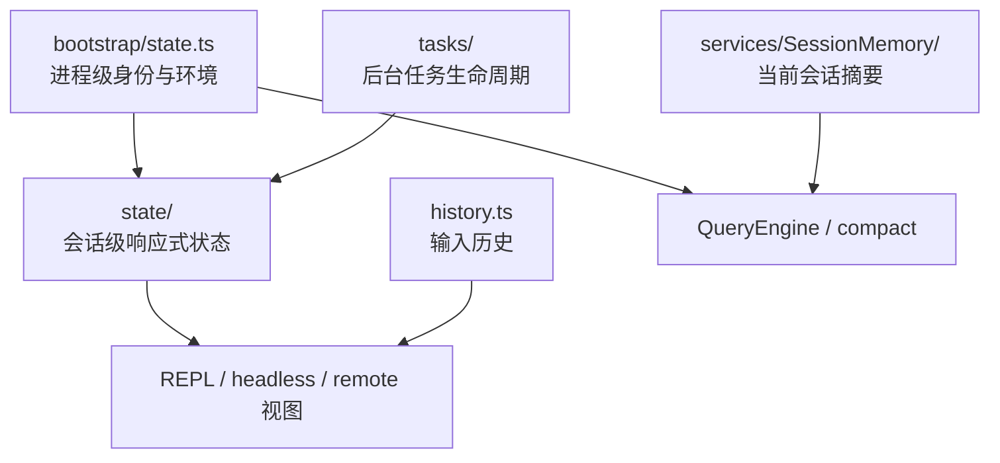
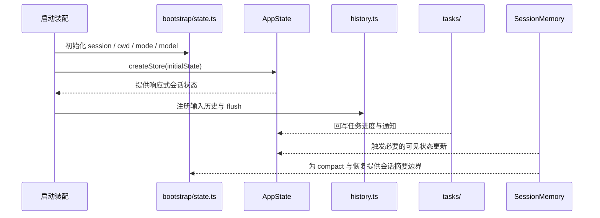

# bootstrap/state、state、history、tasks、SessionMemory 的状态分工

## 1. 文档目标

这篇文档只解释几个核心状态模块之间的责任边界：

- `bootstrap/state.ts`
- `state/`
- `history.ts`
- `Task.ts`、`tasks.ts`、`tasks/`
- `services/SessionMemory/`

重点不是字段清单，而是回答下面几个问题：

- 哪一层才是进程级全局状态。
- 哪一层才是交互式会话的响应式状态。
- 哪些状态是专用子系统，而不是统一 store 的一部分。

### 1.1 Overview 视图



这张图强调状态的拥有者不是单一 store。不同状态面分别服务进程身份、会话渲染、输入恢复、后台任务和会话摘要。

### 1.2 数据流视图



这条数据流说明状态不是沿一条链串行流动，而是由多个拥有者在不同生命周期内并行维护，再被会话主线按需读取。

## 2. 一句话结论

这个项目的状态不是单一 store，而是五层分工：

- `bootstrap/state.ts` 是进程级单例状态。
- `state/` 是交互式和 headless 会话的响应式运行态。
- `history.ts` 是输入历史与粘贴引用的专用持久化状态。
- `tasks/` 是异步任务生命周期状态。
- `SessionMemory` 是面向当前会话摘要的后台记忆状态。

它们共同服务同一条会话主线，但拥有者、生命周期和读写入口都不同。

## 3. 分层关系

```text
进程级状态
  - bootstrap/state.ts
        |
        +--> 提供项目身份、session 身份、模型/遥测/模式等共享上下文
        |
        v
会话级响应式状态
  - state/AppState.tsx
  - state/store.ts
  - state/onChangeAppState.ts
        |
        +--> 驱动 REPL/headless 会话中的 UI、权限模式、MCP 视图、任务视图
        |
        +--> 接入专用状态子系统
              - history.ts
              - Task.ts / tasks.ts / tasks/
              - services/SessionMemory/
```

需要先建立一个总判断：

- 不是所有状态都应该进入 `AppState`。
- 也不是所有状态都应该放进 `bootstrap/state.ts` 这种全局单例。

这个项目明显采用的是“全局内核态 + 会话响应态 + 专用子系统状态”三段式结构。

### 3.1 先用一个类比把五层状态放进同一画面

如果把 Claude Code 想成一座城市，这五层状态可以这样理解：

- `bootstrap/state.ts` 像市政府的户籍与行政底册。它记录这座城市当前是谁、在哪、属于哪个辖区，提供稳定身份和全局坐标。
- `state/` 像城市运行指挥中心的大屏。它显示这座城市此刻正在发生什么，哪些任务在跑、哪些权限模式在生效、哪些远端连接或通知需要被用户实时看到。
- `history.ts` 像市民服务大厅的办事记录簿。它专门保存“用户之前输入过什么”，方便以后回放和检索，但它不是整座城市的全部运行日志。
- `tasks/` 像各类正在执行的工单系统。每张工单有自己的状态、生命周期、输出文件和终止条件。
- `SessionMemory` 像市政府给当前城市运行写的阶段性简报。它不记录全部原始事件，而是持续提炼“到目前为止最重要、最该保留的摘要”。

这个类比最想说明的是：这些状态都和“系统在运行”有关，但它们处理的不是同一种问题。

- 有的状态负责稳定身份。
- 有的状态负责实时可见运行态。
- 有的状态负责恢复输入。
- 有的状态负责后台任务生命周期。
- 有的状态负责当前会话摘要。

### 3.2 再看一个真实会话场景

假设用户启动 `claude`，在一个项目里连续做了三件事：

- 先输入一条请求，让系统分析当前改动。
- 然后触发一个后台任务。
- 接着会话变长，系统开始做摘要维护。

这时五层状态会同时但分工明确地发生变化：

1. 启动阶段先由 `bootstrap/state.ts` 固定全局身份。
      例如当前 `sessionId`、`projectRoot`、`cwd`、运行模式等会先被放进进程级状态。它定义的是“这次会话到底是谁、在哪个项目里”。

2. 会话建立后，`state/` 创建 `AppState`。
      这时 REPL 或 headless 会话开始拥有自己的响应式运行态，比如权限模式、通知、MCP 视图、任务视图、UI 选择状态等。它定义的是“当前会话此刻正在发生什么”。

3. 当用户输入请求时，`history.ts` 记录输入历史。
      它会把这次输入加进 `pendingEntries`，并异步 flush 到 `history.jsonl`。这一步的目的不是给模型提供上下文，而是为了之后可以用上箭头、搜索、恢复输入。

4. 如果请求触发了后台 agent 或 shell，`tasks/` 负责任务生命周期。
      任务类型由任务系统定义，但真正实时可见的任务状态会写进 `AppState.tasks`，这样 UI 才能看到某个任务是 `pending`、`running` 还是 `completed`。

5. 如果会话变长，`SessionMemory` 会在后台提炼摘要。
      它不会替代 transcript，也不会替代 history，而是根据阈值和 hook 触发，用 forked agent 更新当前会话的 memory 文件，为后续 compact 和继续对话提供更稳定的摘要信息。

这个场景可以压缩成一句话：

> `bootstrap/state.ts` 决定“我们是谁”，`AppState` 决定“现在发生什么”，`history.ts` 决定“用户说过什么”，`tasks/` 决定“后台在跑什么”，`SessionMemory` 决定“到目前为止该记住什么”。

## 4. 状态分工对照表

| 状态层 | 主要拥有者 | 生命周期 | 典型写入口 | 典型读入口 | 主要职责 |
| --- | --- | --- | --- | --- | --- |
| `bootstrap/state.ts` | 进程与运行时内核 | 进程生命周期 | 启动装配、session 切换、全局 setter | 任意基础模块 getter | 保存进程级共享上下文和稳定会话身份 |
| `state/` | REPL / headless 会话 | 一次会话生命周期 | `createStore(...).setState(...)` | UI、工具、远程模式、任务面板 | 保存响应式会话状态和用户可见运行态 |
| `history.ts` | 输入历史子系统 | 跨会话持久化 | `addToHistory()`、flush | Up-arrow、搜索、恢复输入 | 保存输入历史和粘贴引用 |
| `Task.ts`、`tasks.ts`、`tasks/` | 任务子系统 | 单个任务生命周期 | 任务实现通过 `setAppState` 更新 | 任务 UI、工具、调度逻辑 | 保存后台任务状态和任务类型边界 |
| `services/SessionMemory/` | 会话摘要子系统 | 当前会话持续期间 | post-sampling hook、手动 summary | compaction 和后续轮次上下文 | 保存当前会话的摘要型记忆 |

## 5. `bootstrap/state.ts` 的责任

### 5.1 它是进程级单例，而不是响应式 store

`bootstrap/state.ts` 的核心特征是模块内部维护一个 `STATE` 单例，并通过大量 getter/setter 暴露访问。这说明它的定位是：

- 给整个进程提供共享状态。
- 允许基础设施模块在不依赖 UI store 的情况下读取上下文。
- 保持少数关键身份状态在任何入口模式下都可访问。

因此，这一层更接近“运行时内核态”，而不是 React/Ink 意义上的应用状态。

### 5.2 它保存的是跨模块共享的稳定上下文

这一层典型保存的是：

- `sessionId`、`parentSessionId`
- `originalCwd`、`projectRoot`、当前 `cwd`
- model usage、cost、duration、telemetry 句柄
- 运行模式标记、远程模式标记、direct-connect 信息
- inline plugins、allowed channels、prompt cache latch 等全局运行时信息

这些状态的共同点是：

- 需要跨多个模块共享。
- 不适合为 UI 响应而频繁触发重渲染。
- 在交互式和非交互式模式下都必须可用。

### 5.3 它更像“身份与环境状态”，不是“界面状态”

例如 `projectRoot` 用于稳定项目身份，`switchSession()` 用于原子切换当前 session，`getSessionProjectDir()` 这种信息会被历史、会话恢复、transcript 等多个子系统同时消费。

所以 `bootstrap/state.ts` 的首要价值是提供统一的运行时身份边界，而不是承载所有动态过程状态。

### 5.4 源码里的最小例子

`src/bootstrap/state.ts` 里 `switchSession(...)`、`getSessionId()`、`setProjectRoot(...)` 这组函数，就是这一层最典型的最小样本。

它们共同体现出一个事实：这一层管理的是稳定身份边界，而不是响应式界面数据。

- `switchSession(...)` 原子切换当前会话身份。
- `setProjectRoot(...)` 固定项目身份边界。
- 各种 getter 让基础设施模块在不依赖 UI store 的情况下拿到当前运行时上下文。

这个最小例子很适合说明 `bootstrap/state.ts` 的本质是“进程级内核态”。

## 6. `state/` 的责任

### 6.1 `state/` 是会话级响应式运行态

`state/store.ts` 提供极简 store 抽象，`AppState.tsx` 定义大而稳定的 `AppState` 结构，`main.tsx` 在交互式和 headless 两条入口里创建 store。

这一层承载的是一次会话中需要被 UI、权限交互、远程状态、任务面板实时感知的状态，例如：

- `toolPermissionContext`
- `tasks`
- `mcp`
- `plugins`
- notifications、todos、fileHistory、elicitation
- remote/bridge 状态、footer 状态、prompt suggestion 等

换句话说，`state/` 是“当前会话正在发生什么”的主显示面。

### 6.2 它的状态更新是显式且可观察的

`createStore()` 的更新模型很简单：

- 通过 `setState(updater)` 更新。
- 在状态变化时触发 `onChangeAppState`。
- 通知订阅者刷新。

这说明 `state/` 的设计目标不是做复杂状态机，而是做一个稳定、明确、可插 side effect 的会话 store。

### 6.3 `onChangeAppState.ts` 是状态与外部系统的桥

`onChangeAppState.ts` 的职责不是保存新状态，而是在 `AppState` 变化后把必要副作用推出去，例如：

- 同步 permission mode 到外部 metadata
- 把部分用户配置持久化回 settings/global config
- 在设置变化时刷新认证缓存与环境变量

因此，这一层是“响应式会话状态”，但真正的持久化和外部同步并不直接埋在 UI 组件里，而是集中在变更回调边界。

### 6.4 源码里的最小例子

`src/state/AppStateStore.ts` 里的 `AppState` 类型和 `getDefaultAppState()`，再加上 `src/state/store.ts` 的 `createStore(...)`，构成了这一层最典型的最小样本。

从 `AppState` 可以直接看到这层状态关注的是：

- `toolPermissionContext`
- `tasks`
- `mcp`
- notifications、remote 状态、footer/UI 选择等

而 `getDefaultAppState()` 和 `createStore(...)` 则说明它是一个会话级响应式 store，有明确初始值、显式更新和订阅机制。这正是“当前会话运行态”的典型特征。

## 7. `history.ts` 的责任

### 7.1 它保存的是输入历史，不是会话 transcript

`history.ts` 专注于用户输入历史与粘贴内容引用管理。它处理的是：

- `display` 文本
- pasted content 的内联内容或 hash 引用
- `project` 与 `sessionId` 关联
- 异步 flush 到全局 `history.jsonl`

这层状态的核心用途是：

- 上下箭头历史恢复
- 搜索历史
- 粘贴引用的懒加载还原

它不是完整消息 transcript，也不是给模型看的上下文主存。

### 7.2 它有自己的缓冲和落盘策略

`history.ts` 维护 `pendingEntries`、flush promise、cleanup 钩子和 skip 集合，说明它是一个专门的“输入历史缓冲系统”。

这类状态不适合放进 `AppState`，因为：

- 它主要服务持久化与恢复，而不是实时渲染。
- 它有自己的写入节奏、锁和清理逻辑。
- 它跨会话持久存在，但又带项目与 session 过滤语义。

### 7.3 它的范围是“可回放输入”，不是“可总结上下文”

所以它应与另外两类状态区分开：

- 与 transcript 区分：history 只记录用户输入恢复所需信息。
- 与 SessionMemory 区分：history 不是摘要，也不会主动提炼知识。

### 7.4 源码里的最小例子

`src/history.ts` 里 `pendingEntries`、`currentFlushPromise` 和 `addToHistory(...)` 是这一层最典型的最小样本。

这三个对象连起来，正好体现了 history 子系统的真实职责：

- 先把输入放进待刷新的缓冲区 `pendingEntries`。
- 通过 `currentFlushPromise` 和 flush 逻辑控制异步落盘。
- 用 `addToHistory(...)` 作为统一写入口。

这个最小例子很能说明 `history.ts` 不是 UI store，也不是 transcript，而是专门围绕“输入恢复与持久化”的子系统。

## 8. `tasks/` 的责任

### 8.1 任务系统是异步执行状态面

`Task.ts` 定义任务公共契约和基础状态，`tasks.ts` 维护任务类型注册表，`tasks/` 目录下的具体任务实现各自管理自己的执行过程。

从架构上看，任务系统的作用是：

- 为后台 shell、subagent、remote agent、workflow 等异步实体提供统一类型边界。
- 让这些异步实体的运行态能够被主会话感知和展示。

### 8.2 任务的“活状态”主要挂在 `AppState.tasks`

虽然任务类型和基础字段定义在 `Task.ts`、`tasks.ts`，但会话内真正实时变化的任务状态主要落在 `AppState.tasks` 中。任务实现通过 `TaskContext` 提供的 `getAppState`、`setAppState`、`abortController` 与主会话交互。

这说明任务系统本身并不是一个独立总 store，而是：

- 用自己的类型系统定义任务边界。
- 把运行时状态投影到 `AppState`，供 UI 与控制逻辑消费。

### 8.3 它解决的是“后台生命周期”，不是“长期持久化”

任务的状态字段更偏向执行生命周期，例如：

- `pending` / `running` / `completed` / `failed` / `killed`
- 输出文件偏移
- 前后台显示状态

这类状态本质上属于“正在运行的过程”，与历史、会话摘要、项目身份都不是一类问题。

### 8.4 源码里的最小例子

`src/Task.ts` 里的 `TaskStatus`、`TaskContext`、`TaskStateBase`，再加上 `src/tasks.ts` 里的 `getAllTasks()`，就是任务系统最典型的最小样本。

它们一起说明了两件事：

- 任务系统先定义“什么叫任务、任务有哪些生命周期状态、任务和主会话如何交互”。
- 再由 `getAllTasks()` 把具体任务类型注册进系统。

这说明 `tasks/` 更像“后台执行实体的类型系统与生命周期边界”，而不是一个独立的万能状态仓库。

## 9. `SessionMemory` 的责任

### 9.1 它是当前会话的摘要型状态，不是通用状态仓库

`services/SessionMemory/` 负责在当前会话期间维护一个 markdown memory 文件，并在后台逐步更新。它处理的不是 UI 状态，也不是原始 transcript，而是“当前会话到目前为止应该保留下来的摘要信息”。

这层状态的目标是：

- 帮助长会话继续推进。
- 支撑 compaction 后的信息延续。
- 通过后台提炼降低上下文丢失。

### 9.2 它由 hook 驱动，而不是由界面驱动

`setup.ts` 在启动时注册 `initSessionMemory()`，后者再通过 post-sampling hook 把摘要提取挂到主会话回路上。满足阈值后，它会用 forked agent 更新 memory 文件；`/summary` 则走手动触发路径。

因此，SessionMemory 更像“会话后台服务”，不是 REPL store 的一个字段。

### 9.3 它应与其它“记忆”概念分开

这层最容易和其它状态混淆，需要明确区分：

- 它不是 `history.ts`，因为它不追求原样回放输入。
- 它不是 transcript，因为它不保存完整消息序列。
- 它也不是 `memdir/` 的长期记忆注入体系，因为它面向当前会话的持续摘要。

### 9.4 源码里的最小例子

`src/services/SessionMemory/sessionMemory.ts` 里的 `initSessionMemory()` 与 `shouldExtractMemory(...)` 一起构成了这一层最典型的最小样本。

从这段代码可以直接看到：

- SessionMemory 不是用户每次输入时手工更新的。
- 它会基于 token 阈值、tool call 数量和 hook 时机来决定是否抽取摘要。
- 真正的摘要更新是在后台进行的，并且会读写当前会话的 memory 文件。

这个例子很能说明 `SessionMemory` 的本质是“会话后台摘要服务”，而不是普通的 store 字段。

## 10. 五层之间如何协作

### 10.1 启动阶段

启动阶段的责任分工大致是：

1. `bootstrap/state.ts` 建立进程级 session/cwd/model 等基础上下文。
2. `main.tsx` 创建 `AppState` store，形成当前会话的响应式运行态。
3. `setup.ts` 注册 SessionMemory 这类后台 hook。
4. 输入历史和任务子系统在需要时按各自方式接入。

### 10.2 会话运行阶段

一轮典型交互会同时触发多层状态变化：

- 用户输入进入后，`history.ts` 记录可恢复输入。
- 查询循环推进时，`AppState` 更新权限模式、通知、MCP 状态、任务状态等。
- 如果工具触发后台工作，任务状态写入 `AppState.tasks`。
- 如果会话达到阈值，SessionMemory 在后台更新摘要文件。

### 10.3 会话切换与恢复阶段

当发生 `switchSession()` 或 resume 时：

- `bootstrap/state.ts` 负责切换稳定 session 身份和项目目录边界。
- `AppState` 负责切换当前会话显示与交互态。
- `history.ts` 继续按项目和 session 维度过滤输入记录。
- SessionMemory 继续围绕当前活跃会话摘要工作。

这进一步证明，五层状态虽然协作紧密，但不共享同一种生命周期。

## 11. 不应混淆的边界

### 11.1 `bootstrap/state.ts` 不等于全局 UI store

它是进程级共享内核态，重点是身份、路径、模型、遥测和模式信息。

### 11.2 `AppState` 不等于所有状态的总仓库

它只承载需要被当前会话实时消费和渲染的状态，不替代输入历史或会话摘要系统。

### 11.3 `history.ts` 不等于 transcript

它保存的是输入历史恢复信息，不是完整会话消息流。

### 11.4 任务系统不等于一般性的后台队列服务

它主要解决当前会话里异步执行实体的统一生命周期与展示问题。

### 11.5 `SessionMemory` 不等于长期记忆系统

它只服务当前会话摘要，长期记忆和跨会话记忆仍属于别的模块边界。

## 12. 设计价值

这种分层的主要价值有三点：

1. 基础运行时可以在不依赖 UI 的前提下共享稳定上下文。
2. REPL/headless 会话可以拥有清晰的响应式状态面，而不会被历史和摘要逻辑污染。
3. 输入历史、异步任务、会话摘要这类专用问题都能各自采用最合适的持久化与更新策略。

如果只记一句话，可以这样记：

- `bootstrap/state.ts` 保存进程级身份。
- `state/` 保存当前会话可观察状态。
- `history.ts` 保存输入恢复状态。
- `tasks/` 保存后台执行状态。
- `SessionMemory` 保存当前会话的摘要记忆。