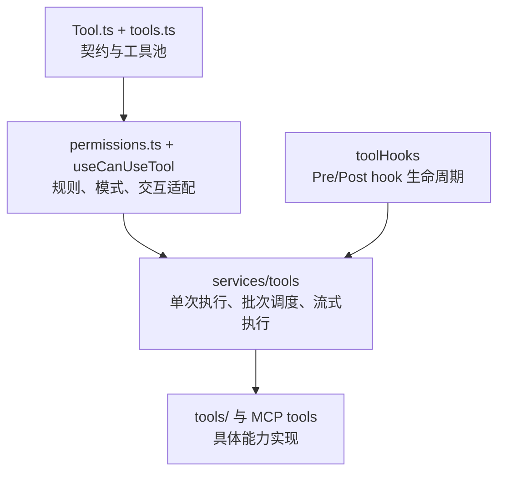
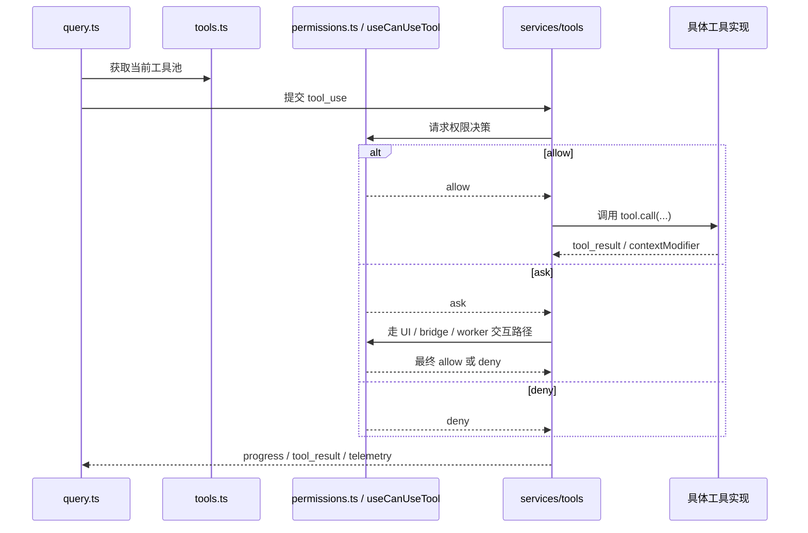

# tools、permissions、services/tools 协作关系

## 1. 文档目标

这篇文档聚焦工具执行主干，不分析具体单个工具的实现，而是解释三层结构如何协作：

- `Tool.ts` / `tools.ts` 定义和装配能力面。
- `utils/permissions/` 与 `hooks/useCanUseTool.tsx` 决定工具是否可以执行。
- `services/tools/` 负责真正的执行编排。

### 1.1 Overview 视图



这张图强调工具主线的三段式分工：注册层决定能看见什么，权限层决定能不能执行，执行层决定允许后的实际运行方式。

### 1.2 数据流视图



这条数据流说明一次工具调用不是直接落到 `tool.call(...)`，而是必须经过工具池、权限系统和执行编排三层串接。

## 2. 一句话结论

这一套设计不是“工具列表 + 权限判断”的简单组合，而是三段式流水线：

1. 注册层决定“当前运行时有哪些工具能被模型看见”。
2. 权限层决定“某次具体工具调用是否可以执行，以及如何得到这个决定”。
3. 执行层决定“被允许的工具调用如何并发、如何回写结果、如何插入 hooks 和 telemetry”。

## 3. 模块分层

```text
Tool 契约与注册层
  - Tool.ts
  - tools.ts
        |
        v
权限决策层
  - types/permissions.ts
  - utils/permissions/permissions.ts
  - utils/permissions/PermissionMode.ts
  - hooks/useCanUseTool.tsx
        |
        v
执行编排层
  - services/tools/toolExecution.ts
  - services/tools/toolHooks.ts
  - services/tools/toolOrchestration.ts
  - services/tools/StreamingToolExecutor.ts
```

这三层虽然都围绕 tool 运转，但边界相当明确：

- 注册层关心可见能力面。
- 权限层关心决策与交互。
- 执行层关心顺序、并发、取消和结果回流。

## 4. Tool.ts 与 tools.ts 的责任

### 4.1 Tool.ts 是统一契约层

`Tool.ts` 定义了所有工具共享的核心契约，包括：

- 工具的输入 schema 和描述接口。
- `call(...)` 的统一调用方式。
- `isConcurrencySafe(...)`、`isReadOnly(...)`、`interruptBehavior(...)` 等执行语义。
- `ToolPermissionContext` 与 `ToolUseContext` 这两个运行时上下文。

从架构上看，`Tool.ts` 的作用是把各种不同能力统一成同一种“可执行单元”，让上层不需要知道它是本地工具、MCP 工具还是代理工具。

### 4.2 tools.ts 是能力装配面

`tools.ts` 不是单纯罗列工具文件，它承担了“当前环境下工具池如何生成”的责任：

- 注册 built-in tools。
- 根据 feature flag、环境模式、REPL/simple/coordinator 等条件过滤能力。
- 按 deny rule 在工具展示前做预过滤。
- 把 built-in tools 与 MCP tools 合并成统一工具池。

因此，`tools.ts` 决定的是“模型此刻能看到什么”，而不是“这次调用能不能执行”。

这两件事必须分开：

- 工具池控制能力面大小和 prompt 体积。
- 权限检查控制每次调用的实际执行权。

## 5. 权限体系的责任分层

权限体系由两层组成：

- `utils/permissions/` 负责规则、模式和自动判定逻辑。
- `hooks/useCanUseTool.tsx` 负责把“需要用户决定”的情形接到交互式 UI、bridge 或 worker 协调逻辑。

### 5.1 PermissionMode 是模式层

权限模式这一层实际上分成两部分：

- `types/permissions.ts` 提供共享的 mode 类型和枚举集合。
- `PermissionMode.ts` 提供 schema、标题、外部模式映射等模式辅助逻辑。

这些文件共同描述运行时权限模式，例如：

- `default`
- `plan`
- `acceptEdits`
- `bypassPermissions`
- `dontAsk`
- `auto`

这些模式不是具体规则，而是“整体决策策略”。它们决定权限系统如何解释 ask/allow/deny，而不是替代规则系统。

### 5.2 permissions.ts 是规则和自动判定内核

`permissions.ts` 的核心职责，是把多种来源的权限信息合并成统一决策。它负责：

- allow/deny/ask rules 的解析与匹配。
- 工具级和内容级规则判断。
- bypass、acceptEdits、dontAsk、auto 等模式转换。
- auto mode classifier 和 denial tracking。
- headless/async agent 场景下的自动拒绝或 hook 优先判定。

这里最重要的一点是：权限不是一次 if/else，而是分阶段决策。

### 5.3 内层判定与外层判定的分工

`permissions.ts` 里实际分成两层：

- `hasPermissionsToUseToolInner(...)` 负责规则匹配、工具自身 `checkPermissions(...)`、bypass 与 always-allow 这类基础判定。
- `hasPermissionsToUseTool(...)` 在此基础上再叠加 `dontAsk`、`auto`、headless agent hook 优先等运行时模式逻辑。

因此，权限体系不是单个函数拍板，而是“基础许可判断 + 运行环境修正”的双层结构。

## 6. 权限判定顺序

从源码看，权限判定顺序大致可以概括为下面这条主线。

### 6.1 规则和工具自身先执行

`hasPermissionsToUseToolInner(...)` 先处理规则和工具自身约束：

1. 整个工具的 deny rule。
2. 整个工具的 ask rule。
3. 工具自己的 `checkPermissions(...)`。
4. 工具实现返回的 deny。
5. `requiresUserInteraction()` 这类 bypass-immune 约束。
6. 工具内部产生的 content-specific ask rule。
7. safety check 这类必须提示的场景。

这说明“工具是否可用”并不完全由全局配置决定，工具实现本身也可以声明更细的权限语义。

### 6.2 模式和 always-allow 在后面生效

在前面的不可绕过检查通过后，系统才会继续处理：

1. `bypassPermissions` 或 plan 下的 bypass 继承。
2. 整个工具的 always-allow rule。
3. 把 `passthrough` 转为真正的 `ask`。

这意味着 bypass 不是万能绕过；对安全路径、内容级 ask、必须交互的工具，仍然要保留限制。

### 6.3 外层再做模式转换

外层的 `hasPermissionsToUseTool(...)` 会在得到 ask 结果后继续处理：

- `dontAsk`：把 ask 转为 deny。
- `auto`：走 classifier、allowlist、acceptEdits 快路径与 denial tracking。
- headless/async agent：先给 PermissionRequest hooks 机会，否则自动拒绝。

这意味着权限系统分成“基础判定”和“运行模式判定”两层，而不是一层里全部揉在一起。

## 7. useCanUseTool 的角色

`hooks/useCanUseTool.tsx` 不是权限规则本身，而是权限决策和交互系统之间的适配层。

它的职责是：

- 调用 `hasPermissionsToUseTool(...)` 获得基础决策。
- 在需要用户介入时补齐工具描述和展示文案。
- 对 `allow` 直接返回。
- 对 `deny` 记录日志、通知和 UI 状态。
- 对 `ask` 根据上下文分流到不同交互路径。

从源码看，ask 至少会区分三类处理方式：

- 交互式本地权限对话框。
- coordinator / swarm worker 的自动检查或转发。
- bridge / channel 等外部回调控制面。

因此，`useCanUseTool` 的价值不是“再做一次权限判断”，而是把统一权限结果接到不同执行环境中。

## 8. services/tools 的责任

执行层可以再拆成三个子角色。

### 8.1 toolExecution.ts 负责单次工具调用

`toolExecution.ts` 处理的是“一次 tool_use 如何执行到底”，包括：

- 解析并定位工具定义。
- 调用 pre/post hooks。
- 结合 hook 结果与 `canUseTool` 得出最终 permission decision。
- 执行真正的 `tool.call(...)`。
- 生成 progress、tool_result、hook 附件和 telemetry。

所以它是单次执行的“执行器”，不是批处理器。

### 8.2 toolHooks.ts 负责 hook 与 permission 合流

`toolHooks.ts` 处理的不是业务工具，而是工具调用周边的 hook 生命周期，尤其是：

- `PreToolUse` / `PostToolUse` / `PostToolUseFailure`。
- hook allow 是否还能被 rule 覆盖。
- hook ask/deny 如何回落到正常权限流程。

这层很关键，因为它明确了一个设计原则：

- hook 可以影响权限，但不能悄悄绕过用户显式配置的 deny/ask 规则。

### 8.3 toolOrchestration.ts 负责批次与并发策略

`toolOrchestration.ts` 的职责是对一批 `tool_use` block 做调度：

- 把工具调用分成 concurrency-safe 批次和非 concurrency-safe 批次。
- 只让连续的并发安全工具并行。
- 对非并发安全工具维持串行和顺序语义。
- 在批处理后应用 `contextModifier`。

它回答的是“这一批工具怎么排程”，而不是“单个工具如何执行”。

### 8.4 StreamingToolExecutor 负责流式阶段执行

`StreamingToolExecutor.ts` 解决的是更具体的问题：模型还在 streaming 时，工具已经陆续出现，如何提前开始执行但又不打乱顺序。

它负责：

- 在流式输出过程中提前启动工具。
- 允许 progress 先行透出，但把最终结果维持为按出现顺序回放。
- 保证结果按工具出现顺序吐回。
- 在 streaming fallback、用户中断或 sibling error 时生成合成结果。
- 处理“并发安全工具可并行、非安全工具独占”的运行时约束。

它可以理解为 `toolOrchestration` 的流式优化版本。

## 9. 三层协作的主链路

```text
模型看到工具池
  <- tools.ts 按运行时和 deny rule 预过滤

模型发出 tool_use
  -> query / services/tools 接管执行

单次执行前
  -> toolHooks + permissions + useCanUseTool 给出最终权限决策

被允许后
  -> toolExecution 调用具体工具
  -> query 在流式阶段先交给 StreamingToolExecutor，在批次收尾时再交给 toolOrchestration / runTools

执行结果
  -> 归一化为消息
  -> 回到 query 主循环
```

这条链路反映出一个核心设计：

- “模型能看到哪些工具” 和 “某次调用能不能做” 是两层。
- “能不能做” 和 “怎么做、怎么并发” 也是两层。

## 10. 关键边界

### 10.1 注册层不做执行决策

`tools.ts` 可以因为 deny rule 把整类工具从 prompt 中移除，但它不负责单次 permission prompt、classifier 或 hook。

### 10.2 权限层不做批量调度

权限层只回答某次调用是否可以执行，不回答多个工具之间是否应该并发、谁先谁后。

### 10.3 执行层不决定工具池

`services/tools/` 假定工具池已经准备好，它不重新决定可见能力面，只面向当前 `tool_use` 做执行。

## 11. 设计价值

这套拆分的价值主要体现在三点：

1. 工具生态可以持续扩展，而不把权限逻辑散落到每个工具目录里。
2. 权限策略可以在交互式、本地 headless、bridge、swarm worker 等不同运行环境里复用同一内核。
3. 查询循环可以根据场景选择流式执行或批量执行，而不改动工具契约本身。

如果只保留一句话来记忆，可以这样理解：

- `Tool.ts` 和 `tools.ts` 定义能力面。
- `permissions` 和 `useCanUseTool` 定义执行许可。
- `services/tools` 定义执行方式。